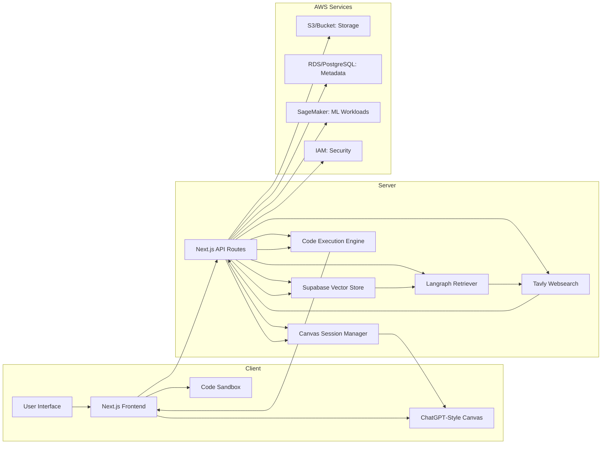

# AWS MLOps Learning Platform

Welcome to the **AWS MLOps Learning Platform**, a one‑stop hub designed to help you prepare for the AWS Machine Learning Specialty certification. This platform combines cutting‑edge retrieval‑augmented generation (RAG) techniques, an interactive code sandbox, a ChatGPT‑style canvas, and a comprehensive learning guide to accelerate your study and hands‑on practice.

## Features

1. **Advanced Retrieval‑Augmented Generation (RAG)**
   - Built with **Next.js**, **Langraph**, **Tavly Websearch**, and **Supabase Vector Store**
   - Dynamically fetches and indexes the latest AWS documentation, whitepapers, and blog posts
   - Enables context‑aware, up‑to‑date answers to your ML certification queries
   - Mermaid architecture diagram below illustrates the flow from user query to vectorized retrieval and response generation

2. **Interactive Code Sandbox**
   - Run Python and JavaScript snippets directly in your browser
   - Preconfigured with popular ML libraries (boto3, SageMaker SDK, scikit‑learn, TensorFlow, PyTorch)
   - Persistent storage of your experiments and notebooks
   - Easy sharing of code snippets with teammates for pair‑programming or review

3. **ChatGPT‑Styled Canvas**
   - Conversational interface for asking questions, exploring concepts, and refining code
   - Inline code execution and artifact creation (plots, tables, diagrams)
   - Versioned history of your learning sessions
   - Collaboration mode to invite peers or mentors for real‑time feedback

4. **Detailed Learning Guide**
   - Curated roadmap covering all core AWS ML Specialty domains:
     - Data Engineering, Exploratory Data Analysis, Feature Engineering
     - Model Training, Tuning, and Deployment on SageMaker
     - Monitoring, Debugging, and MLOps best practices on AWS
     - Security, Compliance, and Cost Optimization
   - Each topic includes theory, architecture diagrams, code samples, and quiz questions
   - Regularly updated with the latest AWS announcements and exam blueprints

## System Architecture



## Installation & Setup

1. **Clone the repository**
   ```bash
   git clone https://github.com/your‑org/aws‑mlops‑platform.git
   cd aws‑mlops‑platform
   ```

2. **Install dependencies**
   ```bash
   pnpm install
   ```

3. **Configure environment variables**
   Copy `.env.example` to `.env.local` and set the following:
   - `NEXT_PUBLIC_SUPABASE_URL`
   - `NEXT_PUBLIC_SUPABASE_ANON_KEY`
   - `TAVLY_API_KEY`
   - `LANGRAPH_API_KEY`
   - `AWS_ACCESS_KEY_ID` & `AWS_SECRET_ACCESS_KEY`

4. **Run database migrations**
   ```bash
   pnpm prisma migrate dev
   ```

5. **Start the development server**
   ```bash
   pnpm dev
   ```

## Usage

- Navigate to `http://localhost:3000`
- Sign in with your AWS credentials or a GitHub account
- Explore the interactive canvas, run code in the sandbox, and follow the learning guide
- Use the search bar to ask questions or fetch documentation snippets

## Contributing

Contributions are welcome! Please open issues or submit pull requests for bugs, enhancements, or new content modules.

## License

This project is licensed under the MIT License. See the [LICENSE](LICENSE) file for details.

