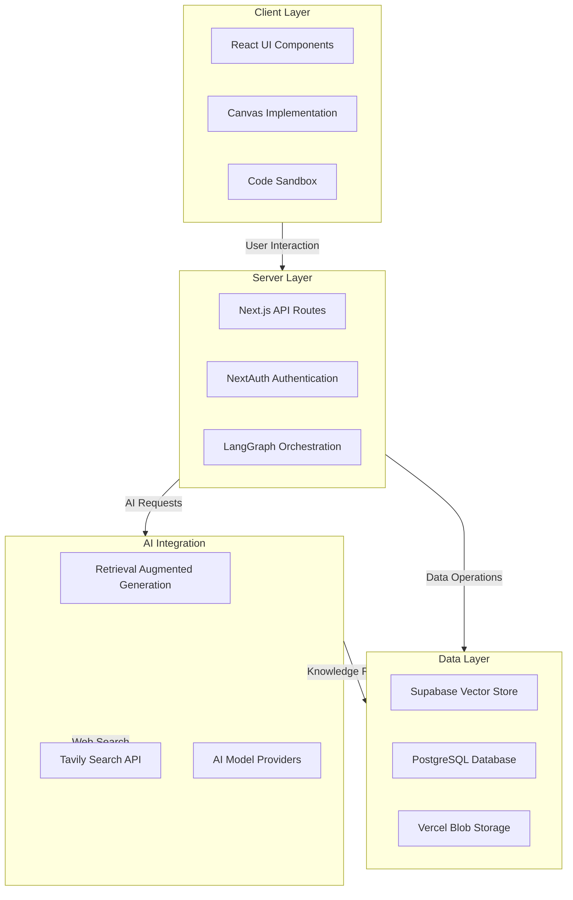
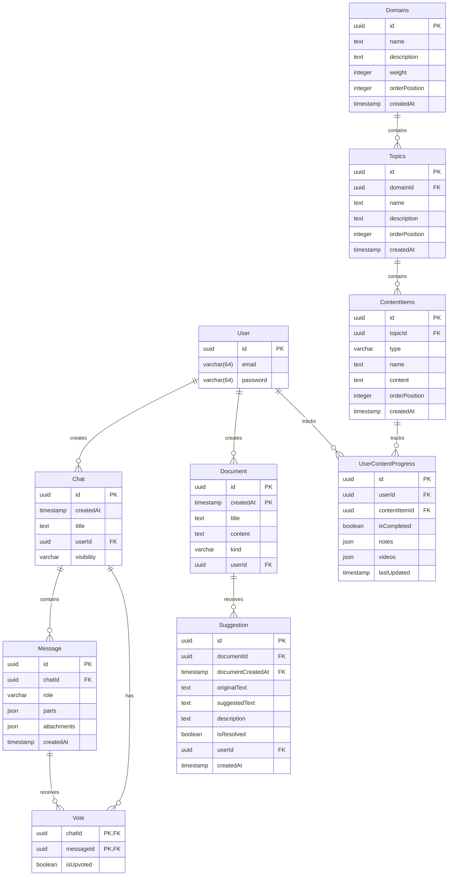

# AWS MLOps Learning Platform

A comprehensive learning platform designed specifically for AWS Machine Learning Specialty certification preparation, featuring advanced RAG, interactive code execution, and structured learning paths.

## Overview

This platform provides a guided learning experience for mastering AWS Machine Learning services and preparing for the AWS Machine Learning Specialty certification. The application combines sophisticated Retrieval Augmented Generation (RAG) capabilities with interactive coding environments and a structured learning path to help users build practical skills while preparing for the certification exam.

## Key Features

### 1. Advanced CRAG (Context Retrieval Augmented Generation)
- **NextJS Integration**: Built on a modern Next.js application architecture with React 19 and Tailwind CSS
- **LangGraph Framework**: Utilizes LangGraph for sophisticated AI pipeline orchestration
- **Tavily Websearch Integration**: Real-time relevant information retrieval from multiple sources
- **Supabase Vector Store**: Efficient storage and retrieval of embedding vectors for semantic search

### 2. Code Running Sandbox
- **Interactive Code Execution**: Python, JavaScript, and other language code execution directly in the browser
- **Real-time Output Visualization**: See results instantly with integrated visualization capabilities
- **Saved Code Snippets**: Create and save code examples for future reference
- **AWS SDK Integration**: Test AWS service interactions in a controlled environment

### 3. ChatGPT-styled Canvas Implementation
- **Interactive Whiteboard**: Collaborative workspace for notes, code, and diagrams
- **Real-time Rendering**: Immediate preview of code output and content changes
- **Multi-format Support**: Support for markdown, code blocks, and embedded visualizations
- **Conversation Context**: Maintain context between chat and canvas for seamless learning

### 4. Comprehensive Learning Guide
- **Structured Learning Paths**: Step-by-step curriculum covering all AWS ML certification topics
- **Interactive Assessments**: Evaluate your understanding with quizzes and practical exercises
- **Real-world Scenarios**: Apply concepts to practical examples based on certification exam scenarios
- **Progress Tracking**: Monitor your learning journey and identify areas for improvement

## System Architecture



## Database Schema



## Technologies Used

### Frontend
- Next.js 15.3.0 with App Router and PPR
- React 19.0.0
- Tailwind CSS with shadcn/ui components
- SWR for efficient data fetching

### Backend
- Next.js API Routes
- NextAuth for authentication
- Drizzle ORM
- PostgreSQL database
- Vercel Blob for file storage

### AI Integration
- AI SDK for model integration
- LangGraph for RAG workflow orchestration
- Tavily Search API for web search
- Supabase for vector embeddings storage
- xAI provider integration

## Getting Started

### Prerequisites
- Node.js 18+ and npm/pnpm
- PostgreSQL database
- API keys for:
  - xAI (Grok models)
  - Tavily Search
  - Supabase

### Installation

1. Clone the repository
```bash
git clone https://github.com/yourusername/aws-mlops-learning-platform.git
cd aws-mlops-learning-platform
```

2. Install dependencies
```bash
pnpm install
```

3. Configure environment variables
```bash
cp .env.example .env.local
# Edit .env.local with your API keys and database configuration
```

4. Run database migrations
```bash
pnpm db:migrate
```

5. Start the development server
```bash
pnpm dev
```

## AWS Machine Learning Specialty Certification

This platform is specifically designed to help prepare for the AWS Machine Learning Specialty certification exam, which validates your expertise in:

- Data Engineering
- Exploratory Data Analysis
- Modeling
- Machine Learning Implementation and Operations

The learning materials cover all AWS machine learning services including:

- Amazon SageMaker
- Amazon Bedrock
- Amazon Comprehend
- Amazon Rekognition
- Amazon Translate
- Amazon Polly
- Amazon Transcribe
- Amazon Personalize
- Amazon Forecast

## Contributing

We welcome contributions to improve the platform! Please follow these steps:

1. Fork the repository
2. Create a feature branch (`git checkout -b feature/amazing-feature`)
3. Commit your changes (`git commit -m 'Add some amazing feature'`)
4. Push to the branch (`git push origin feature/amazing-feature`)
5. Open a Pull Request

## License

This project is licensed under the MIT License - see the LICENSE file for details.

## Acknowledgments

- AWS for their comprehensive machine learning services
- Tavily for their search API integration
- Supabase for vector storage capabilities
- The open-source community for their invaluable contributions to the tools used in this project
