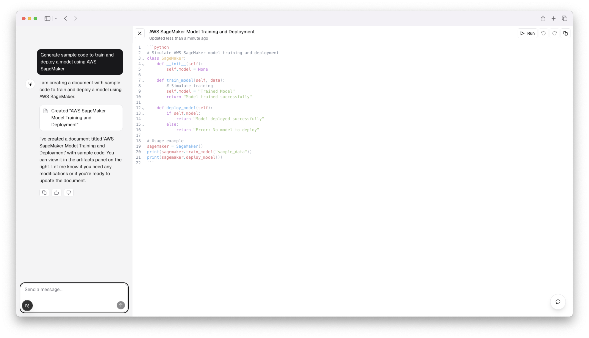

# 🧠 AWS MLOps Learning Platform

<div align="center">


<br>

*A comprehensive learning platform designed specifically for AWS Machine Learning Specialty certification preparation*

</div>


## ✨ Overview

This platform provides a guided learning experience for mastering AWS Machine Learning services and preparing for the AWS Machine Learning Specialty certification. The application combines sophisticated Retrieval Augmented Generation (RAG) capabilities with interactive coding environments and a structured learning path to help users build practical skills while preparing for the certification exam.

> 💡 **Built for AWS ML learners, by AWS ML experts.**
> 
> This platform offers a hands-on approach to learning AWS machine learning services, with a focus on practical skills and certification preparation.

## 🚀 Key Features

### 1. Advanced CRAG (Context Retrieval Augmented Generation)

<kbd>

- **NextJS Integration**: Built on a modern Next.js application architecture with React 19 and Tailwind CSS
- **LangGraph Framework**: Utilizes LangGraph for sophisticated AI pipeline orchestration
- **Semantic Chunking**: Intelligently divides documents into contextually meaningful units rather than arbitrary fixed sizes
- **Cross Encoder Reranker**: Improves retrieval accuracy by re-ranking candidate passages using powerful cross-encoder models
- **Query Expansion Technique**: Enhances user queries with related terms to improve retrieval of relevant information
- **Tavily Websearch Integration**: Real-time relevant information retrieval from multiple sources
- **Supabase Vector Store**: Efficient storage and retrieval of embedding vectors for semantic search

</kbd>


### 2. 💻 Code Running Sandbox

<kbd>

- **Interactive Code Execution**: Python, JavaScript, and other language code execution directly in the browser
- **Real-time Output Visualization**: See results instantly with integrated visualization capabilities
- **Saved Code Snippets**: Create and save code examples for future reference
- **AWS SDK Integration**: Test AWS service interactions in a controlled environment

</kbd>

### 3. 🎨 ChatGPT-styled Canvas Implementation


<kbd>

- **Interactive Whiteboard**: Collaborative workspace for notes, code, and diagrams
- **Real-time Rendering**: Immediate preview of code output and content changes
- **Multi-format Support**: Support for markdown, code blocks, and embedded visualizations
- **Conversation Context**: Maintain context between chat and canvas for seamless learning

</kbd>

### 4. 📚 Comprehensive Learning Guide


<kbd>

- **Structured Learning Paths**: Step-by-step curriculum covering all AWS ML certification topics
- **Interactive Assessments**: Evaluate your understanding with quizzes and practical exercises
- **Real-world Scenarios**: Apply concepts to practical examples based on certification exam scenarios
- **Progress Tracking**: Monitor your learning journey and identify areas for improvement

</kbd>

## 🏗️ System Architecture


## 🗃️ Database Schema


## 🛠️ Technologies Used

<div class="tech-container">

<div class="tech-section">
<h3>Frontend</h3>
<ul>
<li>Next.js 15.3.0 with App Router and PPR</li>
<li>React 19.0.0</li>
<li>Tailwind CSS with shadcn/ui components</li>
<li>SWR for efficient data fetching</li>
</ul>
</div>

<div class="tech-section">
<h3>Backend</h3>
<ul>
<li>Next.js API Routes</li>
<li>NextAuth for authentication</li>
<li>Drizzle ORM</li>
<li>PostgreSQL database</li>
<li>Vercel Blob for file storage</li>
</ul>
</div>

<div class="tech-section">
<h3>AI Integration</h3>
<ul>
<li>AI SDK for model integration</li>
<li>LangGraph for RAG workflow orchestration</li>
<li>Tavily Search API for web search</li>
<li>Supabase for vector embeddings storage</li>
<li>xAI provider integration</li>
</ul>
</div>

</div>

## 🚦 Getting Started

### Prerequisites

- Node.js 18+ and npm/pnpm
- PostgreSQL database
- API keys for:
  - xAI (Grok models)
  - Tavily Search
  - Supabase

### Installation

1. Clone the repository
```bash
git clone https://github.com/yourusername/aws-mlops-learning-platform.git
cd aws-mlops-learning-platform
```

2. Install dependencies
```bash
pnpm install
```

3. Configure environment variables
```bash
cp .env.example .env.local
# Edit .env.local with your API keys and database configuration
```

4. Run database migrations
```bash
pnpm db:migrate
```

5. Start the development server
```bash
pnpm dev
```

## 🎓 AWS Machine Learning Specialty Certification

<kbd>

This platform is specifically designed to help prepare for the AWS Machine Learning Specialty certification exam, which validates your expertise across four crucial domains:

</kbd>

### 📊 Domain 1: Data Engineering (20%)

<kbd>

Create, manage, and transform data repositories for machine learning

#### Key Topics:

- **Data Repositories**
  - Data sources identification
  - Storage options comparison
  - AWS storage services (S3, EFS, EBS, RDS, DynamoDB)
  
- **Data Ingestion**
  - Batch vs streaming data processing
  - Data pipeline orchestration
  - AWS services: Kinesis, EMR, AWS Glue
  
- **Data Transformation**
  - ETL processes
  - Data wrangling techniques
  - Frameworks: Hadoop, Spark, Hive

</kbd>

### 🔍 Domain 2: Exploratory Data Analysis (24%)

<kbd>

Sanitize, prepare, and analyze data for machine learning

#### Key Topics:

- **Data Preparation and Cleaning**
  - Handling missing/corrupt data
  - Data formatting and normalization
  - Handling imbalanced datasets
  
- **Feature Engineering**
  - Feature extraction techniques (text, image, audio)
  - Dimensionality reduction
  - Tokenization, one-hot encoding, word embeddings
  - AWS services: SageMaker Ground Truth, AWS Glue FindMatches
  
- **Data Visualization and Analysis**
  - Statistical analysis techniques
  - Correlation analysis and summary statistics
  - Cluster analysis and visualization
  - AWS services: QuickSight, Athena

</kbd>

### 🧮 Domain 3: Modeling (36%)

<kbd>

Select, train, and tune machine learning models

#### Key Topics:

- **Problem Framing**
  - Supervised vs unsupervised learning
  - Classification, regression, forecasting, clustering
  - Foundation models and large language models
  
- **Model Selection**
  - Algorithm types and use cases
  - Linear models, tree-based models, neural networks
  - Transfer learning and recommendation systems
  - Key algorithms: XGBoost, k-means, CNNs, RNNs, etc.
  
- **Model Training**
  - Training/validation strategies
  - Optimization algorithms and loss functions
  - Distributed vs non-distributed training
  - AWS services: SageMaker Training, EC2
  
- **Hyperparameter Optimization**
  - Regularization techniques
  - Neural network architecture design
  - Tree-based and linear model parameters
  - AWS services: SageMaker Hyperparameter Optimization
  
- **Model Evaluation**
  - Metrics: AUC-ROC, Precision, Recall, F1 score
  - Overfitting vs underfitting
  - A/B testing and cross-validation
  - AWS services: SageMaker Model Monitor

</kbd>

### 🚀 Domain 4: Machine Learning Implementation and Operations (20%)

<kbd>

Deploy, monitor, and maintain machine learning solutions

#### Key Topics:

- **Building Robust ML Solutions**
  - Performance optimization and scalability
  - Logging, monitoring, and error handling
  - Container-based and edge deployments
  - AWS services: CloudTrail, CloudWatch, Auto Scaling
  
- **ML Services Selection**
  - Custom vs pre-built models
  - Real-time vs batch inference
  - Cost optimization strategies
  - High-level AI services (Comprehend, Rekognition, etc.)
  
- **Security for ML Solutions**
  - Identity and access management
  - Storage and network security
  - Encryption and data anonymization
  - AWS services: IAM, KMS, VPC
  
- **Deployment and Operations**
  - Endpoint management and model versioning
  - A/B testing and monitoring in production
  - Performance degradation and model drift detection
  - AWS services: SageMaker Endpoints, Processing, Debugger

</kbd>

The platform covers all major AWS machine learning services including:

<div class="aws-services">
<span class="aws-service-tag">Amazon SageMaker</span>
<span class="aws-service-tag">Amazon Bedrock</span>
<span class="aws-service-tag">Amazon Comprehend</span>
<span class="aws-service-tag">Amazon Rekognition</span>
<span class="aws-service-tag">Amazon Translate</span>
<span class="aws-service-tag">Amazon Polly</span>
<span class="aws-service-tag">Amazon Transcribe</span>
<span class="aws-service-tag">Amazon Personalize</span>
<span class="aws-service-tag">Amazon Forecast</span>
<span class="aws-service-tag">Amazon Textract</span>
<span class="aws-service-tag">Amazon Lex</span>
<span class="aws-service-tag">Amazon Kendra</span>
</div>

## 👥 Contributing

We welcome contributions to improve the platform! Please follow these steps:

1. Fork the repository
2. Create a feature branch (`git checkout -b feature/amazing-feature`)
3. Commit your changes (`git commit -m 'Add some amazing feature'`)
4. Push to the branch (`git push origin feature/amazing-feature`)
5. Open a Pull Request

## 📄 License

This project is licensed under the MIT License - see the LICENSE file for details.

## 🙏 Acknowledgments

- AWS for their comprehensive machine learning services
- Tavily for their search API integration
- Supabase for vector storage capabilities
- The open-source community for their invaluable contributions to the tools used in this project

---

<div align="center">
  <p>Built with ❤️ for the AWS ML community</p>
  
  <a href="https://aws.amazon.com/"></a>
  <a href="https://nextjs.org/"></a>
  <a href="https://react.dev/"></a>
  <a href="https://supabase.com/"></a>
  <a href="https://docs.langchain.com/docs/"></a>
</div>

<style>
/* Dark mode friendly styles */
.tech-container {
  display: flex;
  flex-wrap: wrap;
  gap: 20px;
  justify-content: center;
  margin-bottom: 30px;
}

.tech-section {
  flex: 1;
  min-width: 250px;
  border: 1px solid #888;
  border-radius: 8px;
  padding: 15px;
}

.aws-services {
  display: flex;
  flex-wrap: wrap;
  gap: 10px;
  margin-bottom: 20px;
}

.aws-service-tag {
  border: 1px solid #4f94ef;
  background-color: rgba(79, 148, 239, 0.1);
  color: inherit;
  padding: 5px 10px;
  border-radius: 15px;
}

/* The following CSS ensures compatibility with both light and dark modes */
@media (prefers-color-scheme: dark) {
  .tech-section {
    border-color: #666;
    background-color: rgba(255, 255, 255, 0.05);
  }
  
  .aws-service-tag {
    border-color: #6ea8ff;
    background-color: rgba(110, 168, 255, 0.1);
  }
  
  kbd {
    background-color: rgba(255, 255, 255, 0.1);
    border-color: #666;
  }
}
</style>
