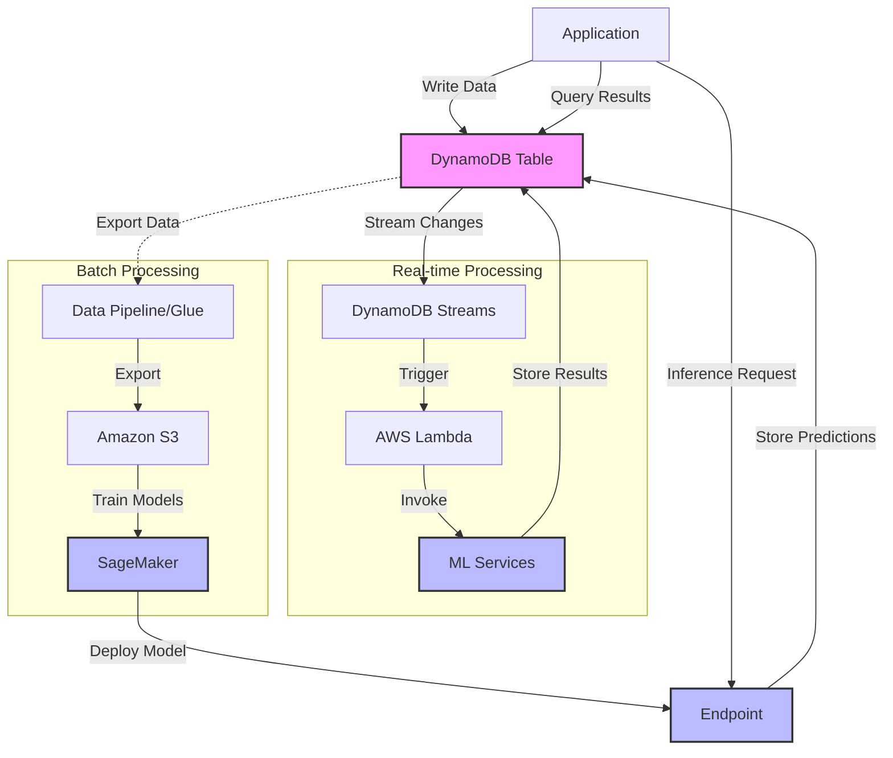

# Amazon DynamoDB

## Quick Revision Block

> Key Points:
> 
> - Amazon DynamoDB is a fully managed, serverless NoSQL database service that provides consistent single-digit millisecond latency with virtually unlimited throughput and storage for ML workloads.
> - DynamoDB's event-driven architecture with Streams enables real-time ML processing, sentiment analysis, and anomaly detection when integrated with services like Lambda, SageMaker, and Comprehend.
> - The flexible schema design of DynamoDB makes it ideal for storing heterogeneous ML model metadata, features, and prediction results with different attributes across items.
> - DynamoDB can be integrated into ML pipelines by exporting data to S3 for model training in SageMaker while serving as the high-performance database for real-time inference results.

## Prerequisites

- **NoSQL Database Concepts**: Understanding of non-relational databases and key-value/document data models
- **AWS Lambda**: Familiarity with serverless computing for processing DynamoDB events
- **Data Streaming Patterns**: Knowledge of event-based architectures for real-time data processing

## Detailed Explanation

### What is Amazon DynamoDB?

Amazon DynamoDB is a fully managed, serverless NoSQL database service that delivers consistent performance at any scale. It provides a flexible, schema-less data model that supports both key-value and document data structures, with built-in security, backup and restore capabilities, and in-memory caching. For machine learning applications, DynamoDB serves as both a source of training data and a high-performance datastore for real-time ML inference results and features.

### Key Characteristics

- **Fully Managed and Serverless**: DynamoDB eliminates the operational burden of managing database infrastructure, allowing ML teams to focus on model development rather than database administration.
  
- **Consistent Performance at Scale**: DynamoDB provides predictable, single-digit millisecond response times for ML applications, regardless of data volume or request rate.
  
- **Flexible Schema Design**: The schema-less nature of DynamoDB allows each item (row) to have different attributes, making it ideal for storing varied ML features, model metadata, and prediction results.
  
- **Event-Driven Integration**: DynamoDB Streams captures a time-ordered sequence of item-level modifications, enabling real-time ML processing through integration with AWS Lambda and other services.

### How it Works

1. **Data Modeling for ML Use Cases**:
   - Design tables with partition keys and sort keys optimized for ML access patterns
   - Use secondary indexes to enable efficient querying across multiple dimensions
   - Store structured and semi-structured data with flexible attribute schemas

2. **Integration with ML Services**:
   - Stream real-time data changes to Lambda functions for ML processing
   - Export table data to S3 for batch training in SageMaker
   - Connect DynamoDB with Amazon Comprehend for sentiment analysis
   - Implement anomaly detection using SageMaker Random Cut Forest algorithm

3. **Performance Optimization**:
   - Use DynamoDB Accelerator (DAX) for microsecond read performance on ML features
   - Configure auto-scaling to handle varying ML workload demands
   - Implement strategic data partitioning for ML access patterns

### Practical Real World Use Cases

- **Real-time Sentiment Analysis**: An e-commerce platform uses DynamoDB to store customer reviews, connecting DynamoDB Streams with Lambda functions that invoke Amazon Comprehend to analyze sentiment. The analysis results are stored back in DynamoDB for immediate use in the application.
  
- **Anomaly Detection System**: A financial services company implements an anomaly detection system by using DynamoDB Streams to capture transaction data in real-time. AWS Lambda functions process these streams and invoke SageMaker endpoints running Random Cut Forest algorithms to identify suspicious transactions instantly.
  
- **Recommendation Engine**: A media streaming service uses DynamoDB to store user interaction data. This data is periodically exported to S3 for training recommendation models in SageMaker, while the trained model serves predictions via API calls, with results stored in DynamoDB for low-latency access by the application.

## System Design Considerations

### Architecture Patterns

- **Stream Processing Pattern**: Use DynamoDB Streams with Lambda to trigger real-time ML processing for each data modification.
  
- **Batch Analytics Pattern**: Export DynamoDB data to S3 using Data Pipeline or AWS Glue for ML model training with SageMaker.

### Performance Optimization

- **Table Design Optimization**: Structure tables with ML access patterns in mind, using composite keys and sparse indexes to improve query efficiency.
  
- **DAX Integration**: Implement DynamoDB Accelerator for applications requiring microsecond response times for ML feature retrieval.

### Cost Optimization

- **On-demand Capacity Mode**: For unpredictable ML workloads, use on-demand capacity to pay only for what you use without capacity planning.
  
- **Reserved Capacity**: For predictable ML workloads, purchase reserved capacity to reduce costs for consistent usage patterns.

### Security Best Practices

- **Fine-grained Access Control**: Implement IAM policies with the principle of least privilege for applications and ML services accessing DynamoDB.
  
- **Encryption**: Enable encryption at rest using AWS Key Management Service (KMS) and encryption in transit for sensitive ML data.

## Common Exam Scenarios

- **Scenario 1**: A company wants to analyze customer sentiment from product reviews stored in DynamoDB in real-time.
  
  Solution: Implement DynamoDB Streams to capture new reviews as they're added to the table. Configure a Lambda function triggered by these streams to invoke Amazon Comprehend for sentiment analysis. Store the sentiment scores back in DynamoDB for use by the application. This event-driven architecture provides real-time sentiment insights without impacting the primary database workload.

- **Scenario 2**: An ML team needs to train models on historical transaction data stored in DynamoDB, but they don't want to affect production performance.
  
  Solution: Use AWS Data Pipeline to create a scheduled export of the DynamoDB table to Amazon S3. Configure the export job to run during off-peak hours to minimize impact on production. Once the data is in S3, use SageMaker to train the ML models on this data. This approach separates analytical queries from the production environment while still leveraging the valuable historical data.

- **Scenario 3**: A financial application needs to detect anomalous transactions in real-time from data flowing into DynamoDB.
  
  Solution: Enable DynamoDB Streams on the transactions table and create a Lambda function that processes each new transaction record. The Lambda function should format the transaction data and send it to a pre-trained SageMaker endpoint running a Random Cut Forest algorithm for anomaly detection. Configure CloudWatch Alarms to alert on detected anomalies. This architecture enables real-time anomaly detection without adding latency to the transaction processing flow.

## Related Concepts

- **[DynamoDB Streams]**: The change data capture feature that provides a time-ordered sequence of item-level modifications in DynamoDB tables.
  
- **[DAX (DynamoDB Accelerator)]**: An in-memory cache for DynamoDB that provides microsecond read performance for low-latency ML feature retrieval.
  
- **[Global Tables]**: A multi-region, multi-active database capability for global ML applications requiring low-latency data access worldwide.

## Learning Resources

### Official Documentation

- [Amazon DynamoDB Developer Guide](https://docs.aws.amazon.com/amazondynamodb/latest/developerguide/Introduction.html)
- [DynamoDB and Amazon SageMaker Integration](https://docs.aws.amazon.com/amazondynamodb/latest/developerguide/sagemaker-integration.html)

### Video Tutorials

- [AWS re:Invent 2023: DynamoDB for Machine Learning Applications](https://www.youtube.com/watch?v=LdGbVhWIGYU)
- [Real-time Analytics with DynamoDB Streams and Machine Learning](https://www.youtube.com/watch?v=2iwOfHw2_Pc)

### Hands-on Labs

- [Building ML Pipelines with DynamoDB and SageMaker](https://aws.amazon.com/getting-started/hands-on/build-ml-pipeline-dynamodb-sagemaker/)
- [Implementing Anomaly Detection on DynamoDB Streams](https://github.com/aws-samples/amazon-sagemaker-dynamodb-anomaly-detection)

### Practice Questions

- Q1: A gaming company stores player activity data in DynamoDB and wants to analyze this data for abnormal behavior patterns that might indicate cheating. What is the most efficient architecture for this use case?
    - A: Enable DynamoDB Streams on the activity table, create a Lambda function that processes new records and sends them to a SageMaker endpoint running an anomaly detection algorithm, with results stored back in DynamoDB for immediate action by the game servers.

- Q2: A retail company wants to use its historical transaction data stored in DynamoDB to train a recommendation model without impacting the performance of its production database. What approach should they use?
    - A: Implement AWS Data Pipeline or AWS Glue to export DynamoDB data to S3, then use SageMaker to train the recommendation model on this data, and deploy the model as an endpoint that the application can call for real-time recommendations.