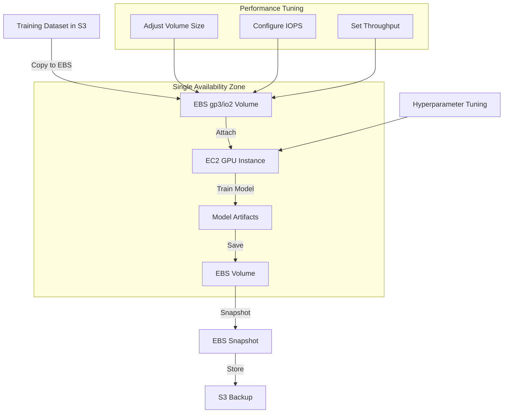

# Amazon EBS (Elastic Block Store)

## Quick Revision Block

> Key Points:
> 
> - Amazon EBS provides high-performance, persistent block storage volumes that can be attached to EC2 instances for ML workloads requiring low-latency storage.
> - EBS volumes are ideal for compute-intensive machine learning training on single instances due to their high IOPS capabilities and various volume types optimized for different performance needs.
> - Unlike shared storage options (EFS), EBS volumes can only be attached to one EC2 instance at a time, making them unsuitable for distributed ML training across multiple instances.
> - EBS snapshots provide point-in-time backups of volumes, enabling efficient data protection and migration of ML datasets and model storage volumes.

## Prerequisites

- **Block Storage Concepts**: Understanding of block-level storage and how it differs from object and file storage
- **AWS EC2**: Familiarity with EC2 instances and their integration with storage services
- **Storage Performance Metrics**: Knowledge of IOPS, throughput, and latency requirements for ML workloads

## Detailed Explanation

### What is Amazon EBS (Elastic Block Store)?

Amazon Elastic Block Store (EBS) is a high-performance, scalable block storage service designed to work with Amazon EC2 instances. EBS provides persistent storage volumes that can be attached to EC2 instances like virtual hard drives, allowing data to persist independently of the instance lifecycle. For machine learning workloads, EBS delivers the low-latency, high IOPS performance necessary for compute-intensive model training and data preprocessing on single instances.

### Key Characteristics

- **Block-Level Storage**: EBS operates at the block level, making it suitable for applications that need fast, raw storage access with consistent I/O performance.
  
- **Persistence and Durability**: EBS volumes persist independently of the EC2 instance lifecycle, with durability ranging from 99.8% to 99.999% depending on the volume type.
  
- **Performance Optimization**: Multiple volume types cater to different performance requirements:
  - General Purpose SSD (gp3/gp2): Balanced price and performance for most ML workloads
  - Provisioned IOPS SSD (io2/io1): Highest performance for I/O-intensive ML training jobs
  - Throughput Optimized HDD (st1): Cost-effective for high-throughput, sequential workloads like data preprocessing
  - Cold HDD (sc1): Lowest cost option for infrequently accessed datasets
  
- **Single-Instance Attachment**: Each EBS volume can be attached to only one EC2 instance at a time, limiting its use for distributed training across multiple instances.

### How it Works

1. **Volume Creation and Configuration**:
   - Create an EBS volume in the same Availability Zone as your EC2 instance
   - Select the appropriate volume type and size based on ML workload requirements
   - Configure performance parameters (IOPS, throughput) for SSD-based volumes

2. **Attachment and Usage**:
   - Attach the volume to an EC2 instance (must be in the same Availability Zone)
   - Format with a file system and mount for use by ML applications
   - Read and write data with the performance characteristics of the chosen volume type

3. **Data Protection**:
   - Create point-in-time snapshots for backup and recovery
   - Store snapshots in S3 with incremental backup (only changed blocks)
   - Use snapshots for migration or replication of ML environments

### Practical Real World Use Cases

- **High-Performance ML Training**: A data science team uses r5.24xlarge EC2 instances with io2 EBS volumes to train complex neural networks, benefiting from high-performance, low-latency storage for frequent read/write operations on large training datasets.
  
- **Model Development Environment**: ML engineers use EC2 instances with gp3 volumes as development environments, providing consistent performance for data preprocessing, feature engineering, and model experimentation with the ability to snapshot progress and share environments.
  
- **Batch Inference Processing**: A production ML system uses st1 volumes to store large datasets for batch inference jobs, leveraging the high-throughput capabilities for sequential processing of data while minimizing storage costs.

## System Design Considerations

### Architecture Patterns

- **ML Development Instance Pattern**: Use EBS volumes for ML development environments with snapshots for versioning and disaster recovery.
  
- **Performance-Optimized Training Pattern**: Configure EC2 instances with Provisioned IOPS volumes for high-performance training jobs with consistent latency.

### Performance Optimization

- **Volume Type Selection**: Match volume type to workload requirements - io2 for highest IOPS, gp3 for balanced performance, st1 for sequential access.
  
- **IOPS and Throughput Provisioning**: For SSD volumes, provision appropriate IOPS and throughput based on ML workload analysis to avoid bottlenecks.

### Cost Optimization

- **Right-Sizing**: Analyze storage requirements and provision appropriate volume sizes to avoid over-allocation.
  
- **Storage Tiering**: Use Throughput Optimized (st1) or Cold HDD (sc1) volumes for large training datasets with primarily sequential access patterns.

### Security Best Practices

- **Encryption**: Enable EBS encryption using AWS KMS keys for sensitive training data and model artifacts.
  
- **IAM Access Control**: Implement IAM policies to control who can create, attach, modify, and delete EBS volumes and snapshots.

## Common Exam Scenarios

- **Scenario 1**: A company needs to train a deep learning model on a large dataset with high I/O requirements. The training will run on a single EC2 instance and needs consistent performance.
  
  Solution: Use an EC2 instance with an io2 EBS volume. Configure the volume with sufficient size and provisioned IOPS to handle the expected workload. Monitor performance using CloudWatch metrics and adjust as needed. Enable encryption for data protection.

- **Scenario 2**: Data scientists need to share a common ML environment with development tools and libraries, but each needs their own workspace for experiments.
  
  Solution: Create a standard EBS volume with the common ML environment, create a snapshot, and use it as the basis for creating individual volumes for each data scientist. Each can then attach their volume to their own EC2 instance while maintaining consistency in the base environment.

- **Scenario 3**: A company needs to run distributed training across a cluster of GPU instances for a large natural language processing model.
  
  Solution: EBS volumes would not be suitable for this scenario since they can only be attached to one instance at a time. Instead, use Amazon EFS for shared storage across instances or implement a distributed training approach where each instance uses its own EBS volume and coordinates through parameter servers.

## Related Concepts

- **[Amazon EC2 Instance Store]**: Non-persistent, physically attached storage for temporary data that provides higher performance but without data durability.
  
- **[EBS Snapshots]**: Point-in-time backups of EBS volumes that are stored incrementally in S3 for data protection and migration.
  
- **[EBS vs EFS]**: Comparison of block storage (EBS) versus file storage (EFS) for different ML workload requirements.

## Learning Resources

### Official Documentation

- [Amazon EBS User Guide](https://docs.aws.amazon.com/ebs/latest/userguide/what-is-ebs.html)
- [EBS Volume Types](https://docs.aws.amazon.com/AWSEC2/latest/UserGuide/ebs-volume-types.html)

### Video Tutorials

- [AWS re:Invent 2023: Deep Dive on Amazon EBS](https://www.youtube.com/watch?v=LdGbVhWIGYU)
- [Optimizing EBS Performance for ML Workloads](https://www.youtube.com/watch?v=2iwOfHw2_Pc)

### Hands-on Labs

- [Setting Up High-Performance ML Infrastructure with EBS](https://aws.amazon.com/getting-started/hands-on/ec2-with-ebs/)
- [Optimizing EBS Volumes for Deep Learning](https://github.com/aws-samples/amazon-sagemaker-with-ebs-volumes)

### Practice Questions

- Q1: An ML engineer is setting up an environment for training a computer vision model on a single EC2 instance. The workload requires high IOPS for random read operations on the training dataset. Which EBS volume type would be most appropriate?
    - A: Provisioned IOPS SSD (io2), as it provides the highest IOPS performance with the lowest latency, making it ideal for I/O-intensive ML workloads with random access patterns.

- Q2: A data science team needs to distribute model training across multiple EC2 instances that need shared access to the same dataset. Can they use a single EBS volume for this purpose?
    - A: No, an EBS volume can only be attached to one EC2 instance at a time. For shared access across multiple instances, they should use Amazon EFS or implement a distributed training architecture where each instance works with its own copy of the data.