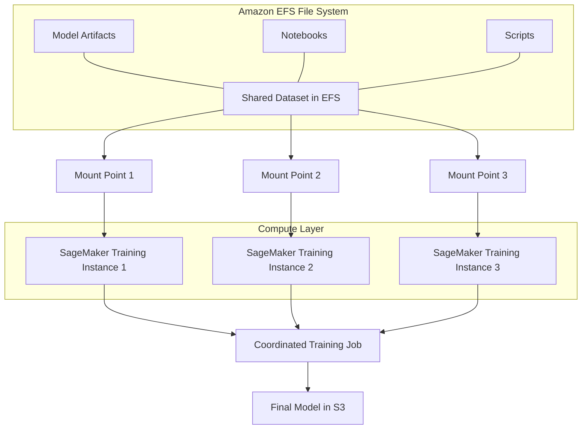

# Amazon EFS (Elastic File System)

## Quick Revision Block

> Key Points:
> 
> - Amazon EFS is a fully managed, serverless, elastic NFS file system service that provides shared file storage with automatic scaling for AWS ML workloads.
> - EFS offers the performance and consistency needed for machine learning workflows, particularly for distributed training across multiple compute instances.
> - The service integrates seamlessly with SageMaker, EC2, EKS, and other AWS compute services, enabling collaborative ML development without provisioning storage capacity.
> - EFS automatically scales to petabytes without disruption, with pay-as-you-go pricing that eliminates the need to forecast storage requirements for growing ML datasets.

## Prerequisites

- **Network File System (NFS)**: Understanding of NFS protocol and file system mounting concepts
- **AWS VPC**: Knowledge of virtual private cloud configurations and security groups
- **Linux/Unix File Systems**: Familiarity with Linux file permissions and access patterns

## Detailed Explanation

### What is Amazon EFS (Elastic File System)?

Amazon EFS is a fully managed, serverless, elastic file storage service that provides a simple, scalable, and shared Network File System (NFS) for use with AWS cloud services and on-premises resources. For machine learning workloads, EFS delivers the performance, consistency, and shared access needed for distributed training and collaboration across data science teams, automatically scaling from gigabytes to petabytes without provisioning or management.

### Key Characteristics

- **Elastic Scaling**: Amazon EFS is built to scale on demand to petabytes without disrupting applications, growing and shrinking automatically as you add and remove files, which is critical for ML projects with expanding datasets or model repositories.
  
- **Shared Access Model**: Multiple compute instances can access the same file system simultaneously, enabling distributed training across clusters and collaborative ML development across teams.
  
- **Performance Modes**:
  - General Purpose: Lower latency for most ML workloads 
  - Max I/O: Higher throughput for massively parallel access, ideal for high-performance computing in ML

- **Throughput Modes**:
  - Elastic: Automatically scales throughput up and down based on workload, ideal for variable ML processing needs
  - Provisioned: Fixed throughput for predictable performance requirements
  - Bursting: Baseline throughput with ability to burst higher when needed

### How it Works

1. **File System Creation**:
   - Create a file system in your AWS region through the console, CLI, or API
   - Select performance mode, throughput mode, and whether to use Regional (multiple AZ) or One Zone storage
   - Create mount targets in your VPC's subnets to provide access points

2. **Mounting and Access**:
   - Mount the file system on EC2 instances, SageMaker notebooks, or containers using the NFS protocol
   - Access is controlled via IAM policies and network security (security groups, VPC settings)
   - File-level permissions are managed using standard POSIX permissions

3. **Data Management**:
   - Read and write data to the file system just like a local directory
   - Data is automatically replicated (Regional) or backed up (One Zone)
   - Lifecycle management transitions infrequently accessed files to lower-cost storage

### Practical Real World Use Cases

- **Distributed ML Training**: EFS is well suited for large data AI applications where multiple instances and containers will access the same data improving collaboration and reducing data duplication. Data scientists can run distributed training jobs across multiple GPU instances with shared access to training datasets.
  
- **SageMaker Integration**: Amazon SageMaker Studio is the first fully integrated development environment (IDE) for machine learning (ML). It provides a single, web-based visual interface where you can perform all ML development steps while using EFS for shared storage needs.
  
- **Kubeflow on AWS**: Kubeflow on AWS used with AWS Deep Learning Containers and Amazon Elastic File System (Amazon EFS) simplifies collaboration and provides flexibility in training deep learning models at scale on both EKS and SageMaker in a hybrid architecture.

## System Design Considerations

### Architecture Patterns

- **Shared ML Data Repository Pattern**: Use EFS as a central repository for ML datasets, notebooks, and model artifacts across all ML environments in the organization.
  
- **Distributed Training Pattern**: Leverage EFS for parallel access from multiple compute instances to the same data, enabling linear scaling of compute resources without duplicating data.

### Performance Optimization

- **Performance Mode Selection**: Choose General Purpose mode for latency-sensitive workloads and Max I/O for throughput-intensive, highly parallel ML workloads.
  
- **Throughput Mode Selection**: Use Elastic mode for variable workloads like ad-hoc experimentation, and Provisioned mode for predictable performance during critical training jobs.

### Cost Optimization

- **Lifecycle Management**: Implement lifecycle policies to automatically move infrequently accessed datasets to the EFS Infrequent Access storage class.
  
- **One Zone Storage**: For non-critical development data, use One Zone storage which is more cost-effective than the default Regional storage that replicates across multiple Availability Zones.

### Security Best Practices

- **IAM Access Control**: NFS client access to Amazon EFS is controlled by both AWS Identity and Access Management (IAM) policies and network security policies, such as security groups, enabling fine-grained access control for your ML workflows.
  
- **Encryption**: Enable encryption at rest using AWS KMS keys and encryption in transit for sensitive ML datasets and models.

## Common Exam Scenarios

- **Scenario 1**: A data science team needs a shared file system that can be accessed by multiple SageMaker notebooks and training instances for collaborative model development. The team has unpredictable storage growth as they acquire new datasets.
  
  Solution: Use Amazon EFS with Elastic throughput mode. Create an EFS file system in the same VPC as the SageMaker resources, configure mount targets in each Availability Zone, and set up appropriate security groups. The elastic nature of EFS will handle unpredictable growth without management overhead.

- **Scenario 2**: A company needs to run distributed training for a large deep learning model across a cluster of GPU instances. The training data is several terabytes in size, and efficiency is critical.
  
  Solution: Create an EFS file system with Max I/O performance mode for high throughput, and mount it across all training instances. Use the same data path in the training script on all instances to access the dataset without duplication, improving storage efficiency and removing the need to copy data to each instance.

- **Scenario 3**: An ML operations team needs to implement a cost-effective storage solution for their ML model registry while maintaining high availability.
  
  Solution: Create an EFS file system with lifecycle management enabled, automatically moving infrequently accessed model versions to EFS Infrequent Access storage. Configure Regional storage for high availability, and set up appropriate backup policies using AWS Backup.

## Related Concepts

- **[Amazon FSx for Lustre]**: A high-performance file system optimized for compute-intensive ML workloads requiring even higher throughput than EFS Max I/O mode.
  
- **[SageMaker Studio Storage]**: How SageMaker Studio integrates with EFS to provide persistent storage for notebooks and ML assets.
  
- **[Distributed Training in AWS]**: Methods for distributing ML workloads across multiple compute instances using shared storage systems like EFS.

## Learning Resources

### Official Documentation

- [Amazon EFS User Guide](https://docs.aws.amazon.com/efs/latest/ug/whatisefs.html)
- [Amazon EFS for SageMaker](https://docs.aws.amazon.com/sagemaker/latest/dg/studio-efs-storage.html)

### Video Tutorials

- [AWS re:Invent 2023: Optimizing Storage for ML Workloads](https://www.youtube.com/watch?v=LdGbVhWIGYU)
- [EFS for Machine Learning Best Practices](https://www.youtube.com/watch?v=2xFp2rWQAZo)

### Hands-on Labs

- [Building Distributed ML Training with EFS](https://aws.amazon.com/getting-started/hands-on/distribute-training-across-instances-with-efs/)
- [Using EFS with Amazon SageMaker Studio](https://github.com/aws-samples/amazon-sagemaker-with-efs)

### Practice Questions

- Q1: A data science team wants to share training datasets between multiple EC2 instances running deep learning frameworks. Which AWS storage service is most appropriate for this use case?
    - A: Amazon EFS, as it provides a shared file system that can be mounted simultaneously by multiple EC2 instances, enabling collaborative access to the same training datasets.

- Q2: What is the primary benefit of using Amazon EFS Elastic throughput mode for machine learning workloads?
    - A: Elastic throughput mode automatically scales file system throughput up and down based on workload demands, eliminating the need to provision fixed throughput levels and optimizing costs for the variable nature of ML workloads.