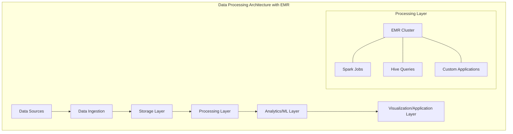

# Amazon EMR (Elastic MapReduce)

## Quick Revision Block

> Key Points:
> 
> - Amazon EMR is a cloud-based service that simplifies running big data frameworks like Apache Hadoop, Spark, and Hive on AWS for large-scale data processing and analysis.
> - EMR provides a fully managed, elastic infrastructure that automatically scales compute resources based on workload demands and supports various instance types (including GPU instances for ML).
> - The service is structured with master, core, and task nodes, with various deployment options including on-demand, reserved, and cost-efficient spot instances.
> - For the AWS ML Specialty exam, understand EMR's role in data processing pipelines, its machine learning capabilities, cluster management, and integration with other AWS services.

## Prerequisites

- **Big Data Concepts**: Understanding of distributed computing and big data processing frameworks
- **AWS Infrastructure Knowledge**: Familiarity with EC2, S3, and other core AWS services
- **Basic Programming Skills**: Knowledge of languages commonly used with EMR (Python, Scala, or Java)

## Detailed Explanation

### What is Amazon EMR?

Amazon EMR (Elastic MapReduce) is a cloud-based big data platform that simplifies the process of running large-scale distributed data processing frameworks like Apache Hadoop, Apache Spark, HBase, Presto, and Hive on AWS. It handles the provisioning and management of the underlying infrastructure, allowing data engineers and scientists to focus on analyzing data and extracting insights. EMR is designed for a variety of workloads including data transformation, machine learning, financial analysis, scientific simulation, bioinformatics, and real-time streaming analytics.

### Key Characteristics

- **Managed Framework Environment**:
  - **Pre-configured Applications**: Ready-to-use big data frameworks and tools
  - **Custom Configuration**: Ability to customize cluster configurations and install additional software
  - **Application Integration**: Seamless integration with a wide ecosystem of big data tools

- **Elastic Scaling Capabilities**:
  - **Dynamic Resource Allocation**: Ability to scale up or down based on workload requirements
  - **Instance Fleet Options**: Support for diverse instance types optimized for different workloads
  - **Spot Instance Integration**: Cost optimization through spot instance usage for task nodes

- **Performance Optimizations**:
  - **AWS-Optimized Versions**: Performance-tuned versions of open-source frameworks
  - **Storage Options**: HDFS, EMRFS (EMR File System for S3), and local file systems
  - **Advanced Configurations**: Tunable parameters for memory, CPU, disk I/O, and network throughput

### How it Works

EMR operates on a cluster architecture with the following components:

1. **Cluster Nodes**:
   - **Master Node**: Manages the cluster and coordinates distribution of data and tasks
   - **Core Nodes**: Run tasks and store data using HDFS
   - **Task Nodes**: Optional nodes that only run tasks, without storing data

2. **Cluster Lifecycle**:
   - **Provisioning**: Create a cluster with specified applications and configuration
   - **Bootstrapping**: Execute custom actions during cluster creation
   - **Job Execution**: Submit work to the cluster as steps
   - **Termination**: Shut down the cluster automatically after completion or keep it running

3. **Data Processing Flow**:
   - **Input**: Load data from sources like S3, DynamoDB, or other data stores
   - **Processing**: Process data using the chosen framework (Spark, Hadoop, etc.)
   - **Output**: Write results to destinations like S3, HDFS, or databases

```mermaid
graph TB
    A[Data Sources] --> B[EMR Cluster]
    B --> C[Data Destinations]
    
    subgraph "EMR Cluster"
        D[Master Node]
        E[Core Nodes]
        F[Task Nodes]
        
        D --- E
        D --- F
        E --- F
    end
    
    subgraph "Processing Frameworks"
        G[Apache Hadoop]
        H[Apache Spark]
        I[Apache Hive]
        J[Presto]
    end
    
    B --- Processing Frameworks
```

### Practical Real World Use Cases

- **Machine Learning at Scale**:
  - **Use Case**: Training complex ML models on large datasets
  - **Implementation**: Use Spark MLlib or custom ML libraries on EMR to distribute training across the cluster
  - **Benefits**: Process terabytes of training data efficiently, reducing training time from days to hours

- **ETL Data Processing**:
  - **Use Case**: Transforming raw log data into structured formats for analysis
  - **Implementation**: Use EMR with Spark or Hive to extract, transform, and load data into analytical data stores
  - **Benefits**: Process large volumes of data in parallel with automatic scaling based on workload

- **Genomics Data Analysis**:
  - **Use Case**: Processing genomic sequencing data for research
  - **Implementation**: Use EMR to run bioinformatics tools and custom analysis scripts across distributed nodes
  - **Benefits**: Speed up complex genetic analysis while maintaining cost efficiency for research budgets

## System Design Considerations

### Architecture Patterns

- **Transient Clusters**:
  - **Pattern**: Create clusters for specific jobs and terminate them after completion
  - **Implementation**: Script cluster creation, job submission, and termination using AWS CLI or SDK
  - **Benefits**: Maximize cost efficiency by only paying for compute when needed

- **Persistent Multi-tenant Clusters**:
  - **Pattern**: Maintain long-running clusters shared across multiple teams or applications
  - **Implementation**: Use EMR security configurations, resource management, and job scheduling
  - **Benefits**: Reduce startup overhead and provide immediate processing capabilities



### Performance Optimization

- **Cluster Configuration**:
  - **Right-sizing**: Choose appropriate instance types based on workload characteristics
  - **Cluster Composition**: Determine optimal ratio of core to task nodes
  - **Storage Configuration**: Configure HDFS replication factor and block size

- **Application Tuning**:
  - **Memory Management**: Configure executor memory, driver memory, and heap sizes
  - **Partition Optimization**: Set appropriate partition sizes for parallelism
  - **Caching Strategies**: Utilize memory caching for frequently accessed data

- **I/O Optimization**:
  - **Data Compression**: Use compression codecs to reduce data transfer and storage
  - **File Formats**: Choose optimal formats (Parquet, ORC) for your workload
  - **Partition Pruning**: Implement data partitioning strategies for efficient query performance

### Cost Optimization

- **Instance Strategy**:
  - **Spot Instances**: Use for task nodes to reduce costs up to 90%
  - **Instance Right-sizing**: Select instance types that match workload requirements
  - **Reserved Instances**: Consider for master and core nodes in long-running clusters

- **Cluster Management**:
  - **Auto-termination**: Configure clusters to terminate automatically after completion
  - **Scaling Policies**: Implement automatic scaling based on workload metrics
  - **Idle Termination**: Set up CloudWatch alarms to detect and terminate idle clusters

- **Storage Optimization**:
  - **S3 vs. HDFS**: Use S3 for persistent storage and HDFS for temporary working data
  - **Data Lifecycle Policies**: Implement tiered storage strategies for aging data
  - **Compression**: Enable compression for intermediate and output data

### Security Best Practices

- **Authentication and Authorization**:
  - **IAM Roles**: Configure appropriate roles for EMR service and EC2 instance profiles
  - **Kerberos**: Enable for user authentication on long-running clusters
  - **LDAP Integration**: Connect to corporate directory services for user management

- **Data Protection**:
  - **Encryption at Rest**: Enable for HDFS, EBS volumes, and S3 data
  - **Encryption in Transit**: Configure TLS for data in motion
  - **Key Management**: Use AWS KMS for encryption key management

- **Network Security**:
  - **VPC Deployment**: Run clusters in private subnets
  - **Security Groups**: Configure to restrict inbound and outbound traffic
  - **Block Public Access**: Ensure no accidental exposure of EMR interfaces

## Common Exam Scenarios

- **Scenario 1**: A company needs to process terabytes of log data daily for machine learning model training. The data processing involves complex transformations that can be expressed using Spark.
  - **Solution**: Use a transient EMR cluster with Spark installed. Configure the cluster to auto-terminate after completion, use spot instances for task nodes, and set up appropriate IAM roles for S3 access. The processed data can be stored in S3 in Parquet format for efficient querying.

- **Scenario 2**: A genomics research team needs to analyze large datasets periodically, with varying computational demands throughout the month.
  - **Solution**: Create EMR clusters with instance fleets to handle varying workloads, utilizing on-demand instances for master nodes and core nodes, and spot instances for task nodes. Implement EMR managed scaling to automatically adjust the number of task nodes based on workload.

- **Scenario 3**: A data science team needs to build and train multiple machine learning models on a massive dataset, requiring both data preprocessing and distributed training capabilities.
  - **Solution**: Deploy an EMR cluster with Spark and necessary ML libraries. Use EMR notebooks or EMR Studio for interactive development, and leverage Spark MLlib for distributed model training. Consider using GPU instances for deep learning workloads, and implement S3 for model storage and versioning.

## Related Concepts

- **[Apache Hadoop]**: An open-source framework that allows for distributed processing of large data sets across clusters of computers.
- **[Apache Spark]**: A unified analytics engine for large-scale data processing, offering performance improvements over traditional Hadoop MapReduce.
- **[AWS Glue]**: A serverless data integration service that complements EMR for ETL workflows, particularly for simpler, scheduled data transformations.
- **[Amazon SageMaker]**: A fully managed service for building, training, and deploying machine learning models, which can utilize data processed by EMR.

## Learning Resources

### Official Documentation

- [Amazon EMR Documentation](https://docs.aws.amazon.com/emr/latest/ManagementGuide/emr-what-is-emr.html)
- [Amazon EMR Release Guide](https://docs.aws.amazon.com/emr/latest/ReleaseGuide/emr-release-components.html)
- [EMR Best Practices](https://docs.aws.amazon.com/emr/latest/ManagementGuide/emr-plan-best-practices.html)

### Video Tutorials

- [Introduction to Amazon EMR](https://www.youtube.com/watch?v=rUTLL17vvyk)
- [Deep Dive into Amazon EMR](https://www.youtube.com/watch?v=SyWxT3EtHrE)

### Hands-on Labs

- [Getting Started with Amazon EMR](https://aws.amazon.com/getting-started/hands-on/analyze-big-data/)
- [Build a Machine Learning Pipeline with EMR and SageMaker](https://aws.amazon.com/blogs/machine-learning/build-amazon-sagemaker-notebooks-backed-by-spark-in-amazon-emr/)

### Practice Questions

- Q1: A company wants to run Spark jobs for machine learning feature engineering but is concerned about cost optimization. Which EMR cluster configuration would be most cost-effective?
    - A: Configure a transient EMR cluster with on-demand instances for master and core nodes, and spot instances for task nodes. Enable EMR managed scaling and set the cluster to auto-terminate after job completion to minimize costs while maintaining reliability for critical components.

- Q2: A data science team needs to process clickstream data for training a recommendation model. The data arrives daily in S3 as JSON files. What is the most efficient approach using EMR?
    - A: Create an EMR cluster with Spark installed and write a Spark job to read the JSON files, perform feature engineering, and save the results in Parquet format in S3. Schedule the cluster creation and job submission using AWS Step Functions or CloudWatch Events to automate the daily processing. Using Parquet format will optimize storage and query performance for the training phase.
