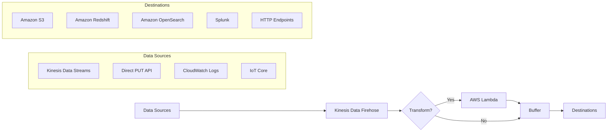
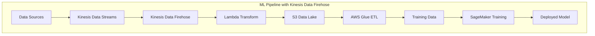

# Amazon Kinesis Data Firehose

## Quick Revision Block

> Key Points:
> 
> - Amazon Kinesis Data Firehose (now Amazon Data Firehose) is a fully managed service that reliably loads streaming data into data lakes, data stores, and analytics services.
> - The service can automatically convert data formats (e.g., to Parquet or ORC), compress, transform, and encrypt data before loading it to destinations like S3, Redshift, OpenSearch, or third-party services.
> - Unlike Kinesis Data Streams, Firehose eliminates the need to write custom code for data delivery and handles scaling, monitoring, and maintenance automatically.
> - For the AWS ML Specialty exam, understand Firehose's role in ETL pipelines, how it transforms streaming data for machine learning workflows, and how it integrates with other AWS analytics services.

## Prerequisites

- **Stream Processing Concepts**: Understanding of streaming data fundamentals and real-time processing
- **AWS Data Services**: Familiarity with AWS storage and analytics destinations (S3, Redshift, etc.)
- **Basic ETL Knowledge**: Understanding of data transformation and loading concepts

## Detailed Explanation

### What is Amazon Kinesis Data Firehose?

Amazon Kinesis Data Firehose (recently renamed to Amazon Data Firehose) is a fully managed service that automates the capture, transformation, and delivery of streaming data to various AWS data stores and analytics services. It serves as a reliable bridge between data producers and destinations, handling all the complex tasks of scaling, data transformation, and delivery management without requiring custom code development. In machine learning workflows, Firehose is often used to prepare streaming data for analysis, model training, and real-time inference.

### Key Characteristics

- **Fully Managed Service**:
  - **Zero Administration**: No servers to manage or code to maintain for data delivery
  - **Automatic Scaling**: Dynamically adjusts to handle varying data volumes
  - **Simple Integration**: Easily connects to data producers and destinations using the AWS console or APIs

- **Data Transformation Capabilities**:
  - **Format Conversion**: Automatically converts JSON to analytics-optimized formats like Parquet and ORC
  - **Data Processing**: Can invoke Lambda functions to transform data in transit
  - **Partitioning**: Dynamically partitions data by attributes for optimized storage and querying

- **Delivery Options**:
  - **Multiple Destinations**: Delivers to S3, Redshift, OpenSearch Service, Splunk, and other HTTP endpoints
  - **Backup**: Can simultaneously back up raw data to S3 while processing
  - **Batching Controls**: Configurable buffer sizes and intervals for optimized delivery

### How it Works

The Firehose workflow consists of the following steps:

1. **Data Ingestion**: Streaming data is captured from sources like Kinesis Data Streams, direct PUT API calls, or AWS services
2. **Optional Transformation**: Data can be transformed using AWS Lambda functions
3. **Buffering**: Records are buffered based on size or time configurations
4. **Delivery**: Data is reliably delivered to the configured destination(s)
5. **Error Handling**: Failed records are backed up to S3 for troubleshooting and reprocessing

### Practical Real World Use Cases

- **ML Training Data Preparation**:
  - **Use Case**: Converting and storing streaming data for ML model training
  - **Implementation**: Firehose captures streaming data, converts it to Parquet format, and delivers it to S3 for SageMaker training jobs
  - **Benefits**: Data is automatically transformed into an optimized format for efficient model training

- **Real-time Log Analytics**:
  - **Use Case**: Processing application logs for anomaly detection
  - **Implementation**: Logs flow through Firehose with Lambda transformations to extract features before delivery to analytics services
  - **Benefits**: Streamlined pipeline from raw logs to analytics-ready data without custom code

- **IoT Data Processing**:
  - **Use Case**: Managing sensor data from thousands of devices
  - **Implementation**: IoT Core sends data to Firehose, which processes and routes it to multiple destinations
  - **Benefits**: Reliable handling of variable data volumes with automatic scaling

## System Design Considerations

### Architecture Patterns

- **ETL Data Pipeline**:
  - **Pattern**: Using Firehose as the transformation and loading component in an ETL workflow
  - **Implementation**: Data Streams → Firehose (with Lambda transformation) → S3 → Glue/Athena for analysis
  - **Benefits**: Simplified management of the transformation and loading phases

- **Multi-destination Delivery**:
  - **Pattern**: Sending the same data to multiple destinations for different purposes
  - **Implementation**: Firehose with S3 backup enabled while delivering to primary destination
  - **Benefits**: Data is available for both immediate analysis and long-term storage/processing

### Performance Optimization

- **Buffer Tuning**:
  - **Size vs. Latency**: Larger buffer sizes increase throughput but add latency
  - **Interval Setting**: Shorter intervals reduce latency but may increase API calls
  - **Dynamic Adjustment**: Change settings based on traffic patterns and requirements

- **Transformation Efficiency**:
  - **Lambda Optimization**: Keep transformations lightweight and efficient
  - **Batch Processing**: Design Lambda functions to handle records in batches
  - **Memory Allocation**: Properly size Lambda functions for data volume

- **Destination Configuration**:
  - **S3 Prefixes**: Use dynamic partitioning for optimized query performance
  - **Compression**: Enable compression to reduce storage costs and improve query speed
  - **Format Selection**: Choose appropriate formats (Parquet, ORC) based on query patterns

### Cost Optimization

- **Data Volume Management**:
  - **Filtering**: Use Lambda to filter out unnecessary data before delivery
  - **Compression**: Enable compression to reduce data transfer and storage costs
  - **Format Conversion**: Convert to columnar formats to reduce query costs downstream

- **Service Configuration**:
  - **Buffer Optimization**: Tune buffer settings to reduce API calls
  - **Region Selection**: Choose regions with lower data transfer costs
  - **Reserved Capacity**: For consistent high-volume workloads, consider Reserved Capacity pricing for Kinesis Data Streams if used as a source

### Security Best Practices

- **Data Protection**:
  - **Encryption**: Enable server-side encryption for data at rest
  - **VPC Delivery**: Use VPC delivery for sensitive destinations
  - **Access Controls**: Implement strict IAM policies for Firehose access

- **Monitoring and Compliance**:
  - **CloudWatch Integration**: Monitor delivery metrics and set up alarms
  - **Error Logging**: Enable error logging to S3 for troubleshooting
  - **Data Backup**: Enable S3 backup for compliance and audit requirements

## Common Exam Scenarios

- **Scenario 1**: A company needs to ingest streaming data and store it in Apache Parquet format for machine learning model training. Which AWS service should they use?
  - **Solution**: Amazon Kinesis Data Firehose is the best choice as it can automatically convert incoming JSON data to Parquet format before delivering it to S3, without requiring custom code development.

- **Scenario 2**: A retail company wants to perform real-time analysis on purchase data while also storing it for long-term machine learning model training.
  - **Solution**: Use Kinesis Data Streams to ingest the data, then configure Firehose to read from the stream and deliver data to both Amazon OpenSearch Service for real-time analysis and S3 in Parquet format for ML training.

- **Scenario 3**: A company needs to transform streaming data before loading it into their data warehouse for business intelligence and ML feature extraction.
  - **Solution**: Configure Kinesis Data Firehose with a Lambda transformation function to clean and enrich the data, then set Redshift as the destination with appropriate S3 backup for the raw data.

## Related Concepts

- **[Amazon Kinesis Data Streams]**: A service for collecting and processing large streams of data records in real time, often used as a source for Firehose.
- **[AWS Lambda]**: A serverless compute service that can be used with Firehose to transform incoming data before delivery.
- **[Amazon S3]**: Object storage service that serves as a primary destination for Firehose deliveries and a foundation for data lakes.
- **[Amazon Redshift]**: A data warehouse service that can receive data from Firehose for analytics and machine learning workloads.

## Learning Resources

### Official Documentation

- [Amazon Data Firehose Developer Guide](https://docs.aws.amazon.com/firehose/latest/dev/what-is-this-service.html)
- [Data Format Conversion in Amazon Data Firehose](https://docs.aws.amazon.com/firehose/latest/dev/record-format-conversion.html)
- [Amazon Data Firehose Data Transformation](https://docs.aws.amazon.com/firehose/latest/dev/data-transformation.html)

### Video Tutorials

- [Introduction to Amazon Data Firehose](https://www.youtube.com/watch?v=Z4tMhO1IQ8M)
- [Building Real-time Data Pipelines with Amazon Kinesis](https://www.youtube.com/watch?v=4-JmX6MIDDI)

### Hands-on Labs

- [Stream Data to an Amazon S3 Data Lake](https://aws.amazon.com/getting-started/hands-on/stream-data-to-amazon-s3-using-amazon-kinesis-firehose/)
- [Real-time Analytics with Amazon Kinesis](https://aws.amazon.com/getting-started/hands-on/real-time-analytics-with-kinesis/)

### Practice Questions

- Q1: A Machine Learning team needs to ingest streaming data and store it in a format optimized for ML processing. Which of the following services would both ingest and store this data in the correct format with the least development effort?
    - A: Amazon Kinesis Data Firehose (now Amazon Data Firehose) is the answer because it can automatically convert streaming data to analytics-optimized formats like Parquet or ORC before storing it in S3, requiring minimal setup and no custom code.

- Q2: A retail chain has been using Kinesis Data Firehose to ingest purchasing records to S3. They now need to apply simple transformations to support ML model training. Which approach requires the least development effort?
    - A: Adding Lambda transformation to the existing Firehose delivery stream would be the most efficient approach, as it maintains the existing pipeline while adding the needed transformation capability without requiring new infrastructure or code development.
