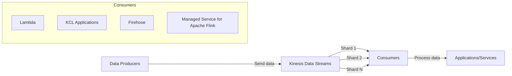
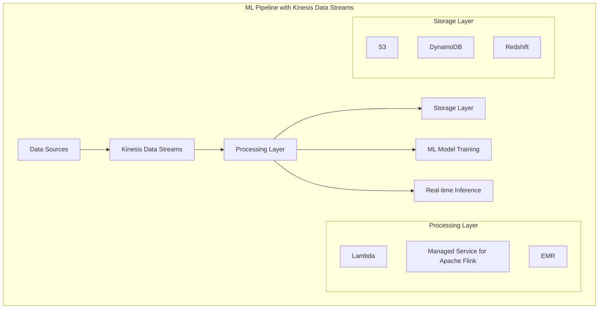

# Amazon Kinesis Data Streams

## Quick Revision Block

> Key Points:
> 
> - Amazon Kinesis Data Streams is a serverless streaming data service that collects, processes, and analyzes real-time data at any scale.
> - The service is built around shards, which can ingest up to 1MB/second or 1,000 records/second and provide up to 2MB/second read throughput.
> - Data retention in Kinesis Data Streams can be configured from 24 hours up to 365 days, making it suitable for both immediate processing and replay scenarios.
> - For the AWS ML Specialty exam, understand how Kinesis Data Streams fits into the streaming data architecture, especially in relation to Firehose, Analytics, and how it integrates with ML workflows.

## Prerequisites

- **Cloud Computing Fundamentals**: Basic understanding of distributed systems and cloud concepts
- **Data Streaming Concepts**: Familiarity with event-driven architectures and real-time data processing
- **AWS Core Services**: Knowledge of S3, Lambda, and IAM for integration with Kinesis

## Detailed Explanation

### What is Amazon Kinesis Data Streams?

Amazon Kinesis Data Streams is a massively scalable and durable real-time data streaming service. It enables you to collect and process large streams of data records in real time from thousands of sources such as website clickstreams, IoT devices, social media feeds, application logs, and more. This continuous data flow can be used to power real-time dashboards, feed into machine learning models for dynamic insights, or trigger alerts and automated actions based on specific events.

### Key Characteristics

- **Scalable Throughput**:
  - **Shards**: The fundamental throughput unit of Kinesis Data Streams, each shard providing 1MB/second ingestion capacity and 2MB/second read capacity.
  - **Dynamic Scaling**: The ability to adjust the number of shards in your stream to handle varying data volumes.
  - **Partition Keys**: Used to group related data records and determine which shard a data record belongs to.

- **Durability and Retention**:
  - **Data Persistence**: All data is stored redundantly across multiple Availability Zones.
  - **Configurable Retention**: Data can be stored from 24 hours up to 365 days, allowing for replay and recovery.
  - **Sequence Numbers**: Each record receives a unique sequence number to maintain order and enable exactly-once processing.

- **Integration Capabilities**:
  - **Producer SDK Options**: Kinesis Producer Library (KPL), AWS SDK, and Kinesis Agent for data ingestion.
  - **Consumer Options**: Kinesis Client Library (KCL), AWS Lambda, Kinesis Data Firehose, and Amazon Managed Service for Apache Flink for data processing.
  - **Cross-service Integration**: Seamless connections with AWS services like Lambda, SageMaker, and S3.

### How it Works

Kinesis Data Streams operates based on the producer-consumer model:

1. **Data Production**: Producers send data records to the stream
2. **Sharding**: Records are distributed across shards based on partition keys
3. **Data Storage**: Records are stored durably across multiple Availability Zones
4. **Data Consumption**: Consumers process the data in real time or on a scheduled basis
5. **Scaling**: Stream capacity can be adjusted by adding or removing shards

### Practical Real World Use Cases

- **Real-time Analytics**:
  - **Use Case**: Monitoring website user activity to detect patterns and anomalies
  - **Implementation**: Clickstream data is sent to Kinesis Data Streams and processed by Amazon Managed Service for Apache Flink for real-time dashboards
  - **ML Integration**: Processed data can feed machine learning models to identify user segments or predict conversion opportunities

- **IoT Data Processing**:
  - **Use Case**: Processing sensor data from industrial equipment for predictive maintenance
  - **Implementation**: Sensors send telemetry to Kinesis Data Streams, which triggers Lambda functions to analyze readings
  - **ML Integration**: The stream feeds data to SageMaker for training models to predict equipment failures

- **Log and Event Processing**:
  - **Use Case**: Analyzing application logs for security events or performance issues
  - **Implementation**: Log data streams through Kinesis to multiple consumers for different purposes (alerting, storage, analysis)
  - **ML Integration**: Historical patterns can be used to train anomaly detection models that process incoming log streams

## System Design Considerations

### Architecture Patterns

- **Fan-out Processing**:
  - **Pattern**: Multiple consumers reading from the same stream for different processing needs
  - **Implementation**: Use Enhanced Fan-Out with dedicated throughput for each consumer
  - **Benefits**: Parallel processing without throughput contention between consumers

- **Lambda Integration**:
  - **Pattern**: Serverless processing of stream records
  - **Implementation**: Configure Lambda function as a stream consumer with batch size and window settings
  - **Benefits**: Automatic scaling, reduced operational complexity, event-driven processing

### Performance Optimization

- **Shard Management**:
  - **Right-sizing**: Calculate the required number of shards based on expected throughput
  - **Auto-scaling**: Use AWS Application Auto Scaling to dynamically adjust shard count
  - **Monitoring**: Track shard-level metrics to identify hotspots or underutilization

- **Producer Optimization**:
  - **Batching**: Use the KPL for automatic batching of small records
  - **Retry Handling**: Implement exponential backoff for throttling exceptions
  - **Partition Key Design**: Distribute records evenly across shards

- **Consumer Optimization**:
  - **Enhanced Fan-Out**: Use for high-throughput consumption needs
  - **Checkpointing**: Implement regular checkpointing to track progress
  - **Parallel Processing**: Utilize multiple threads or processes for higher throughput

### Cost Optimization

- **Shard Hours**:
  - **Right-sizing**: Provision only the necessary number of shards
  - **Consolidation**: Merge shards during periods of low traffic
  - **Stream Sharing**: Use partition keys to multiplex multiple logical streams on one physical stream

- **Extended Retention**:
  - **Tiered Storage**: For data that needs longer retention, consider using Firehose to deliver to S3
  - **Selective Retention**: Apply extended retention only to streams with replay requirements

- **Data Transfer**:
  - **Co-location**: Place producers and consumers in the same AWS region
  - **Batch Processing**: Consider batching for non-real-time workloads to reduce API calls

### Security Best Practices

- **Access Control**:
  - **IAM Policies**: Implement least privilege for stream access
  - **VPC Endpoints**: Use to keep traffic within AWS network
  - **Resource-based Policies**: Control access at the stream level

- **Data Protection**:
  - **Encryption at Rest**: Enable server-side encryption with KMS
  - **Encryption in Transit**: Use HTTPS endpoints for all API calls
  - **Sensitive Data Handling**: Consider preprocessing sensitive data before ingestion

## Common Exam Scenarios

- **Scenario 1**: A company needs to collect and analyze real-time data from thousands of IoT devices, with the ability to process the data multiple ways and store it for later analysis.
  - **Solution**: Use Kinesis Data Streams as the ingestion layer, with Lambda for real-time alerting, Managed Service for Apache Flink for analytics, and Firehose to deliver processed data to S3 for long-term storage and ML model training.

- **Scenario 2**: A financial services firm needs to monitor transaction data in real time to detect potential fraud, while also maintaining a record of all transactions for compliance purposes.
  - **Solution**: Stream transaction data to Kinesis Data Streams, use Lambda to apply a real-time ML fraud detection model from SageMaker, and use Firehose to deliver the raw and enriched data to both S3 and Redshift.

- **Scenario 3**: A company wants to build a real-time recommendation engine based on user clickstream data from their website and mobile app.
  - **Solution**: Stream clickstream data to Kinesis Data Streams, process it with Managed Service for Apache Flink to identify user behaviors, and use the processed data to update a DynamoDB table that serves a SageMaker real-time inference endpoint.

## Related Concepts

- **[Amazon Kinesis Data Firehose]**: A companion service that delivers streaming data to destinations like S3, Redshift, and Elasticsearch without requiring custom consumer applications.
- **[Amazon Managed Service for Apache Flink]**: Formerly Kinesis Data Analytics, provides real-time processing of streaming data using Apache Flink, a popular stream processing framework.
- **[Batch vs Streaming Processing]**: Understanding the differences and appropriate use cases for batch and stream processing architectures.
- **[AWS Lambda]**: A serverless compute service that can act as a Kinesis Data Streams consumer for event-driven processing.

## Learning Resources

### Official Documentation

- [Amazon Kinesis Data Streams Developer Guide](https://docs.aws.amazon.com/streams/latest/dev/introduction.html)
- [Amazon Kinesis Data Streams API Reference](https://docs.aws.amazon.com/kinesis/latest/APIReference/Welcome.html)
- [AWS Streaming Data Solution for Amazon Kinesis](https://aws.amazon.com/solutions/implementations/aws-streaming-data-solution-for-amazon-kinesis/)

### Video Tutorials

- [Getting Started with Amazon Kinesis Data Streams](https://www.youtube.com/watch?v=HzSEfpA5rLc)
- [Building Real-time Applications with Amazon Kinesis](https://www.youtube.com/watch?v=3_IQrJHhLI8)

### Hands-on Labs

- [Process Streaming Data Using Amazon Kinesis and AWS Lambda](https://aws.amazon.com/getting-started/hands-on/real-time-stream-processing-using-kinesis-lambda/)
- [Build a Real-time Stream Processing Pipeline](https://aws.amazon.com/getting-started/hands-on/build-streaming-data-pipeline-amazon-kinesis-firehose-s3-redshift/)

### Practice Questions

- Q1: A company wants to ingest streaming data from IoT devices and store it in Apache Parquet format for analysis. Which AWS services should they use?
    - A: They should use Kinesis Data Firehose, as it can automatically convert incoming data to Parquet format before storing it in S3. While Kinesis Data Streams can ingest the data, it doesn't have built-in format conversion capabilities.

- Q2: A data science team needs to process a high volume of streaming data with custom transformation logic before using it for ML model training. The processing must be scalable and handle data spikes. Which approach is best?
    - A: Use Kinesis Data Streams to ingest the data, configure Enhanced Fan-Out for dedicated consumer throughput, and implement the transformation logic in a consumer application using the Kinesis Client Library (KCL), which provides automatic scaling through shard leasing and checkpointing.
