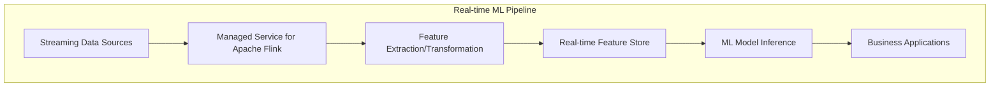

# Amazon Managed Service for Apache Flink

## Quick Revision Block

> Key Points:
> 
> - Amazon Managed Service for Apache Flink (formerly Kinesis Data Analytics) is a fully managed service for real-time processing of streaming data using Apache Flink.
> - The service supports both SQL and Java/Python/Scala applications, allowing developers to process and analyze streaming data using familiar languages.
> - Applications can ingest data from Kinesis Data Streams, Kinesis Data Firehose, or MSK and output results to various destinations including S3, Redshift, and other AWS services.
> - For the AWS ML Specialty exam, understand how this service enables real-time machine learning inference, feature engineering, and how it integrates with the ML pipeline.

## Prerequisites

- **Streaming Data Concepts**: Understanding of real-time data processing paradigms
- **Basic SQL Knowledge**: Familiarity with SQL syntax for SQL-based applications
- **AWS Streaming Services**: Knowledge of Kinesis Data Streams and related services

## Detailed Explanation

### What is Amazon Managed Service for Apache Flink?

Amazon Managed Service for Apache Flink (formerly Amazon Kinesis Data Analytics) is a fully managed service that enables you to process and analyze streaming data in real time using Apache Flink, an open-source framework and distributed processing engine. This service eliminates the operational complexity of deploying and maintaining Apache Flink applications, allowing developers to focus on building real-time data processing logic using familiar languages like SQL, Java, Python, or Scala. The service automatically provisions resources, scales to match application demands, and handles maintenance tasks, making it easier to derive insights from streaming data.

### Key Characteristics

- **Processing Paradigms**:
  - **SQL-based Applications**: For simple transformations and analytics using familiar SQL syntax
  - **Apache Flink Applications**: For complex event processing using Java, Python, or Scala
  - **Windowed Processing**: Support for time-based, count-based, and session-based windows

- **Operational Simplicity**:
  - **Fully Managed**: No need to provision or maintain infrastructure
  - **Automatic Scaling**: Scales compute resources based on incoming data volume
  - **High Availability**: Built-in fault tolerance and automatic application recovery

- **Integration Capabilities**:
  - **Multiple Input Sources**: Ingest from Kinesis Data Streams, MSK, and self-managed Apache Kafka
  - **Diverse Output Destinations**: Send results to S3, Redshift, OpenSearch, Lambda, and other AWS services
  - **Monitoring Integration**: Native integration with CloudWatch for metrics and logging

### How it Works

The service operates by:

1. **Ingesting Data**: Reading streaming data from sources like Kinesis Data Streams or Apache Kafka
2. **Processing in Real Time**: Executing SQL statements or Flink applications against the streaming data
3. **State Management**: Maintaining application state for stateful processing like aggregations
4. **Outputting Results**: Sending processed data to destinations for storage, visualization, or further processing

```mermaid
graph LR
    A[Data Sources] --> B[Amazon Managed Service for Apache Flink]
    B --> C[Destinations]
    
    subgraph "Data Sources"
        D[Kinesis Data Streams]
        E[Amazon MSK]
        F[Self-managed Kafka]
    end
    
    subgraph "Processing Options"
        G[SQL Applications]
        H[Java Applications]
        I[Python Applications]
        J[Scala Applications]
    end
    
    subgraph "Destinations"
        K[Amazon S3]
        L[Amazon Redshift]
        M[Amazon OpenSearch]
        N[AWS Lambda]
        O[Kinesis Data Firehose]
    end
    
    B --- Processing Options
```

### Practical Real World Use Cases

- **Real-time ML Feature Engineering**:
  - **Use Case**: Creating features for machine learning models from streaming data
  - **Implementation**: Process raw events to extract, transform, and normalize features in real time
  - **Benefits**: Enables more responsive ML models that can adapt to changing patterns quickly

- **Anomaly Detection**:
  - **Use Case**: Identifying unusual patterns in streaming data for fraud detection or monitoring
  - **Implementation**: Apply statistical methods or ML models to detect outliers in the data stream
  - **Benefits**: Immediate detection and alerting for timely response to potential issues

- **Time Series Analytics**:
  - **Use Case**: Analyzing time-based patterns in streaming data
  - **Implementation**: Apply windowed aggregations and trend analysis to identify patterns
  - **Benefits**: Real-time insights into temporal patterns for business decision making

## System Design Considerations

### Architecture Patterns

- **Lambda Architecture**:
  - **Pattern**: Combining batch and stream processing for complete analytics
  - **Implementation**: Use Managed Service for Apache Flink for real-time processing and batch processes for historical analysis
  - **Benefits**: Balance between accuracy (batch) and speed (streaming)

- **Streaming ETL**:
  - **Pattern**: Transforming data in transit before storage
  - **Implementation**: Process and enrich streaming data before delivering to data lakes or warehouses
  - **Benefits**: Reduced latency and storage efficiency through pre-processing



### Performance Optimization

- **Parallelism Configuration**:
  - **Parallelism Setting**: Adjust based on input data volume and processing complexity
  - **Operator Chain Strategy**: Configure to optimize execution graph
  - **Checkpoint Interval**: Balance between recovery time and performance overhead

- **State Management**:
  - **State Backend Selection**: Choose appropriate backend for your workload
  - **TTL Configuration**: Set time-to-live for state to avoid unbounded growth
  - **Checkpointing**: Configure properly to balance durability and performance

- **Window Tuning**:
  - **Window Type Selection**: Choose between tumbling, sliding, or session windows
  - **Window Size**: Balance between analytical accuracy and processing delay
  - **Watermark Strategy**: Configure for handling late-arriving data

### Cost Optimization

- **Resource Allocation**:
  - **Right-sizing**: Determine appropriate KPU (Kinesis Processing Unit) count
  - **Autoscaling**: Configure to handle variable workloads efficiently
  - **On-demand vs. Provisioned**: Choose based on usage patterns

- **Input/Output Optimization**:
  - **Data Filtering**: Process only necessary data to reduce compute requirements
  - **Aggregation**: Combine records when possible to reduce output volume
  - **Compression**: Enable for reduced data transfer costs

- **Monitoring and Cleanup**:
  - **Metric-based Alerts**: Set up to identify inefficient resource usage
  - **Unused Application Cleanup**: Remove inactive applications
  - **Log Level Management**: Adjust to balance troubleshooting needs and storage costs

### Security Best Practices

- **Authentication and Authorization**:
  - **IAM Roles**: Implement least privilege for application access
  - **In-application Permissions**: Control access to specific streams or topics
  - **VPC Integration**: Run applications within private networks

- **Data Protection**:
  - **Encryption in Transit**: Enable TLS for all connections
  - **Encryption at Rest**: Configure for application checkpoints and state
  - **Sensitive Data Handling**: Implement masking or tokenization for PII

- **Monitoring and Auditing**:
  - **CloudWatch Integration**: Track application metrics and logs
  - **CloudTrail Logging**: Record API activities for audit purposes
  - **VPC Flow Logs**: Monitor network traffic for security analysis

## Common Exam Scenarios

- **Scenario 1**: A financial services company needs to detect potential fraud in credit card transactions in real-time, with the ability to analyze patterns over time windows.
  - **Solution**: Implement an Amazon Managed Service for Apache Flink application that ingests transaction data from Kinesis Data Streams, applies a combination of rule-based filters and ML models to detect anomalies, and outputs alerts to a Lambda function that can initiate further actions.

- **Scenario 2**: An e-commerce platform wants to provide real-time personalized recommendations based on user browsing behavior.
  - **Solution**: Create a Managed Service for Apache Flink application that processes clickstream data, updates user profiles in real-time, computes similarity scores or applies ML models for recommendations, and sends results to a DynamoDB table that backs the recommendation API.

- **Scenario 3**: An IoT solution needs to process sensor data from thousands of devices, perform aggregations, and identify devices that require maintenance based on anomalous readings.
  - **Solution**: Use Managed Service for Apache Flink to ingest IoT data from Kinesis Data Streams, apply time-windowed aggregations to compute device statistics, implement anomaly detection algorithms, and output maintenance alerts while storing processed data in S3 for historical analysis.

## Related Concepts

- **[Amazon Kinesis Data Streams]**: A massively scalable, durable real-time data streaming service that can serve as an input source for Managed Service for Apache Flink.
- **[Apache Flink]**: The open-source stream processing framework that powers Amazon Managed Service for Apache Flink.
- **[Amazon MSK]**: A fully managed service for Apache Kafka that can be used as a data source for Managed Service for Apache Flink.
- **[Real-time ML Inference]**: The process of making predictions using machine learning models on streaming data as it arrives.

## Learning Resources

### Official Documentation

- [Amazon Managed Service for Apache Flink Developer Guide](https://docs.aws.amazon.com/kinesisanalytics/latest/java/what-is.html)
- [Amazon Managed Service for Apache Flink SQL Reference](https://docs.aws.amazon.com/kinesisanalytics/latest/sqlref/analytics-sql-reference.html)
- [Amazon Managed Service for Apache Flink API Reference](https://docs.aws.amazon.com/kinesisanalytics/latest/apiv2/Welcome.html)

### Video Tutorials

- [Introduction to Amazon Managed Service for Apache Flink](https://www.youtube.com/watch?v=kGXUFZYcHUQ)
- [Building Real-time Applications with Managed Service for Apache Flink](https://www.youtube.com/watch?v=Oh8AdN_u93g)

### Hands-on Labs

- [Getting Started with Amazon Managed Service for Apache Flink](https://aws.amazon.com/getting-started/hands-on/build-streaming-analytics-application/)
- [Real-time Analytics with Managed Service for Apache Flink](https://aws.amazon.com/getting-started/hands-on/real-time-analytics-apache-flink/)

### Practice Questions

- Q1: A company wants to process streaming data from IoT devices and perform complex event processing that includes time-based windowing functions. Which configuration of Amazon Managed Service for Apache Flink should they use?
    - A: They should create a Flink application using the Java/Python SDK rather than SQL, as this provides full access to Apache Flink's powerful windowing capabilities, state management, and complex event processing functions needed for sophisticated IoT analytics.

- Q2: A data scientist needs to generate features for a machine learning model from streaming data in real-time. The features need to be calculated using sliding windows of 5 minutes with updates every 1 minute. Which service is best suited for this requirement?
    - A: Amazon Managed Service for Apache Flink is ideal for this use case because it provides built-in support for sliding window operations, can process streaming data in real-time, and can output the calculated features to a variety of destinations that can feed into the ML pipeline.
