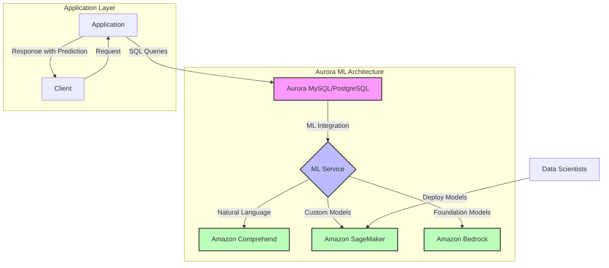

# Amazon RDS

## Quick Revision Block

> Key Points:
> 
> - Amazon RDS is a fully managed relational database service that automates time-consuming administration tasks and simplifies the deployment, operation, and scaling of relational databases.
> - RDS integrates with machine learning services (Amazon SageMaker, Amazon Comprehend, Amazon Bedrock) through Aurora ML, enabling SQL-based ML predictions directly in database queries without specialized ML knowledge.
> - Zero-ETL integrations with Amazon Redshift provide seamless access to analytics and machine learning capabilities on RDS data without complex data pipeline management.
> - RDS supports multiple database engines (MySQL, PostgreSQL, MariaDB, Oracle, SQL Server, and DB2) with specialized features for ML workflows and data security.

## Prerequisites

- **Relational Database Concepts**: Understanding of SQL and relational database design principles
- **AWS Identity and Access Management**: Knowledge of IAM roles and policies for secure service integration
- **Data Pipeline Fundamentals**: Basic understanding of data movement between services

## Detailed Explanation

### What is Amazon RDS?

Amazon Relational Database Service (RDS) is a managed service that makes it easy to set up, operate, and scale relational databases in the AWS cloud. It handles routine database tasks such as provisioning, patching, backups, recovery, failure detection, and repair, allowing developers to focus on application development rather than database administration. For machine learning workloads, RDS serves as both a source for training data and a destination for ML model predictions.

### Key Characteristics

- **Fully Managed Service**: RDS automates undifferentiated database management tasks like provisioning, patching, backups, and high availability, reducing operational overhead for ML teams.
  
- **Multiple Database Engines**: RDS supports six database engines including MySQL, PostgreSQL, MariaDB, Oracle, SQL Server, and DB2, providing flexibility to choose the right database for different ML application requirements.
  
- **Aurora Integration**: Amazon Aurora, a MySQL and PostgreSQL-compatible database engine built for the cloud, provides advanced ML capabilities through Aurora Machine Learning.
  
- **Performance and Scalability**: RDS offers various instance types optimized for different workloads, from memory-optimized instances for ML feature computation to storage-optimized instances for large datasets.

### How it Works

1. **Database Deployment and Management**:
   - Create an RDS instance in the AWS Management Console, CLI, or API
   - Select database engine, instance size, storage type, and high availability options
   - RDS handles underlying infrastructure management automatically

2. **Integration with ML Services**:
   - Aurora ML enables direct integration with SageMaker, Comprehend, and Bedrock
   - Set up IAM roles to allow your RDS/Aurora instance to access ML services
   - Use SQL functions to invoke ML models and process results within database queries

3. **Data Management for ML Workflows**:
   - Store structured training data in RDS tables
   - Use RDS as a source for ML model training via native integration or ETL processes
   - Store ML model predictions back in RDS for application use

### Practical Real World Use Cases

- **Real-time Fraud Detection**: Financial services applications use Aurora ML to directly invoke fraud detection models from SageMaker within transaction processing workflows, enabling immediate risk assessment without complex application integration.
  
- **Sentiment Analysis on Customer Feedback**: E-commerce platforms use the native integration between Aurora and Amazon Comprehend to analyze sentiment in customer reviews directly through SQL queries, automatically categorizing feedback for business intelligence.
  
- **Product Recommendation Systems**: Retail applications leverage RDS to store customer behavior data, which flows to ML services for recommendation model training, with predictions stored back in RDS for retrieval during customer sessions.

## System Design Considerations

### Architecture Patterns

- **Database-Driven ML Pattern**: Use RDS/Aurora as the primary data store with ML predictions executed directly in the database using Aurora ML.
  
- **ML Data Pipeline Pattern**: Use RDS as a source or destination in a data pipeline architecture for ML workflows, with data extraction, transformation, and movement handled by services like AWS Data Pipeline.

### Performance Optimization

- **Instance Type Selection**: Choose appropriate RDS instance types based on ML workload requirements - memory-optimized for complex queries, storage-optimized for large datasets.
  
- **Read Replicas**: Implement read replicas to offload analytical queries for ML feature engineering from the primary database.

### Cost Optimization

- **Instance Sizing**: Right-size RDS instances to match workload requirements and utilize reserved instances for predictable workloads.
  
- **Storage Tiering**: Implement appropriate storage options (SSD, IOPS Provisioned) based on performance needs and leverage storage auto-scaling.

### Security Best Practices

- **IAM Role Configuration**: Create and manage appropriate IAM roles with least privilege principles for integrations between RDS and ML services.
  
- **Encryption**: Enable encryption at rest for RDS instances and snapshots storing sensitive data used in ML workflows.

## Common Exam Scenarios

- **Scenario 1**: A company wants to implement sentiment analysis on customer feedback stored in their database without building complex ML infrastructure or training custom models.
  
  Solution: Use Amazon Aurora MySQL or PostgreSQL with Aurora ML integration to Amazon Comprehend. Configure the necessary IAM roles for Aurora to access Comprehend, and implement SQL functions to invoke sentiment analysis directly from SQL queries.

- **Scenario 2**: A financial services company needs to analyze transaction data for fraud patterns but must keep sensitive data within their database environment.
  
  Solution: Implement Aurora ML with SageMaker integration, where the fraud detection model is deployed in SageMaker and invoked directly from Aurora. This approach maintains data security by minimizing data movement while leveraging advanced ML capabilities.

- **Scenario 3**: A retail company wants to analyze customer purchase history data for business intelligence without complex ETL processes.
  
  Solution: Implement zero-ETL integration between Amazon Aurora and Amazon Redshift, allowing transactional data to be automatically replicated to the data warehouse for analytics without building and managing data pipelines.

## Related Concepts

- **[Aurora Machine Learning]**: A feature of Amazon Aurora that provides SQL functions to invoke ML services directly from database queries.
  
- **[Zero-ETL Integration]**: Technology that automatically replicates data from RDS to analytical services without traditional extract, transform, and load processes.
  
- **[Database Parameter Groups]**: Configuration mechanisms in RDS used to set parameters for ML service integration.

## Learning Resources

### Official Documentation

- [Amazon RDS User Guide](https://docs.aws.amazon.com/AmazonRDS/latest/UserGuide/Welcome.html)
- [Aurora Machine Learning](https://docs.aws.amazon.com/AmazonRDS/latest/AuroraUserGuide/aurora-ml.html)

### Video Tutorials

- [AWS re:Invent 2023: Integrating ML with Relational Databases](https://www.youtube.com/watch?v=LdGbVhWIGYU)
- [Building ML-Powered Applications with Aurora Machine Learning](https://www.youtube.com/watch?v=2iwOfHw2_Pc)

### Hands-on Labs

- [Getting Started with Aurora Machine Learning](https://aws.amazon.com/getting-started/hands-on/amazon-aurora-machine-learning/)
- [Implementing Sentiment Analysis with Aurora and Comprehend](https://github.com/aws-samples/amazon-aurora-ml-workshop)

### Practice Questions

- Q1: A company wants to perform natural language processing on customer feedback stored in their Aurora MySQL database without extracting the data or building custom ML pipelines. Which AWS service integration would be most appropriate?
    - A: Amazon Aurora Machine Learning integration with Amazon Comprehend, which allows direct invocation of sentiment analysis, key phrase extraction, and other NLP functions from SQL queries within the database.

- Q2: What IAM configurations are required to enable Aurora Machine Learning with Amazon SageMaker?
    - A: An IAM role with permissions to invoke SageMaker endpoints must be created and associated with the Aurora DB cluster through the aws_default_sagemaker_role parameter in a custom DB cluster parameter group.