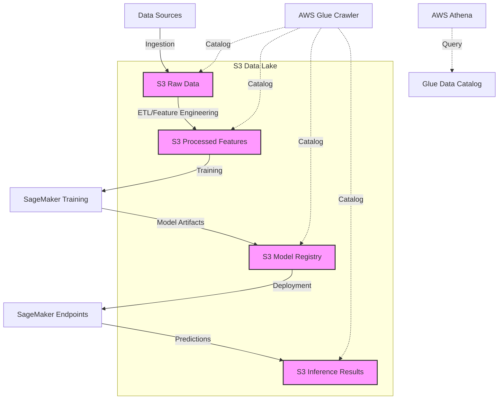

# Amazon S3

## Quick Revision Block

> Key Points:
> 
> - Amazon S3 is AWS's scalable object storage service with 11 9's of durability, providing virtually unlimited storage capacity ideal for ML datasets and model artifacts.
> - S3 integrates seamlessly with SageMaker and other AWS ML services, serving as the foundation for data lakes and enabling centralized data management for ML workflows.
> - Multiple storage classes (Standard, Intelligent-Tiering, IA, Glacier) and S3 Express One Zone enable cost-performance optimization for different stages of ML lifecycle.
> - S3's security features include fine-grained access control, encryption, and integration with AWS security services for protection of sensitive ML datasets.

## Prerequisites

- **Cloud Storage Concepts**: Understanding of object storage principles and how they differ from block and file storage
- **AWS IAM**: Familiarity with AWS Identity and Access Management for implementing proper access controls
- **Data Organization**: Knowledge of data structuring approaches like partitioning and cataloging for efficient data access

## Detailed Explanation

### What is Amazon S3?

Amazon S3 (Simple Storage Service) is AWS's highly scalable, durable, and secure object storage service that enables storing and retrieving any amount of data from anywhere on the web. For machine learning workflows, S3 serves as the primary repository for training datasets, validation data, model artifacts, and batch prediction outputs, with a durability of 99.999999999% (11 9's) and virtually unlimited storage capacity.

### Key Characteristics

- **Object-Based Storage Architecture**: S3 stores data as objects (files) within buckets (containers), with each object containing the data, metadata, and a unique identifier, making it ideal for unstructured or semi-structured ML datasets.
  
- **Storage Classes for Cost Optimization**: S3 offers multiple storage tiers including:
  - S3 Standard: High-performance access for active ML training data
  - S3 Intelligent-Tiering: Automatically moves data between access tiers based on usage patterns
  - S3 Standard-IA/One Zone-IA: Lower cost for less frequently accessed reference datasets
  - S3 Glacier: Archival storage for historical ML experiment data
  - S3 Express One Zone: High-performance, low-latency storage for ML workloads with strict performance requirements
  
- **Global Availability with Regional Isolation**: S3 is globally accessible but stores data in the AWS region of your choice, allowing you to optimize for data residency, latency, and compliance requirements in ML workflows.

### How it Works

S3 functions within ML workflows through a versatile, API-driven architecture:

1. **Data Organization**:
   - Data is stored in buckets with unique, globally-recognized names
   - Objects within buckets can be organized using prefixes (folder-like structures)
   - Metadata tagging enables categorization and discovery of ML assets

2. **Access Mechanisms**:
   - RESTful API for programmatic access from ML applications
   - AWS SDK integration for language-specific access
   - S3 Select for querying data within objects without retrieving entire files
   - Direct integration with SageMaker and other AWS ML services

3. **Data Management Features**:
   - Versioning to track and retrieve previous versions of ML datasets and models
   - Lifecycle policies to automatically transition data between storage classes
   - Event notifications to trigger ML workflows when data changes
   - Replication for redundancy and reduced latency

### Practical Real World Use Cases

- **ML Training Dataset Repository**: A computer vision company stores petabytes of labeled image data in S3, organized by categories and versions. They use S3's versioning capability to track dataset evolution, S3 Select to efficiently sample training examples, and integration with SageMaker for model training.
  
- **Automated ML Pipeline**: A fintech company implements an end-to-end ML pipeline where transaction data is streamed to S3, triggering Lambda functions that preprocess the data and start SageMaker training jobs. Final models are stored back in S3 and automatically deployed to production endpoints.
  
- **Multi-Team ML Research Environment**: A pharmaceutical research organization uses S3 bucket policies and IAM roles to provide secure, compartmentalized access to different research teams while maintaining a centralized data lake architecture, enabling collaboration while enforcing compliance requirements.

## System Design Considerations

### Architecture Patterns

- **Data Lake Pattern**: Use S3 as the foundation of an ML data lake, with organized prefixes for raw data, processed features, model artifacts, and inference results. Add AWS Glue for data cataloging and discovery.
  
- **ML Model Registry Pattern**: Implement a structured approach to model management by storing model artifacts in S3 with standardized paths, metadata tagging for model properties, and versioning to track iterations.

### Performance Optimization

- **S3 Transfer Acceleration**: Enable for faster uploads/downloads of large ML datasets across geographic distances, using the AWS edge network.
  
- **S3 Prefix Organization**: Design prefix hierarchies (folder structures) that optimize for parallel access and avoid hotspots, especially for distributed ML training workloads.

### Cost Optimization

- **Intelligent-Tiering for Variable Access Patterns**: Use S3 Intelligent-Tiering for datasets with changing access patterns throughout the ML lifecycle, automatically moving data to the most cost-effective access tier.
  
- **Lifecycle Policies for ML Assets**: Implement automated lifecycle policies to transition historical training data, experiment logs, and deprecated models to lower-cost storage tiers.

### Security Best Practices

- **Encryption at Rest and in Transit**: Enable default encryption for S3 buckets containing sensitive ML data, using either SSE-S3, SSE-KMS, or SSE-C based on security requirements.
  
- **Fine-Grained Access Control**: Implement bucket policies, IAM policies, and Access Control Lists to provide least-privilege access to ML teams and applications.

## Common Exam Scenarios

- **Scenario 1**: A company wants to implement a machine learning workflow where multiple teams need access to the same datasets, but with different permission levels. Some teams should only have read access, while others need write access to specific prefixes.
  
  Solution: Use S3 bucket policies in combination with IAM roles to implement fine-grained access control. Create role-based access patterns where read-only roles can access the entire bucket, while write roles have conditional access based on prefixes. Use S3 Access Points to simplify managing access for different teams.

- **Scenario 2**: An ML workflow processes sensitive healthcare data that must remain encrypted and cannot leave specific geographic regions due to compliance requirements.
  
  Solution: Store the data in S3 buckets in the compliant region with default encryption enabled using KMS keys. Configure bucket policies to deny any requests that don't use HTTPS. Implement S3 Block Public Access settings and use AWS CloudTrail to audit all access. Use VPC endpoints for S3 to ensure data never travels over the public internet.

- **Scenario 3**: A machine learning pipeline needs to efficiently process large CSV files by extracting only specific columns for training, without downloading the entire dataset.
  
  Solution: Use S3 Select to query and retrieve only the needed columns from the CSV files. This reduces data transfer and processing time by filtering the data at the storage layer rather than after retrieval. For larger-scale queries across multiple files, consider using Amazon Athena with AWS Glue to catalog and query the data.

## Related Concepts

- **[Data Lakes]**: A centralized repository that stores structured and unstructured data at any scale, commonly built on S3 for ML projects.
  
- **[SageMaker Integration]**: How Amazon SageMaker uses S3 for storing datasets, model artifacts, and batch processing results.
  
- **[ETL Processes]**: Extract, Transform, Load workflows that process raw data in S3 for ML feature engineering.

## Learning Resources

### Official Documentation

- [Amazon S3 Developer Guide](https://docs.aws.amazon.com/AmazonS3/latest/dev/Welcome.html)
- [Machine Learning with S3](https://docs.aws.amazon.com/sagemaker/latest/dg/model-train-storage.html)

### Video Tutorials

- [AWS re:Invent 2023: Optimizing ML Training on S3](https://www.youtube.com/watch?v=PbvlHdBitLs)
- [Building ML Data Pipelines with S3](https://www.youtube.com/watch?v=Nqt4HjdN8hE)

### Hands-on Labs

- [Processing ML Datasets with S3 and SageMaker](https://aws.amazon.com/getting-started/hands-on/build-train-deploy-machine-learning-model-sagemaker/)
- [Building a Data Lake with S3](https://aws.amazon.com/getting-started/hands-on/build-data-lake-s3/)

### Practice Questions

- Q1: A data scientist is training a deep learning model and needs to store multiple versions of the model artifacts with the ability to revert to previous versions if needed. Which S3 feature should they enable?
    - A: S3 Versioning, which maintains multiple variants of an object in the same bucket, allowing you to preserve, retrieve, and restore every version of every object stored in your bucket.

- Q2: A machine learning team needs to query specific columns from large CSV files stored in S3 without downloading the entire files. Which S3 feature provides this capability?
    - A: S3 Select, which enables applications to retrieve only a subset of data from an object by using simple SQL expressions, reducing the amount of data transferred and improving query performance.