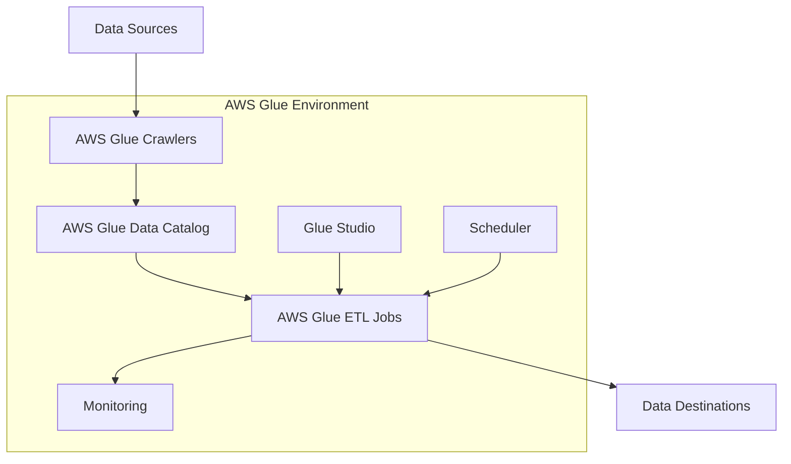
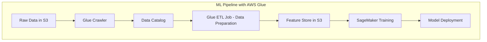

# AWS Glue

## Quick Revision Block

> Key Points:
> 
> - AWS Glue is a fully managed, serverless data integration service that makes it easy to discover, prepare, move, and integrate data from multiple sources for analytics and machine learning.
> - The service consists of three main components: Data Catalog (centralized metadata repository), ETL engine (generates Scala or Python code), and scheduler (manages dependencies and job execution).
> - AWS Glue features include crawlers for automatic schema discovery, transformations for data preparation, and visual ETL through Glue Studio, all with no infrastructure to manage.
> - For the AWS ML Specialty exam, understand Glue's role in the ML pipeline for data preparation, feature engineering, and how it integrates with services like Amazon S3, Redshift, Athena, and SageMaker.

## Prerequisites

- **Data Storage Concepts**: Understanding of various data stores like S3, RDS, and DynamoDB
- **ETL Fundamentals**: Familiarity with Extract, Transform, Load processes
- **Basic Programming Knowledge**: Some understanding of Python or Scala is helpful but not required

## Detailed Explanation

### What is AWS Glue?

AWS Glue is a fully managed, serverless data integration service that simplifies the process of discovering, preparing, and combining data for analytics, machine learning, and application development. It eliminates the need for setting up and managing infrastructure, allowing users to focus on transforming and analyzing their data. Glue automates much of the time-consuming work of data preparation, making it faster to get insights from data through analytics and machine learning.

### Key Characteristics

- **Serverless Architecture**:
  - **No Infrastructure Management**: No need to provision or maintain servers
  - **Automatic Scaling**: Dynamically scales resources based on workload
  - **Pay-per-use Pricing**: Charged only for resources consumed during job execution

- **Comprehensive Data Integration**:
  - **Wide Source Compatibility**: Connects to 70+ diverse data sources
  - **Unified Metadata Management**: Centralizes data definitions in the Data Catalog
  - **Multiple Processing Options**: Supports batch, micro-batch, and streaming workloads

- **Developer-Friendly Features**:
  - **Code Generation**: Automatically generates ETL code in Python or Scala
  - **Visual Interface**: Glue Studio for no-code ETL development
  - **Interactive Sessions**: Interactive data preparation and exploration

### How it Works

AWS Glue functions through three main components working together:

1. **Data Catalog**: A central metadata repository that stores information about data sources, schemas, and transformations
2. **ETL Engine**: Generates and executes code for data transformation based on defined jobs
3. **Scheduler**: Manages job execution, dependencies, and resource allocation

The typical workflow includes:

1. **Data Discovery**: Crawlers scan data sources and populate the Data Catalog
2. **Job Definition**: Define transformation logic using visual tools or code
3. **Job Execution**: Run jobs on a schedule, on-demand, or based on events
4. **Monitoring**: Track job progress and performance

### Practical Real World Use Cases

- **Data Lake Creation and Management**:
  - **Use Case**: Building a centralized repository for diverse data types
  - **Implementation**: Glue catalogs data from various sources, transforms it into analytics-friendly formats, and stores it in S3
  - **Benefits**: Unified access to data for analytics and ML, optimized storage costs, and simplified governance

- **Machine Learning Data Preparation**:
  - **Use Case**: Feature engineering for ML models
  - **Implementation**: Glue transforms raw data into feature vectors, handles missing values, and converts to formats optimized for training
  - **Benefits**: Accelerates ML development cycle, standardizes feature creation, and enables reproducible ML pipelines

- **Real-time Analytics Pipeline**:
  - **Use Case**: Processing streaming data for timely insights
  - **Implementation**: Glue Streaming ETL processes data from Kinesis streams, transforms it, and loads it into analytics platforms
  - **Benefits**: Reduces latency for business decisions, provides consistent processing for batch and streaming, and scales automatically with data volume

## System Design Considerations

### Architecture Patterns

- **Data Catalog as Central Repository**:
  - **Pattern**: Using Glue Data Catalog as the single source of truth for metadata
  - **Implementation**: Integrate with Lake Formation for fine-grained access control
  - **Benefits**: Consistent data definitions, simplified governance, and secure data sharing

- **ETL Orchestration**:
  - **Pattern**: Creating complex data pipelines with dependencies
  - **Implementation**: Use Glue triggers and workflows to create multi-stage processing
  - **Benefits**: Automated data flow, reliable execution, and simplified maintenance

### Performance Optimization

- **Job Configuration**:
  - **Worker Type Selection**: Choose appropriate worker type (Standard, G.1X, G.2X) based on workload
  - **DPU Allocation**: Allocate sufficient Data Processing Units for complex transformations
  - **Job Bookmarks**: Enable for incremental processing and to avoid reprocessing data

- **Data Partitioning**:
  - **Partitioning Strategy**: Design optimal partitioning for data sources and targets
  - **Pushdown Predicates**: Use to filter data at the source rather than after loading
  - **Dynamic Frame Optimization**: Configure appropriate parameters for your data characteristics

- **Spark Tuning**:
  - **Memory Configuration**: Adjust executor memory settings for large datasets
  - **Parallelism**: Set appropriate number of partitions for distributed processing
  - **Caching**: Use strategic caching for frequently accessed datasets

### Cost Optimization

- **Resource Management**:
  - **Right-sizing**: Choose appropriate worker types and numbers
  - **Timeout Settings**: Configure appropriate job timeouts to prevent runaway costs
  - **Development Endpoints**: Use sparingly and terminate when not in use

- **Job Execution Strategy**:
  - **Incremental Processing**: Use job bookmarks to only process new data
  - **Scheduling Efficiency**: Schedule jobs during off-peak hours
  - **Job Consolidation**: Combine related transformations into single jobs when possible

- **Storage Optimization**:
  - **Data Format Selection**: Use columnar formats like Parquet for analytics workloads
  - **Compression**: Enable compression for intermediate and output data
  - **Lifecycle Policies**: Implement for temporary or intermediate data

### Security Best Practices

- **Access Control**:
  - **IAM Roles**: Implement least privilege access for Glue resources
  - **Resource Policies**: Apply to Data Catalog for fine-grained control
  - **Lake Formation Integration**: For column-level and row-level security

- **Data Protection**:
  - **Encryption at Rest**: Enable for Data Catalog and ETL job storage
  - **Encryption in Transit**: Configure for secure data movement
  - **Sensitive Data Detection**: Use Glue's built-in classifiers to identify sensitive information

- **Network Security**:
  - **VPC Configuration**: Run jobs within VPC for isolated network environment
  - **Security Groups**: Configure appropriate ingress and egress rules
  - **Connection Encryption**: Ensure secure connections to data sources and destinations

## Common Exam Scenarios

- **Scenario 1**: A company needs to create a data lake from multiple data sources including on-premises databases, S3 buckets, and third-party APIs. They want to make this data available for analytics and machine learning.
  - **Solution**: Use AWS Glue crawlers to discover and catalog data from various sources, create ETL jobs to transform the data into analytics-ready formats, and store the results in S3. Configure the Data Catalog to make the data accessible to Athena for SQL queries and SageMaker for ML model training.

- **Scenario 2**: A retail company wants to build a real-time recommendation system based on customer behavior data. They need to process both historical data and streaming clickstream data.
  - **Solution**: Use Glue batch ETL jobs to process historical data stored in S3, and Glue Streaming ETL to process real-time clickstream data from Kinesis. Store the processed features in a format optimized for ML, then use SageMaker to train and deploy the recommendation model.

- **Scenario 3**: A financial services firm needs to transform and analyze large volumes of transaction data while ensuring compliance with regulatory requirements for data governance.
  - **Solution**: Implement AWS Glue with Lake Formation to create a governed data lake. Use Glue's data quality features to validate data integrity, apply transformations for masking sensitive information, and configure fine-grained access controls to ensure only authorized users can access specific data elements.

## Related Concepts

- **[ETL Processes]**: The Extract, Transform, Load methodology that forms the foundation of data integration pipelines.
- **[Amazon Athena]**: A serverless query service that works with Glue Data Catalog to enable SQL queries on data in S3.
- **[AWS Lake Formation]**: A service that builds on Glue, adding security, governance, and fine-grained access controls for data lakes.
- **[Amazon SageMaker]**: A fully managed machine learning service that can consume data prepared by Glue for model training and inference.

## Learning Resources

### Official Documentation

- [AWS Glue Developer Guide](https://docs.aws.amazon.com/glue/latest/dg/what-is-glue.html)
- [AWS Glue API Reference](https://docs.aws.amazon.com/glue/latest/dg/aws-glue-api.html)
- [AWS Glue Studio User Guide](https://docs.aws.amazon.com/glue/latest/ug/what-is-glue-studio.html)

### Video Tutorials

- [Introduction to AWS Glue](https://www.youtube.com/watch?v=qgWMfNSN9f4)
- [Building ETL Pipelines with AWS Glue](https://www.youtube.com/watch?v=vXowXoexSJ0)

### Hands-on Labs

- [Getting Started with AWS Glue](https://aws.amazon.com/getting-started/hands-on/build-an-etl-pipeline-using-aws-glue/)
- [Data Preparation for Machine Learning with AWS Glue](https://aws.amazon.com/blogs/machine-learning/building-ml-capabilities-into-analytical-workflows/)

### Practice Questions

- Q1: A data science team needs to prepare data from multiple sources for machine learning model training. The data is stored in various formats across S3 buckets and RDS databases. Which AWS Glue feature would help them efficiently discover and catalog this data?
    - A: AWS Glue crawlers are the best choice as they can automatically scan various data sources, infer schemas, and populate the Data Catalog with metadata, making the data readily available for ETL jobs and analytics tools.

- Q2: A company is processing large CSV files for machine learning feature engineering. They want to optimize storage and query performance. Which transformation should they implement in their AWS Glue ETL job?
    - A: They should implement a format conversion transformation to convert the CSV data to Parquet format, which provides columnar storage that significantly improves query performance and reduces storage requirements through efficient compression and encoding.
