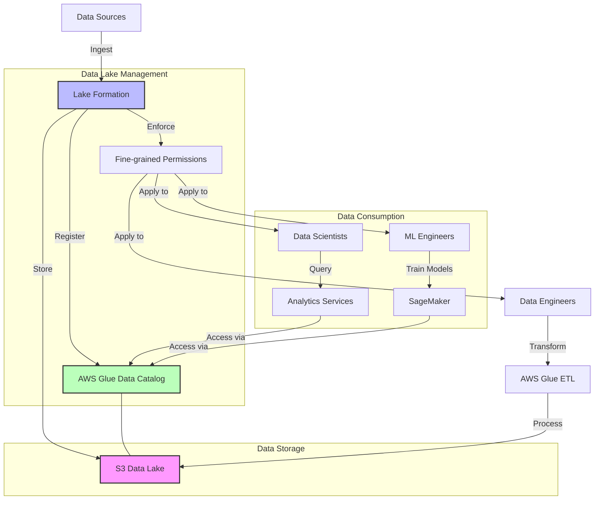

# AWS Lake Formation

## Quick Revision Block

> Key Points:
> 
> - AWS Lake Formation is a service that makes it easy to set up, secure, and manage data lakes, providing a central governance system for diverse ML data sources.
> - Lake Formation simplifies the process of ingesting, cataloging, cleaning, and transforming data from multiple sources into S3-based data lakes for ML workflows.
> - The service provides fine-grained access control at the database, table, column, row, and cell levels, ensuring secure access for different ML teams and use cases.
> - Lake Formation integrates with AWS ML services like SageMaker, making it easier to prepare high-quality data for training machine learning models.

## Prerequisites

- **AWS S3**: Understanding of S3 storage as the foundation for data lakes
- **Data Lake Concepts**: Familiarity with data lake architectures and their benefits for ML workflows
- **AWS IAM**: Knowledge of identity and access management principles for securing data access

## Detailed Explanation

### What is AWS Lake Formation?

AWS Lake Formation is a service that simplifies the process of setting up secure data lakes in AWS. It provides a centralized place to catalog, clean, transform, and secure data from diverse sources, making it readily available for machine learning and analytics. Lake Formation automates many of the complex manual steps traditionally required to create data lakes, allowing data scientists to focus on deriving insights from data rather than managing infrastructure.

### Key Characteristics

- **Centralized Governance**: Lake Formation provides a single point of control for defining and enforcing data access policies across various AWS analytics and ML services.
  
- **Blueprints for Data Ingestion**: Pre-built templates automate the process of ingesting data from diverse sources like databases (MySQL, PostgreSQL, Oracle, SQL Server) and log files into the data lake.
  
- **Fine-grained Access Control**: Lake Formation implements security at the database, table, column, row, and cell levels, allowing precise control over which ML teams can access specific data elements.
  
- **Data Discovery and Cataloging**: Integrated with AWS Glue Data Catalog to automatically discover and register datasets, making them easily searchable and accessible for ML projects.

### How it Works

1. **Data Lake Setup**:
   - Define the S3 location for your data lake
   - Configure security settings and access control policies
   - Register existing S3 locations with Lake Formation 

2. **Data Ingestion and Processing**:
   - Use blueprints to set up data ingestion workflows
   - Schedule and run ETL jobs to transform data
   - Clean and prepare data for ML applications

3. **Data Access and Governance**:
   - Define fine-grained permissions for users and roles
   - Manage access by granting permissions to databases, tables, or columns
   - Implement row-level security for sensitive data

### Practical Real World Use Cases

- **Centralized ML Feature Store**: A financial services company uses Lake Formation to create a governed data lake containing customer features from multiple source systems (transactions, profile data, interaction history). Data scientists across different teams can securely access relevant features for model training without violating compliance requirements.
  
- **Healthcare Analytics Platform**: A healthcare provider implements a HIPAA-compliant data lake using Lake Formation, ingesting data from patient records, medical devices, and billing systems. ML models for patient risk scoring and treatment optimization can access the necessary data while ensuring sensitive patient information is protected through fine-grained access controls.
  
- **Retail Customer 360 View**: A retail organization consolidates data from point-of-sale systems, e-commerce platforms, loyalty programs, and inventory management into a Lake Formation-managed data lake. This unified view enables ML-driven personalization, demand forecasting, and inventory optimization with appropriate access controls for different business functions.

## System Design Considerations

### Architecture Patterns

- **Producer-Consumer Pattern**: Separate data producers (ingestion processes) from data consumers (ML applications) with Lake Formation managing permissions and access.
  
- **Data Lake Zones Pattern**: Implement bronze (raw), silver (processed), and gold (refined) data zones within your data lake for different stages of ML data preparation.

### Performance Optimization

- **Data Partitioning**: Organize data lake files using effective partitioning strategies (date, region, etc.) to optimize ML training data access.
  
- **Compression and Format Selection**: Select appropriate file formats (Parquet, ORC) and compression methods to enhance performance for ML workloads.

### Cost Optimization

- **Lifecycle Management**: Implement S3 lifecycle policies to transition infrequently accessed data to lower-cost storage tiers.
  
- **Query Optimization**: Use table partitioning and indexing to reduce the amount of data scanned for ML feature extraction.

### Security Best Practices

- **Principle of Least Privilege**: Grant only the permissions necessary for each ML role or function using Lake Formation's fine-grained access control.
  
- **Data Encryption**: Ensure encryption of data both at rest (using S3 encryption) and in transit for all data lake contents.

## Common Exam Scenarios

- **Scenario 1**: A company wants to build a data lake for ML purposes but needs to ensure that different data science teams can only access specific subsets of data based on their projects and compliance requirements.
  
  Solution: Implement AWS Lake Formation with fine-grained access controls. Define permissions at the database, table, column, and row levels to ensure each team can only access the data they need. Use tag-based access control for dynamic permissions that scale with the organization's growth.

- **Scenario 2**: An organization has data in multiple source systems including on-premises databases, S3 buckets, and third-party applications. They want to consolidate this data for ML model training while maintaining consistent governance.
  
  Solution: Use Lake Formation blueprints to create automated ingestion workflows from the various sources. Register existing S3 data with Lake Formation. Set up AWS Glue crawlers to discover and catalog the data. Implement a central permission model in Lake Formation to ensure consistent governance across all data sources.

- **Scenario 3**: A regulated financial institution needs to create a feature store for ML models while ensuring sensitive customer information is protected according to compliance requirements.
  
  Solution: Build the feature store using Lake Formation, implementing column-level security to mask PII columns for certain user groups. Use row-level security to restrict access to records based on business units. Configure audit logging with CloudTrail to track all data access for compliance reporting.

## Related Concepts

- **[AWS Glue]**: An ETL service that works closely with Lake Formation to catalog and transform data for ML use cases.
  
- **[Data Lake vs. Data Warehouse]**: Understanding the differences and benefits of data lakes for ML workloads compared to traditional data warehouses.
  
- **[Data Mesh Architecture]**: A decentralized approach to data ownership that can be implemented using Lake Formation's governance capabilities.

## Learning Resources

### Official Documentation

- [AWS Lake Formation User Guide](https://docs.aws.amazon.com/lake-formation/latest/dg/what-is-lake-formation.html)
- [Lake Formation ML Integration](https://docs.aws.amazon.com/lake-formation/latest/dg/machine-learning-integration.html)

### Video Tutorials

- [AWS re:Invent 2023: Building a Secure Data Lake for Machine Learning](https://www.youtube.com/watch?v=LdGbVhWIGYU)
- [Getting Started with AWS Lake Formation](https://www.youtube.com/watch?v=2iwOfHw2_Pc)

### Hands-on Labs

- [Building a Machine Learning Data Lake](https://aws.amazon.com/getting-started/hands-on/build-data-lake-for-machine-learning/)
- [Securing ML Data Access with Lake Formation](https://github.com/aws-samples/aws-lake-formation-ml-security)

### Practice Questions

- Q1: A company is setting up a data lake for ML projects and needs to ensure that data scientists can access data for training models while limiting access to sensitive columns like Social Security Numbers. Which Lake Formation feature should they use?
    - A: Column-level security in Lake Formation, which allows administrators to grant or deny access to specific columns within tables, ensuring sensitive data is only accessible to authorized users.

- Q2: An organization has existing data in multiple S3 buckets that they want to make available for ML training through a governed access model. What is the first step they should take with Lake Formation?
    - A: Register the existing S3 locations with Lake Formation, which establishes Lake Formation as the permissions manager for these locations and enables applying fine-grained access controls to the data they contain.