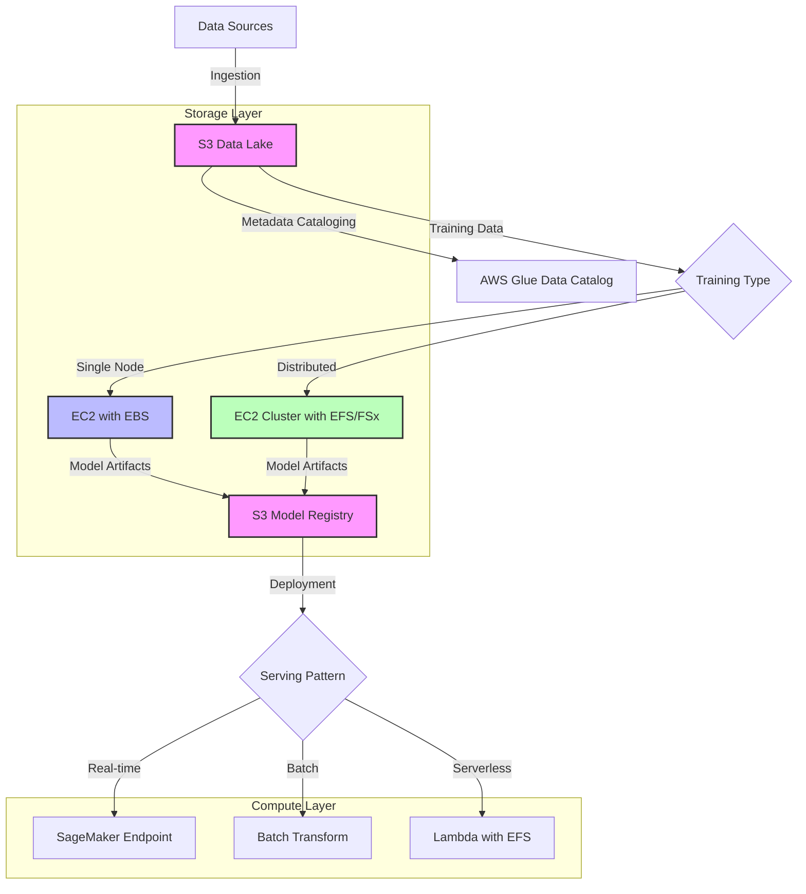

# AWS storage services

## Quick Revision Block

> Key Points:
> 
> - AWS offers a comprehensive suite of storage services categorized as object storage (S3), block storage (EBS), and file storage (EFS), each optimized for different ML workload requirements.
> - Amazon S3 is the foundation for ML data lakes, providing virtually unlimited, highly durable storage for datasets, model artifacts, and serving ML applications at scale.
> - Amazon EBS delivers high-performance block storage for compute-intensive ML training on single EC2 instances with various volume types optimized for different workload patterns.
> - Amazon EFS and FSx for Lustre enable shared file system access across multiple instances, critical for distributed ML training and high-performance computing workloads.

## Prerequisites

- **Cloud Computing Fundamentals**: Understanding AWS infrastructure and service models is essential for effective storage service utilization
- **Data Management Principles**: Familiarity with data formats, organization, and lifecycle management affects storage decisions
- **ML Workflow Requirements**: Knowledge of storage needs for different ML phases (data preparation, training, inference)

## Detailed Explanation

### What is AWS storage services?

AWS storage services are a collection of specialized cloud storage solutions provided by Amazon Web Services, each designed to address specific data storage patterns, performance requirements, and access models. For machine learning workloads, these services offer the foundation for storing training datasets, model artifacts, and serving ML applications, with each service optimized for different phases of the ML lifecycle.

### Key Characteristics

- **Service Categorization**: AWS organizes storage services into three primary categories:
  
  - **Object Storage (S3)**: Stores data as objects with unique identifiers and metadata, providing virtually unlimited scalability for unstructured data.
  
  - **Block Storage (EBS)**: Delivers high-performance, low-latency block storage volumes attachable to EC2 instances, ideal for compute-intensive workloads.
  
  - **File Storage (EFS, FSx)**: Provides file system interfaces with hierarchical organization, supporting shared access across multiple compute instances.

- **Performance vs. Cost Optimization**: Each service offers tiered options balancing performance and cost, allowing ML practitioners to optimize storage expenses while meeting workload requirements.

- **Integration with ML Services**: AWS storage services feature tight integration with ML services like SageMaker, Glue, and EMR to streamline data processing, model training, and deployment workflows.

### How it Works

AWS storage services function within ML workflows through specialized roles:

1. **Data Ingestion and Organization**:
   - S3 serves as the primary landing zone for raw datasets
   - Data can be organized using S3 buckets, prefixes, and tagging for efficient discovery
   - S3 supports versioning and lifecycle policies for data governance

2. **Data Preparation and Feature Engineering**:
   - EFS provides shared file access for distributed preprocessing pipelines
   - EBS volumes deliver high-performance storage for intensive single-instance processing
   - FSx for Lustre offers high-throughput for large dataset transformations

3. **Model Training**:
   - EBS gp3 or io2 volumes enable high-IOPS storage for training on single instances
   - EFS supports distributed training across multiple instances with shared file access
   - FSx for Lustre delivers parallel file system performance for compute-intensive training

4. **Model Deployment and Serving**:
   - S3 stores model artifacts for deployment
   - EFS enables low-latency model loading for serverless inference
   - EBS provides consistent performance for high-throughput inference endpoints

### Practical Real World Use Cases

- **Large-Scale Image Classification**: A medical imaging company processes petabytes of radiological images for diagnostic ML models. They ingest raw data to S3, use FSx for Lustre mounted to SageMaker training instances for high-performance training, and store final model artifacts in S3 for deployment.
  
- **Real-time Recommendation System**: An e-commerce platform serves personalized product recommendations. User interaction data streams to S3, batch training jobs run on EC2 instances with optimized EBS volumes, and models are deployed to SageMaker endpoints using EFS for fast loading of large model artifacts.
  
- **Natural Language Processing Pipeline**: A content analysis service processes millions of documents. The raw text corpus is stored in S3, distributed processing leverages EFS for shared access across a Spark cluster, and trained models are versioned in S3 for production deployment.

## System Design Considerations

### Architecture Patterns

- **Data Lake Pattern**: Use S3 as the foundation of an ML data lake, with AWS Glue for cataloging and Lake Formation for governance. This pattern centralizes data assets for diverse ML workloads while maintaining organization and access control.
  
- **High-Performance Training Pattern**: Combine EC2 instances with optimized EBS volumes for single-node training, or EC2 clusters with EFS/FSx for distributed training. This pattern prioritizes computational efficiency and training throughput.

### Performance Optimization

- **S3 Transfer Acceleration**: Enable for faster uploads/downloads of large datasets to/from S3 across geographic distances.
  
- **EBS Volume Type Selection**: Choose gp3 for general-purpose ML workloads, io2 for high-IOPS requirements, and st1 for sequential throughput optimization.

### Cost Optimization

- **S3 Intelligent-Tiering**: Automatically move data between access tiers based on usage patterns, reducing storage costs for infrequently accessed datasets.
  
- **EFS Infrequent Access**: Use IA storage class for EFS file systems containing reference datasets accessed less frequently.

### Security Best Practices

- **Encryption and Access Control**: Implement encryption at rest for all storage services and fine-grained access control using IAM policies and bucket policies.
  
- **Versioning and Audit**: Enable versioning on S3 buckets containing model artifacts and integrate with CloudTrail for comprehensive audit trails of storage access.

## Common Exam Scenarios

- **Scenario 1**: A data science team needs to process a 20TB dataset for model training. The workload requires shared access across multiple compute instances with high throughput.
  
  Solution: Use Amazon FSx for Lustre for training data storage, which can be mounted across multiple EC2 instances or SageMaker training jobs. FSx for Lustre offers high-throughput shared access ideal for large ML datasets, with the ability to load data directly from S3.

- **Scenario 2**: A recommendation system requires fast access to user profiles and product catalog data during inference, with sub-100ms latency requirements.
  
  Solution: Store model artifacts in S3, but cache frequently accessed feature data on EBS volumes attached to inference instances. Use gp3 EBS volumes with provisioned IOPS to ensure consistent low-latency performance for real-time inference.

- **Scenario 3**: A startup is building an ML pipeline with budget constraints but needs to maintain performance and scalability for growing datasets.
  
  Solution: Implement a tiered storage strategy using S3 Intelligent-Tiering for datasets, with lifecycle policies to automatically archive older data versions to S3 Glacier. Use EFS with Infrequent Access storage class for shared file system needs, and leverage burstable EBS volumes (gp2) for development workloads.

## Related Concepts

- **[Data Lakes]**: A centralized repository that allows storing structured and unstructured data at any scale, commonly built on S3 for ML projects.
  
- **[ETL Processes]**: The methods for extracting, transforming, and loading data, often leveraging storage services as source and destination points.
  
- **[Storage Access Patterns]**: How applications and workloads interact with stored data, influencing which storage service is most appropriate.

## Learning Resources

### Official Documentation

- [AWS Storage Services for Machine Learning](https://docs.aws.amazon.com/whitepapers/latest/aws-overview/storage-services.html)
- [Amazon S3 for Machine Learning Workflows](https://docs.aws.amazon.com/sagemaker/latest/dg/model-train-storage.html)

### Video Tutorials

- [AWS re:Invent 2023: Storage Best Practices for ML Workloads](https://www.youtube.com/watch?v=LdGbVhWIGYU)
- [Optimizing Storage for SageMaker Training Jobs](https://www.youtube.com/watch?v=QJwGnVhdr8A)

### Hands-on Labs

- [Building an ML Data Pipeline with S3 and Glue](https://aws.amazon.com/getting-started/hands-on/build-train-deploy-machine-learning-model-sagemaker/)
- [Performance Testing EFS for Distributed ML Training](https://github.com/aws-samples/aws-ml-storage-workshop)

### Practice Questions

- Q1: A machine learning team needs to store 50TB of image data that will be accessed by multiple EC2 instances simultaneously for training. Which AWS storage service is most appropriate?
    - A: Amazon FSx for Lustre, as it provides a high-performance shared file system optimized for compute-intensive workloads like machine learning, with throughput scaling based on storage size and transparent integration with S3.

- Q2: A company wants to implement a cost-effective storage solution for their ML workflows that includes frequently accessed training data and infrequently accessed historical datasets. Which storage configuration is most appropriate?
    - A: Use S3 with Intelligent-Tiering for automatic cost optimization based on access patterns, S3 Standard for active datasets, and S3 Glacier for long-term archive of historical data, with lifecycle policies to manage transitions between tiers.