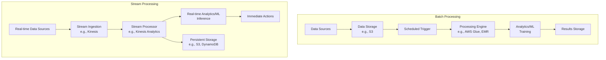
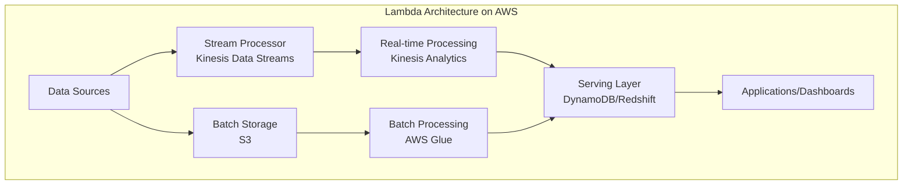

# Batch vs Streaming Data Processing

## Quick Revision Block

> Key Points:
> 
> - Batch processing handles data in large chunks at scheduled intervals, while streaming processes data continuously in real-time or near real-time.
> - Batch processing excels at high-throughput, cost-efficient analytics on historical data, whereas streaming enables immediate insights and actions on fresh data.
> - In AWS ML pipelines, batch processing typically uses services like AWS Glue and AWS Batch, while streaming leverages Amazon Kinesis and MSK.
> - The choice between batch and streaming depends on latency requirements, data volume, cost constraints, and whether historical or real-time analysis is needed.

## Prerequisites

- **Data Ingestion Concepts**: Understanding of how data flows into processing systems from various sources
- **ETL Processes**: Familiarity with Extract, Transform, Load operations that prepare data for analysis
- **AWS Service Knowledge**: Basic understanding of AWS data processing services like Kinesis, Glue, and EMR

## Detailed Explanation

### What is Batch vs Streaming Data Processing?

Batch processing and streaming data processing are two fundamental paradigms for handling data in modern analytics and machine learning pipelines. Batch processing collects data over a period of time and processes it in scheduled, discrete chunks, while streaming data processing handles data continuously as it arrives, allowing for real-time or near real-time analysis and action.

### Key Characteristics

- **Processing Approach**:
  - **Batch Processing**: Processes large volumes of data in scheduled intervals (hourly, daily, weekly). Data is collected, stored, and then processed as a complete set. For Machine Learning, batch processing is "usually performed to a specific schedule" where data waits before processing begins, and new data must wait for the next batch processing cycle.
  - **Streaming Processing**: Processes data continuously as it arrives, with minimal latency between data generation and processing. Streaming data is "data that is emitted at high volume in a continuous, incremental manner with the goal of low-latency processing."

- **Latency**:
  - **Batch Processing**: Higher latency, as data must wait until the scheduled processing time. Suitable when results don't need to be immediate.
  - **Streaming Processing**: Very low latency, often processing data within seconds or milliseconds of its arrival. Streaming data processing allows "analysis and reporting of events as it happens" for use cases like fraud detection or intrusion detection.

- **Data Volume Handling**:
  - **Batch Processing**: Optimized for processing massive volumes of data efficiently, often with higher throughput.
  - **Streaming Processing**: Handles continuous data flows but may require more sophisticated scaling mechanisms for surges in data volume.

### How it Works

#### Batch Processing Flow:

1. **Data Collection**: Data is accumulated from various sources and stored in a repository (like S3)
2. **Trigger**: Based on a schedule or threshold, processing begins
3. **ETL Processing**: The data batch undergoes transformation using services like AWS Glue
4. **Analysis/ML**: The prepared data is used for analytics or machine learning model training
5. **Results Storage**: Results are stored for later use or reporting

#### Streaming Processing Flow:

1. **Data Capture**: Real-time data is captured immediately as it's generated
2. **Stream Ingestion**: Data enters a streaming service like Kinesis Data Streams
3. **Real-time Processing**: Data is processed on-the-fly, often with minimal transformation
4. **Immediate Analysis**: Insights are derived and actions taken immediately
5. **Optional Storage**: Data may be stored for historical analysis or compliance

### Practical Real World Use Cases

- **Batch Processing**:
  - **ML Model Training**: AWS Glue is "a popular choice for ingesting data as a batch process" for machine learning applications, using its crawler to process data in various formats.
  - **Financial Reporting**: End-of-day transaction processing and financial reporting where daily summaries are sufficient.
  - **Inventory Management**: Processes in inventory management use batch processing to collect data across sources and run machine learning algorithms to generate demand forecasts, utilizing the efficiency of compute resources for big data.

- **Streaming Processing**:
  - **Fraud Detection**: Financial institutions use streaming data to "track real-time changes in the stock market, compute value at risk, and automatically rebalance portfolios based on stock price movements."
  - **IoT Monitoring**: Sensors in vehicles, industrial equipment, and farm machinery send data to streaming applications that monitor performance and detect potential defects in advance.
  - **Real-time Recommendations**: Providing immediate personalized recommendations based on current user behavior.

## System Design Considerations

### Architecture Patterns

- **Batch Processing Patterns**:
  - **ETL Pipeline**: A classic pattern where data moves through Extract, Transform, Load stages at scheduled intervals.
  - **Data Lake Processing**: Data is stored in its raw form and processed in batches when needed, often using services like AWS Glue.

- **Streaming Patterns**:
  - **Event-Driven Architecture**: Systems react to streaming events as they occur.
  - **Lambda Architecture**: This architecture "unites batch and real-time analytics" using "fully managed, serverless AWS services" to process data from both streaming and batch sources.
  - **Kappa Architecture**: A simplified version focused on processing all data through the streaming pipeline.

### Performance Optimization

- **Batch Optimization**:
  - **Partitioning**: Divide data logically to enable parallel processing
  - **Right-sizing Compute**: Match compute resources to data volume
  - **Scheduling**: Optimize batch timing to minimize resource conflicts
  - **Incremental Processing**: Process only new or changed data when possible

- **Stream Optimization**:
  - **Buffer Configuration**: Tune buffers to balance throughput and latency
  - **Shard Management**: Properly scale Kinesis shards based on data volume
  - **Stateful Processing**: Implement windowing functions for time-based analysis
  - **Checkpoint Management**: Implement proper checkpointing to avoid reprocessing data

### Cost Optimization

- **Batch Cost Strategies**:
  - **Scheduled Execution**: Run jobs only when needed rather than maintaining constant resources
  - **Spot Instances**: Use AWS Spot instances for non-critical batch processing
  - **Compression**: Compress data to reduce storage costs
  - **Data Lifecycle Policies**: Implement tiered storage strategies

- **Streaming Cost Strategies**:
  - **Right-size Provisioning**: Carefully provision stream capacity to avoid over-allocation
  - **Serverless Options**: Use serverless options like Lambda for processing when possible
  - **Filtering at Source**: Reduce data volume by filtering irrelevant data at the source
  - **Auto-scaling**: Implement auto-scaling to match resources with current needs

### Security Best Practices

- **Encryption**:
  - **Data at Rest**: Encrypt stored batch data and stream storage
  - **Data in Transit**: Use TLS for all data movement between services

- **Access Control**:
  - **IAM Roles**: Implement least privilege access for all processing components
  - **VPC Configuration**: Use VPC endpoints for private network communication
  - **Audit Logging**: Enable CloudTrail for all data processing activities

## Common Exam Scenarios

- **Scenario 1**: A company processes credit card transactions and needs to detect fraud in real-time.
  - **Solution**: Implement a Kinesis Data Streams pipeline with Kinesis Analytics for real-time anomaly detection, using ML models trained on historical fraud data.

- **Scenario 2**: An e-commerce platform needs to update their recommendation engine daily based on customer purchases.
  - **Solution**: Use AWS Glue for ETL jobs scheduled daily to process purchase data, then use SageMaker for batch training of the recommendation model.

- **Scenario 3**: A fleet management company needs both historical analysis and real-time alerts for vehicle performance.
  - **Solution**: Implement a Lambda Architecture using Kinesis for streaming alerts and AWS Glue for batch processing of historical data, with S3 as the common data lake.

## Related Concepts

- **[Data Pipeline Orchestration]**: Tools and approaches for scheduling and managing data workflows, closely related to batch processing.
- **[ETL Processes]**: Extract, Transform, Load processes that prepare data for analysis in both batch and streaming contexts.
- **[AWS Kinesis]**: Amazon's streaming data platform that enables real-time processing for various applications.
- **[AWS Glue]**: A serverless data integration service that makes it easy to discover, prepare, and combine data for analytics, machine learning, and application development.

## Learning Resources

### Official Documentation

- [AWS Batch Documentation](https://docs.aws.amazon.com/batch/)
- [Amazon Kinesis Data Streams Developer Guide](https://docs.aws.amazon.com/streams/latest/dev/introduction.html)
- [AWS Glue Developer Guide](https://docs.aws.amazon.com/glue/latest/dg/what-is-glue.html)

### Video Tutorials

- [AWS Batch Processing vs. Stream Processing - AWS Online Tech Talks](https://www.youtube.com/watch?v=V_CDoJU0m0w)
- [Introduction to Amazon Kinesis - AWS Events](https://www.youtube.com/watch?v=MYccrtj2OCg)

### Hands-on Labs

- [Process Streaming Data with Amazon Kinesis - AWS Workshop](https://aws.amazon.com/getting-started/hands-on/build-streaming-data-application/)
- [Build ETL Processing Pipelines with AWS Glue - AWS Workshop](https://aws.amazon.com/getting-started/hands-on/build-etl-pipeline-aws-glue/)

### Practice Questions

- Q1: Which AWS service would be most appropriate for real-time streaming data processing for fraud detection?
    - A: Amazon Kinesis Data Analytics, as it enables real-time processing of streaming data using SQL or Apache Flink.

- Q2: A company needs to process a large amount of historical sales data for ML model training. The data is processed on a weekly basis. Which AWS service would be most appropriate?
    - A: AWS Glue would be most appropriate as it provides a fully managed ETL service designed for batch processing of data at scheduled intervals.
