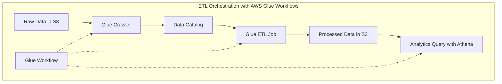

# Data Pipeline Orchestration

## Quick Revision Block

> Key Points:
> 
> - Data pipeline orchestration tools automate, monitor, and manage data workflows across multiple AWS services, ensuring reliable data processing for machine learning workloads.
> - AWS provides multiple orchestration solutions: AWS Step Functions (serverless), Amazon MWAA (Airflow), AWS Glue Workflows (ETL-focused), and SageMaker Pipelines (ML-specific).
> - Effective orchestration handles dependencies, parallel processing, error handling, retries, and monitoring across the entire data and ML workflow.
> - For the AWS ML Specialty exam, understand key orchestration concepts like DAGs, state management, error handling, and when to use different AWS orchestration services.

## Prerequisites

- **AWS Storage Services**: Understanding of S3, RDS, DynamoDB, and other storage options for data sources and targets
- **Data Processing**: Familiarity with ETL concepts and AWS processing services like Glue, EMR, and Lambda
- **AWS IAM**: Knowledge of security and permissions management for pipeline components

## Detailed Explanation

### What is Data Pipeline Orchestration?

Data pipeline orchestration is the process of coordinating, automating, and managing the flow of data between different processing steps and services. It involves defining workflows that specify how data moves from source to destination, ensuring that each processing step executes in the correct order, handling dependencies, managing resources, and providing monitoring and error handling. For machine learning workflows, effective orchestration connects data ingestion, processing, model training, evaluation, and deployment into a unified, automated process.

### Key Characteristics

- **Workflow Management**:
  - **Directed Acyclic Graphs (DAGs)**: Most orchestration tools use DAGs to define the execution order of tasks, ensuring dependencies are respected.
  - **State Management**: Orchestration systems maintain state information across workflow execution, tracking which tasks are completed, running, or pending.
  - **Parameterization**: Ability to pass parameters between workflow steps, allowing dynamic configuration of processing tasks.

- **Scheduling & Triggering**:
  - **Time-based Execution**: Regular scheduling of workflows (hourly, daily, weekly).
  - **Event-driven Processing**: Triggering workflows based on data events (new file arrival, database updates).
  - **Dependency-based Execution**: Starting tasks only when upstream dependencies are satisfied.

- **Reliability Features**:
  - **Error Handling**: Robust mechanisms for handling and reporting errors in the workflow.
  - **Retry Logic**: Automatic retrying of failed tasks with configurable backoff strategies.
  - **Monitoring & Alerting**: Comprehensive visibility into workflow status and notifications for failures.

### How it Works

Data pipeline orchestration in AWS typically involves the following components and flow:

1. **Workflow Definition**: Creating a specification of tasks, their dependencies, and execution conditions
2. **Resource Allocation**: Provisioning or allocating computing resources for each task
3. **Execution Engine**: A service that interprets the workflow definition and executes tasks in the correct order
4. **Monitoring & Logging**: Systems to track execution progress and record task outputs
5. **Error Handling**: Mechanisms to detect, report, and potentially recover from failures

```mermaid
graph TB
    A[Data Source] --> B[Ingestion]
    B --> C[Processing/Transformation]
    C --> D[Storage]
    D --> E[Analytics/ML Training]
    E --> F[Model Deployment]
    
    subgraph "Orchestration Layer"
        O1[Workflow Definition]
        O2[Scheduling]
        O3[Resource Management]
        O4[Error Handling]
        O5[Monitoring]
        O1 --- O2
        O2 --- O3
        O3 --- O4
        O4 --- O5
    end
    
    Orchestration Layer -.-> B
    Orchestration Layer -.-> C
    Orchestration Layer -.-> D
    Orchestration Layer -.-> E
    Orchestration Layer -.-> F
```

### Practical Real World Use Cases

- **ETL Workflows**:
  - **Data Warehouse Loading**: Orchestrating the extraction of data from multiple sources, transforming it, and loading into analytics platforms.
  - **Data Lake Ingestion**: Managing the flow of data from diverse sources into a data lake, with appropriate partitioning and cataloging.

- **Machine Learning Operations**:
  - **End-to-End ML Pipelines**: Orchestrating data preparation, feature engineering, model training, evaluation, and deployment.
  - **Automated Retraining**: Scheduling periodic retraining of ML models with fresh data and monitoring of model performance.

- **Batch Processing**:
  - **Financial Reporting**: Coordinating end-of-day processing of transactions, reconciliation, and report generation.
  - **Recommendation System Updates**: Managing the periodic update of recommendation models with new user interaction data.

## System Design Considerations

### Architecture Patterns

- **Event-Driven Architecture**:
  - **Pattern**: Workflows triggered by events such as file uploads or database changes.
  - **Implementation**: Using services like Amazon EventBridge to trigger Step Functions workflows or AWS Glue jobs.
  - **Benefits**: Reactive processing, reduced latency, efficient resource usage.

- **Scheduled Batch Processing**:
  - **Pattern**: Regular execution of processing tasks on accumulated data.
  - **Implementation**: AWS Glue triggers or EventBridge rules invoking orchestration workflows.
  - **Benefits**: Predictable workloads, efficient resource utilization, simpler monitoring.



### Performance Optimization

- **Parallel Processing**:
  - Identify tasks that can execute concurrently and structure workflows for maximum parallelism.
  - For AWS Step Functions, use Parallel and Map states to process multiple items simultaneously.
  - In Glue Workflows, configure multiple triggers to start independent jobs concurrently.

- **Resource Scaling**:
  - Dynamically adjust compute resources based on workload size.
  - For Glue ETL jobs, configure appropriate DPU settings and worker types.
  - For EMR steps, use instance fleets or auto-scaling to adapt to processing demands.

- **Checkpointing**:
  - Implement checkpointing to resume workflows from failure points rather than restarting entirely.
  - For long-running processes, design tasks to be idempotent to safely handle retries.

### Cost Optimization

- **Serverless Orchestration**:
  - Use AWS Step Functions for cost-effective orchestration with pay-per-use pricing.
  - Implement Lambda functions for light processing tasks to avoid provisioning persistent resources.

- **Right-sizing Resources**:
  - Match compute resources to task requirements to avoid overprovisioning.
  - For AWS Glue jobs, select appropriate worker types (Standard vs. G.1X vs. G.2X) based on memory requirements.

- **Workflow Efficiency**:
  - Design workflows to minimize idle time between steps.
  - Batch similar operations to reduce initialization overhead.
  - Schedule non-urgent workflows during off-peak hours for better resource availability.

### Security Best Practices

- **IAM Role Configuration**:
  - Implement least privilege permissions for each workflow component.
  - Use different IAM roles for different stages of the pipeline with appropriate access scopes.

- **Data Encryption**:
  - Enable encryption for data at rest and in transit throughout the pipeline.
  - Use KMS keys for encryption with appropriate key management policies.

- **Audit and Monitoring**:
  - Enable CloudTrail logging for all orchestration actions.
  - Implement CloudWatch alarms for suspicious activity patterns.
  - Regularly review logs for unauthorized access attempts or unusual workflow patterns.

## Common Exam Scenarios

- **Scenario 1**: A company needs to migrate an existing PySpark-based ETL process to AWS with minimal code changes and maintain a similar schedule-based execution pattern.
  - **Solution**: Use AWS Glue ETL jobs written in PySpark with Glue triggers for scheduling. The existing PySpark code can be reused in Glue jobs with minimal modifications, and Glue triggers can maintain the same schedule patterns.

- **Scenario 2**: An organization needs to build a complex ML workflow with conditional logic, including data preparation, model training, evaluation, and conditional deployment based on quality metrics.
  - **Solution**: Use AWS Step Functions to orchestrate the workflow, with conditional branching based on evaluation metrics. Incorporate SageMaker Processing for data preparation, SageMaker Training for model building, and SageMaker Model deployment steps within the workflow.

- **Scenario 3**: A data science team processes large amounts of financial data daily and needs to analyze it with SQL queries, but wants minimal setup and maintenance overhead.
  - **Solution**: Use AWS Glue to catalog the data and Amazon Athena to run queries. This combination provides serverless SQL analysis on S3 data with minimal setup, leveraging Glue's automated schema discovery and Athena's interactive query capabilities.

## Related Concepts

- **[ETL Processes]**: Extract, Transform, Load workflows that prepare data for analysis, often a key component of data pipelines.
- **[AWS Glue]**: A serverless data integration service for discovering, preparing, and combining data for analytics and machine learning.
- **[AWS Batch]**: A service for running batch computing workloads on AWS, suitable for high-volume processing tasks.
- **[Amazon EMR]**: Managed cluster platform for big data processing using frameworks like Spark and Hadoop.

## Learning Resources

### Official Documentation

- [AWS Step Functions Documentation](https://docs.aws.amazon.com/step-functions/)
- [AWS Glue Workflows Documentation](https://docs.aws.amazon.com/glue/latest/dg/workflows_overview.html)
- [Amazon Managed Workflows for Apache Airflow Documentation](https://docs.aws.amazon.com/mwaa/)
- [Amazon SageMaker Pipelines Documentation](https://docs.aws.amazon.com/sagemaker/latest/dg/pipelines.html)

### Video Tutorials

- [Building ETL Pipelines with AWS Glue](https://www.youtube.com/watch?v=qQerwTfRcpI)
- [Orchestrating ETL Jobs with AWS Step Functions](https://www.youtube.com/watch?v=ZQVzBtTrKLY)

### Hands-on Labs

- [AWS Glue ETL Workshop](https://catalog.workshops.aws/glue-etl/en-US)
- [Building ML Workflows with Amazon SageMaker Pipelines](https://aws.amazon.com/getting-started/hands-on/build-ml-workflow-sagemaker-pipelines/)

### Practice Questions

- Q1: A data science team needs to build a workflow that includes complex data preprocessing, model training with hyperparameter tuning, and conditional deployment based on evaluation metrics. Which AWS service is best suited for orchestrating this workflow?
    - A: AWS Step Functions is the best choice, as it provides visual workflow design with conditional branching, error handling, and native integration with SageMaker components.

- Q2: A company is migrating its existing Apache Airflow-based ETL workflow to AWS and wants to minimize changes to existing DAG definitions. Which AWS service should they choose?
    - A: Amazon Managed Workflows for Apache Airflow (MWAA) is the best option as it provides a managed Airflow environment that can run existing Airflow DAGs with minimal modifications.
