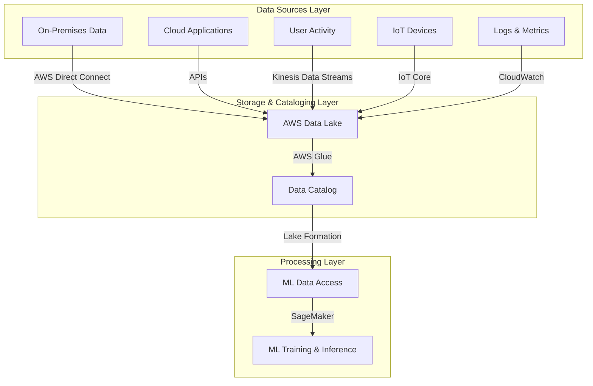

# Data sources identification (user data, logs, databases)

## Quick Revision Block

> Key Points:
> 
> - Proper data source identification is critical for successful ML workflows on AWS, ensuring you have the right data in the right format.
> - AWS provides specialized services for accessing different data types including S3 for object storage, RDS for relational data, DynamoDB for NoSQL, and CloudWatch Logs for application logs.
> - Effective data cataloging and governance using AWS Glue and Lake Formation simplifies discovery and access to diverse data sources.
> - Best practice is to establish a unified data pipeline architecture that accommodates batch, streaming, and real-time data ingestion patterns.

## Prerequisites

- **Cloud Computing Fundamentals**: Understanding of AWS infrastructure and service models is essential for working with AWS data services
- **Database Concepts**: Familiarity with different database types (relational, NoSQL) and query languages helps with data extraction
- **Data Storage Principles**: Knowledge of storage architectures (object, block, file) affects how you access and process different data sources

## Detailed Explanation

### What is Data sources identification?

Data sources identification is the process of discovering, cataloging, and establishing access to the various repositories where data resides within an organization's ecosystem. For AWS machine learning projects, this includes identifying and characterizing data in user-facing applications, system logs, operational databases, data warehouses, and third-party sources, then determining the appropriate methods to extract and integrate this data for ML workflows.

### Key Characteristics

- **Data Source Diversity**: AWS ML projects typically require multiple data sources including structured data (databases), semi-structured data (logs, JSON), and unstructured data (text, images).
  
- **Categorization by Storage Type**: AWS organizes data sources into object storage (S3), block storage (EBS), file systems (EFS), relational databases (RDS), NoSQL databases (DynamoDB), and specialized services (Redshift, Athena).
  
- **Access Patterns**: Different data sources require different access methods - direct database connections, API calls, stream consumption, or batch file processing. AWS provides specialized services for each access pattern.

### How it Works

1. **Inventory Assessment**: Catalog all potential data sources relevant to your ML objective, including application databases, logs, user activity records, and external datasets.

2. **Access Evaluation**: For each identified source, determine:
   - Current storage location (on-premises or AWS)
   - Data format and structure
   - Volume and velocity considerations
   - Security and compliance requirements

3. **Ingestion Planning**: Map appropriate AWS services for data access:
   - For on-premises data: Direct Connect, Storage Gateway, or Snowball for transfer
   - For AWS-native storage: Direct access through service APIs
   - For streaming data: Kinesis Data Streams or Firehose

4. **Centralization Strategy**: Determine if a data lake approach (using S3 with Lake Formation) or federation approach (using services like Athena) is appropriate for your ML workflow.

5. **Preparation for Feature Engineering**: Evaluate source data for completeness, consistency, and relevance to ML objectives, planning necessary transformation steps.

### Practical Real World Use Cases

- **Customer Behavior Analysis**: Combine e-commerce transaction data from RDS databases, clickstream logs from CloudWatch, and customer profile data from DynamoDB to build recommendation models.
  
- **Predictive Maintenance**: Integrate IoT sensor data streams from Kinesis, equipment logs from S3, and maintenance records from operational databases to predict equipment failures.
  
- **Security Threat Detection**: Aggregate VPC flow logs, CloudTrail audit logs, and application logs in a centralized S3 data lake, then apply ML models to detect anomalies and potential security threats.

## System Design Considerations

### Architecture Patterns

- **Data Lake Pattern**: Centralize raw data from multiple sources in S3, use AWS Glue for cataloging, and Lake Formation for governance. This pattern works well for large-scale ML workflows with diverse data sources.
  
- **Stream Processing Pattern**: Use Kinesis Data Streams to capture real-time data, process with Lambda or Kinesis Analytics, and store in purpose-built stores like Timestream or S3. Appropriate for ML models requiring real-time or near-real-time data.

### Performance Optimization

- **Data Proximity**: Position your ML workloads in the same AWS region as your primary data sources to minimize latency and transfer costs.
  
- **Appropriate Access Patterns**: Use bulk export for historical data and streaming interfaces for real-time data to balance latency and throughput requirements.

### Cost Optimization

- **Data Transfer Planning**: Minimize cross-region data transfers by positioning ML workloads close to data sources or by implementing regional replication strategies.
  
- **Tiered Storage Strategy**: Implement lifecycle policies to automatically move less frequently accessed data to lower-cost storage tiers like S3 Glacier.

### Security Best Practices

- **Least Privilege Access**: Implement IAM policies that grant the minimum necessary permissions for ML workflows to access only required data sources.
  
- **Data Encryption**: Enable encryption at rest for all data sources, using AWS KMS for key management, and encryption in transit for all data movements.

## Common Exam Scenarios

- **Scenario 1**: A company wants to build an ML model that analyzes customer behavior across their website, mobile app, and customer service interactions. They need to identify appropriate data sources and design an efficient data integration architecture.
  
  Solution: Recommend a data lake architecture using S3, with AWS Glue for data cataloging. Capture website logs via CloudWatch, mobile app interactions via mobile analytics, and customer service data from their CRM system. Use Lake Formation for access control and AWS Glue ETL for data preparation.

- **Scenario 2**: A manufacturing company has sensor data in an on-premises database, equipment logs stored in various file formats, and wants to build a predictive maintenance ML model on AWS.
  
  Solution: Implement AWS Direct Connect for real-time sensor data streaming, use AWS Snowball for one-time transfer of historical logs, and establish an S3-based data lake. Catalog the data with Glue and use SageMaker for model development.

- **Scenario 3**: A financial services company needs to analyze transaction data for fraud detection while maintaining strict compliance with financial regulations.
  
  Solution: Implement a secured data pipeline using encrypted RDS instances for transaction data, CloudTrail for audit logging, and a VPC-isolated SageMaker environment. Use AWS Macie to automatically discover and protect sensitive data in their ML pipeline.

## Related Concepts

- **[Data Lake Architecture]**: A comprehensive approach to storing vast amounts of raw data in its native format until needed for ML or analytics.
  
- **[ETL Processes]**: The methods for extracting data from source systems, transforming it for use, and loading it into target destinations for ML.
  
- **[Data Governance]**: The policies and processes for ensuring data quality, security, and compliance throughout the ML lifecycle.

## Learning Resources

### Official Documentation

- [Amazon ML data sources guide](https://docs.aws.amazon.com/machine-learning/latest/dg/creating-and-using-datasources.html)
- [AWS Big Data Analytics Options whitepaper](https://docs.aws.amazon.com/whitepapers/latest/big-data-analytics-options/amazon-machine-learning.html)

### Video Tutorials

- [AWS re:Invent 2023: Building data lakes for ML workloads](https://www.youtube.com/watch?v=lZ4lBRk9_W0)
- [AWS Machine Learning: Working with Various Data Sources](https://www.youtube.com/watch?v=wzSi5u0Q0XQ)

### Hands-on Labs

- [Building an ML Data Pipeline on AWS](https://aws.amazon.com/getting-started/hands-on/build-train-deploy-machine-learning-model-sagemaker/)
- [Working with Multiple Data Sources in SageMaker](https://github.com/aws-samples/amazon-sagemaker-multiple-data-sources)

### Practice Questions

- Q1: A company has transaction data in an RDS MySQL database, customer profile data in DynamoDB, and clickstream data in S3. What is the most efficient way to combine these data sources for ML training?
    - A: Use AWS Glue to catalog all data sources, create ETL jobs to transform the data, and store the prepared data in S3 for SageMaker to access.

- Q2: Which AWS service should you use to automatically discover and catalog metadata from diverse data sources for ML projects?
    - A: AWS Glue Data Catalog, which automatically discovers, catalogs, and makes searchable metadata from databases, data warehouses, and various file formats, integrating with Lake Formation for security and SageMaker for model training.