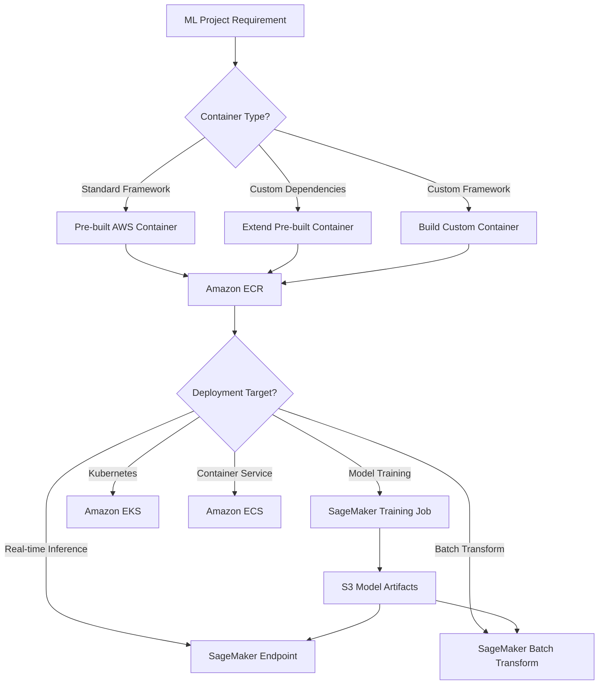

# Docker on AWS

## Quick Revision Block

> Key Points:
> 
> - AWS SageMaker relies heavily on Docker containers for both training and deploying machine learning models at scale.
> - Three primary approaches to using Docker in AWS ML: pre-built images, extending pre-built images, and creating custom containers.
> - AWS Deep Learning Containers provide optimized environments for popular frameworks (TensorFlow, PyTorch, MXNet) that work across SageMaker, ECS, and EKS.
> - Containerization improves reproducibility, portability, and scalability of ML workloads by encapsulating code, dependencies, and configurations.

## Prerequisites

- **Docker Fundamentals**: Understanding of basic Docker concepts including images, containers, Dockerfiles, and container registries.
- **AWS Services**: Familiarity with core AWS services like EC2, S3, IAM, and their roles in ML workflows.
- **ML Frameworks**: Basic knowledge of at least one major ML framework (TensorFlow, PyTorch, etc.) to understand container integration.

## Detailed Explanation

### What is Docker on AWS?

Docker on AWS refers to the integration of Docker container technology with AWS services for machine learning workloads. Docker containers package code, dependencies, and configurations into standardized units that can run consistently across different environments. In AWS ML services, particularly SageMaker, Docker containers are the fundamental building blocks that enable the training and deployment of models in a consistent, reproducible, and scalable manner. AWS provides specialized container images, tools, and services that are optimized for ML workloads and seamlessly integrate with the broader AWS ecosystem.

### Key Characteristics

- **Consistency and Reproducibility**: Docker containers encapsulate the entire ML environment including code, frameworks, libraries, and system dependencies, ensuring consistent behavior across development, testing, and production.
- **Portability**: Containerized ML workloads can move easily between environments—local development, testing, and various AWS services including SageMaker, ECS, and EKS.
- **Scalability**: Containers simplify the process of scaling ML workloads by making it easier to distribute training across multiple instances or deploy multiple model copies for inference.

### How it Works

Docker containers in AWS ML workflows operate through the following process:

1. **Image Selection or Creation**: Choose a pre-built AWS image for common frameworks, extend an existing image, or create a custom image to meet specific requirements.

2. **Image Configuration**: Configure the container with the necessary code, dependencies, and settings for either training or inference tasks.

3. **Image Registration**: Push the container image to Amazon ECR (Elastic Container Registry) where it can be accessed by AWS services.

4. **Container Orchestration**: AWS services like SageMaker, ECS, or EKS handle the deployment, execution, and scaling of containers across managed infrastructure.

5. **Resource Management**: AWS automatically provisions the required resources (CPU, GPU, memory) based on specifications and manages the container lifecycle.

In SageMaker specifically, containers must follow particular conventions:
- Training containers need to handle training data from S3 or other sources and save model artifacts.
- Inference containers must implement specific REST API endpoints to process prediction requests.

### Practical Real World Use Cases

- **Distributed Training**: Using Docker containers to package a TensorFlow training job that runs across multiple GPU instances in SageMaker, automatically handling data distribution and gradient synchronization.
- **Multi-Model Deployment**: Hosting multiple ML models in a single container on SageMaker to efficiently serve predictions for various use cases with shared resources.
- **Development and Production Consistency**: Data scientists develop and test models in local Docker environments identical to the production environment, eliminating "it works on my machine" issues.

## System Design Considerations

### Architecture Patterns

- **Built-in Algorithm Pattern**: Using AWS SageMaker's built-in algorithm containers for standard ML tasks without any container customization.
  ```
  ML Code (Python) → SageMaker Built-in Algorithm Container → Managed Training/Inference
  ```

- **Extended Container Pattern**: Extending AWS pre-built containers to add custom dependencies while maintaining compatibility with SageMaker APIs.
  ```
  Base AWS Container → Custom Dockerfile (add dependencies) → ECR → SageMaker
  ```



### Performance Optimization

- **Instance Selection**: Choose the right container and instance type combination for workloads—CPU instances (C5) for preprocessing, GPU instances (P3, G4) for training, and inference-optimized instances (Inf1) for deployment.
- **Framework Optimization**: Use containers optimized for specific frameworks; AWS Deep Learning Containers include performance-tuned versions of TensorFlow, PyTorch, and MXNet.

### Cost Optimization

- **Container Rightsizing**: Configure containers with appropriate resources to avoid over-provisioning in SageMaker deployments.
- **Multi-Model Endpoints**: Use container support for multi-model endpoints to efficiently host multiple models with shared resources.

### Security Best Practices

- **Image Scanning**: Implement container image scanning with Amazon ECR to identify security vulnerabilities before deployment.
- **IAM Roles**: Configure appropriate IAM roles for containers to access AWS resources with least privilege principles.

## Common Exam Scenarios

- **Container Selection**: Given a scenario involving a custom model with specific framework dependencies, determine whether to use a pre-built container, extend an existing container, or build a custom container.
- **Troubleshooting**: Identify and resolve common container-related issues such as insufficient disk space, missing dependencies, or permission problems.
- **Multi-Container Deployment**: Design a solution that deploys multiple containers for a complex ML pipeline with preprocessing, model inference, and post-processing steps.

## Related Concepts

- **Amazon ECR**: The container registry service where Docker images are stored and from which they are deployed to various AWS services.
- **AWS Batch**: Service for running batch computing workloads that can utilize Docker containers for ML preprocessing or batch inference.
- **AWS Fargate**: Serverless compute engine for containers that can be used for certain ML workloads without managing servers.

## Learning Resources

### Official Documentation

- [Docker Containers for Training and Deploying Models (SageMaker)](https://docs.aws.amazon.com/sagemaker/latest/dg/docker-containers.html)
- [AWS Deep Learning Containers](https://aws.amazon.com/machine-learning/containers/)

### Video Tutorials

- [Building Custom Containers for SageMaker Training and Inference](https://www.youtube.com/watch?v=vGdMR-V8FLk)
- [Distributed ML Training with AWS Deep Learning Containers](https://www.youtube.com/watch?v=S_PyDDY9NbM)

### Hands-on Labs

- [SageMaker Custom Container Workshop](https://github.com/aws-samples/amazon-sagemaker-custom-container)
- [SageMaker Bring Your Own Algorithm Sample](https://github.com/aws/amazon-sagemaker-examples/blob/master/advanced_functionality/scikit_bring_your_own/scikit_bring_your_own.ipynb)

### Practice Questions

- Q1: A data scientist wants to deploy a custom PyTorch model for inference in SageMaker but needs additional Python libraries not included in the standard PyTorch container. What is the most efficient approach?
    - A: Extend the pre-built PyTorch container with a Dockerfile that installs the required libraries, then register the container in Amazon ECR and use it for deployment.
- Q2: Which storage location inside a SageMaker training container persists after training completes and should be used to save model artifacts?
    - A: The /opt/ml/model directory, which SageMaker automatically uploads to S3 after training completes.

