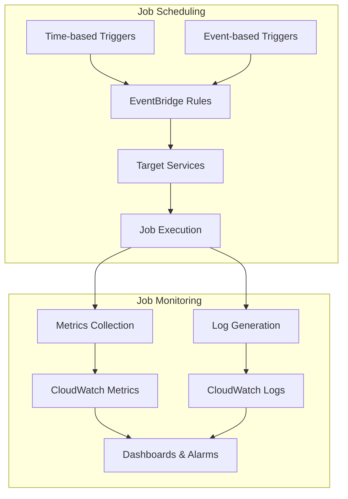
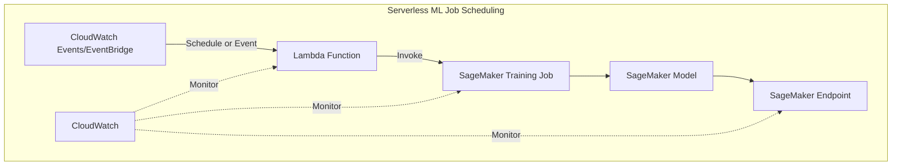

# Job Scheduling and Monitoring

## Quick Revision Block

> Key Points:
> 
> - Job scheduling in AWS involves configuring automated execution of tasks using services like EventBridge, CloudWatch Events, Step Functions, and native schedulers in AWS Glue and SageMaker.
> - Monitoring ML workflows requires tracking multiple metrics: infrastructure performance, data quality, model training progress, and pipeline execution status.
> - AWS CloudWatch serves as the primary monitoring service, integrating with most AWS services to provide metrics, logs, dashboards, and alerts.
> - Effective job scheduling and monitoring are critical for automating ML pipelines, ensuring resource optimization, enabling fault tolerance, and maintaining regulatory compliance.

## Prerequisites

- **AWS Service Knowledge**: Basic understanding of key AWS services like Lambda, EC2, SageMaker, and Glue
- **Machine Learning Lifecycle**: Familiarity with the steps in developing and deploying ML models
- **IAM Concepts**: Understanding of AWS security and permissions management

## Detailed Explanation

### What is Job Scheduling and Monitoring?

Job scheduling and monitoring in AWS refers to the processes and tools used to automate the execution of tasks at specified times or in response to events, and to track the performance, health, and outcomes of these tasks. In machine learning workflows, this includes scheduling data ingestion, preprocessing, model training, evaluation, and deployment jobs, as well as monitoring their execution, resource utilization, and results.

### Key Characteristics

- **Job Scheduling Features**:
  - **Time-based Scheduling**: Running jobs at specific times, intervals, or using cron expressions
  - **Event-driven Execution**: Triggering jobs in response to events like file uploads or database changes
  - **Dependency Management**: Executing jobs based on the completion of prerequisite tasks
  - **Resource Allocation**: Assigning appropriate compute resources for each job type

- **Monitoring Capabilities**:
  - **Performance Metrics**: Tracking CPU, memory, network, and disk utilization
  - **Job Status Tracking**: Monitoring the progress and completion status of jobs
  - **Log Analysis**: Collecting and analyzing detailed logs of job execution
  - **Alerting**: Notifying stakeholders of errors, anomalies, or threshold breaches

### How it Works

#### Job Scheduling Mechanisms:

1. **Cron-based Scheduling**:
   - Uses cron expressions to define execution schedules (e.g., "run daily at 2 AM")
   - Implemented through EventBridge rules or service-specific schedulers

2. **Event-driven Scheduling**:
   - Monitors for specific events like S3 uploads or database updates
   - Triggers job execution when specified conditions are met

3. **Workflow-based Scheduling**:
   - Defines dependencies between jobs in a workflow
   - Executes jobs in sequence or parallel based on workflow definition

#### Monitoring Flow:

1. **Metrics Collection**:
   - AWS services emit metrics to CloudWatch
   - Custom metrics can be published from applications

2. **Log Aggregation**:
   - Application and service logs sent to CloudWatch Logs
   - Logs can be filtered and analyzed for insights

3. **Dashboard Visualization**:
   - Key metrics displayed on customizable dashboards
   - Trends and patterns made visible for analysis

4. **Alert Generation**:
   - Alarms triggered when metrics cross thresholds
   - Notifications sent through SNS, email, or other channels

### Practical Real World Use Cases

- **Scheduled ML Model Retraining**:
  - **Implementation**: Using EventBridge to trigger SageMaker training jobs on a weekly basis
  - **Monitoring**: CloudWatch metrics for training job performance and model quality metrics
  - **Benefits**: Ensures models stay current with fresh data while optimizing compute resource usage

- **Event-driven Data Processing**:
  - **Implementation**: Triggering Glue ETL jobs when new data arrives in an S3 bucket
  - **Monitoring**: Tracking data processing completeness, errors, and resource utilization
  - **Benefits**: Reduces data processing latency and eliminates unnecessary processing

- **ML Pipeline Orchestration**:
  - **Implementation**: Using Step Functions to coordinate data preprocessing, model training, and deployment
  - **Monitoring**: End-to-end visibility into pipeline execution status and performance
  - **Benefits**: Ensures consistent processes and provides audit trails for compliance

## System Design Considerations

### Architecture Patterns

- **Serverless Scheduling Pattern**:
  - **Components**: EventBridge + Lambda + SageMaker/Glue
  - **Use Case**: Cost-effective, event-driven ML workflow execution
  - **Benefits**: Minimal management overhead, pay-per-use pricing model

- **Container-based Batch Pattern**:
  - **Components**: ECR + AWS Batch + CloudWatch
  - **Use Case**: Computationally intensive, custom ML processing
  - **Benefits**: Greater control over execution environment, optimized for batch workloads

### Performance Optimization

- **Resource Allocation**:
  - **Right-sizing Instances**: Selecting appropriate instance types based on job requirements
  - **Auto Scaling**: Dynamically adjusting resources based on workload
  - **Spot Instances**: Using Spot instances for cost-effective, fault-tolerant processing

- **Scheduling Efficiency**:
  - **Batch Processing**: Grouping similar jobs to reduce initialization overhead
  - **Concurrent Execution**: Running independent jobs in parallel
  - **Off-peak Scheduling**: Running resource-intensive jobs during periods of low demand

- **Monitoring Optimization**:
  - **Metric Filtering**: Collecting only relevant metrics to reduce noise
  - **Log Level Adjustment**: Setting appropriate log levels to balance detail and volume
  - **Composite Metrics**: Creating derived metrics for more meaningful insights

### Cost Optimization

- **Scheduling Strategies**:
  - **Consolidation**: Grouping jobs to minimize container startup/shutdown costs
  - **Time-based Execution**: Running jobs during off-peak hours for better spot instance pricing
  - **Resource Matching**: Assigning appropriate instance types to different job requirements

- **Monitoring Efficiency**:
  - **Metric Resolution**: Adjusting metric collection frequency based on needs
  - **Log Retention**: Setting appropriate retention periods for different log types
  - **Dashboard Sharing**: Creating shared dashboards for team visibility

### Security Best Practices

- **Permission Management**:
  - **Least Privilege**: Granting minimal necessary permissions to job execution roles
  - **Resource Isolation**: Separating different workloads using security groups and VPCs
  - **Secrets Management**: Securely handling credentials needed for job execution

- **Monitoring Security**:
  - **Log Encryption**: Encrypting logs containing sensitive information
  - **Access Control**: Restricting dashboard and alert access to authorized personnel
  - **Audit Trail**: Maintaining comprehensive logs for security audit purposes

## Common Exam Scenarios

- **Scenario 1**: A company needs to retrain their recommendation system daily with the latest user interaction data, and wants to ensure the model quality doesn't degrade.
  - **Solution**: Set up a daily scheduled EventBridge rule to trigger a Step Functions workflow that handles data preprocessing, model training, and evaluation. Configure CloudWatch alarms to monitor model quality metrics and send notifications if they fall below thresholds.

- **Scenario 2**: A data science team wants to process IoT device data in batches every hour, with minimal infrastructure management overhead.
  - **Solution**: Use AWS Glue triggers to schedule ETL jobs hourly, processing data from an IoT ingest buffer to a queryable format. Set up CloudWatch metrics for job success rate and duration, with alarms for failed jobs.

- **Scenario 3**: A financial services company needs to maintain audit trails of their ML model training and deployment for compliance purposes.
  - **Solution**: Implement Step Functions to orchestrate the ML workflow with detailed execution history. Configure comprehensive CloudWatch logging with appropriate retention periods, and set up CloudWatch Logs Insights for querying historical execution records.

## Related Concepts

- **[Data Pipeline Orchestration]**: Coordinating the flow of data through various processing stages, which often involves sophisticated job scheduling.
- **[AWS CloudWatch]**: The primary monitoring service that integrates with most AWS services to provide metrics, logs, and alarms.
- **[AWS EventBridge]**: A serverless event bus service that connects application data from your own apps, SaaS, and AWS services.
- **[AWS Step Functions]**: A visual workflow service for building distributed applications, useful for coordinating ML pipeline steps.

## Learning Resources

### Official Documentation

- [Amazon CloudWatch Documentation](https://docs.aws.amazon.com/cloudwatch/)
- [Amazon EventBridge Documentation](https://docs.aws.amazon.com/eventbridge/)
- [AWS Step Functions Documentation](https://docs.aws.amazon.com/step-functions/)
- [Amazon SageMaker Model Monitor Documentation](https://docs.aws.amazon.com/sagemaker/latest/dg/model-monitor.html)

### Video Tutorials

- [Monitoring Machine Learning Workloads with CloudWatch](https://www.youtube.com/watch?v=uxCuYYNFTkw)
- [Automating ML Workflows with Step Functions](https://www.youtube.com/watch?v=9i1A44MkPYM)

### Hands-on Labs

- [Build a Serverless ML Pipeline with AWS Step Functions](https://aws.amazon.com/getting-started/hands-on/build-serverless-workflows-step-functions/)
- [Monitor and Troubleshoot ML Workflows](https://aws.amazon.com/getting-started/hands-on/monitor-ml-workflows/)

### Practice Questions

- Q1: A company wants to schedule their SageMaker training jobs to run automatically whenever new data arrives in their S3 bucket. Which AWS service should they use?
    - A: They should use Amazon EventBridge to create a rule that monitors the S3 bucket for object creation events and triggers a Lambda function that initiates the SageMaker training job.

- Q2: A data scientist has set up a ML pipeline using Step Functions but notices that some execution paths consistently fail. What's the most effective way to identify the specific step that's causing the failure?
    - A: They should use CloudWatch Logs Insights to query the execution logs from Step Functions, filtering by execution IDs that resulted in failure to identify patterns and the specific steps where errors are occurring.
