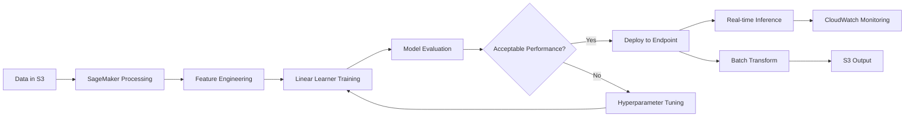

# Logistic regression

## Quick Revision Block

> Key Points:
> 
> - Logistic regression is a statistical model for classification problems that predicts the probability of binary or multi-class outcomes.
> - AWS SageMaker provides the Linear Learner algorithm specifically optimized for logistic regression tasks with efficient implementation.
> - Logistic regression offers simplicity, speed, and interpretability, making it suitable for initial modeling before exploring complex approaches.
> - For AWS ML Specialty certification, understand both the mathematical foundations and AWS-specific implementation considerations.

## Prerequisites

- **Linear Algebra**: Brief understanding of sigmoid functions and matrix operations to grasp the mathematical foundations.
- **AWS SageMaker**: Basic knowledge of SageMaker environment for model training and deployment.
- **Data Preprocessing**: Ability to format and prepare data for logistic regression models (normalization, encoding).

## Detailed Explanation

### What is Logistic regression?

Logistic regression is a statistical model that predicts the probability of an outcome with a finite set of possible values. Unlike linear regression that predicts continuous values, logistic regression transforms predictions using the sigmoid function to output values between 0 and 1, representing probabilities of class membership. It's widely used for binary classification (yes/no outcomes) and can be extended to multi-class problems.

### Key Characteristics

- **Probabilistic Output**: Returns probability values between 0 and 1 that can be thresholded to make class predictions, allowing for flexible decision boundaries.
- **Interpretability**: Coefficients have clear interpretations related to the log-odds of the outcome, making it easy to explain the model's decisions to stakeholders.
- **Computational Efficiency**: Requires less computational power than complex models like neural networks, making it suitable for large datasets with limited resources.

### How it Works

Logistic regression works by applying the sigmoid function to a linear combination of input features:

1. Calculate the linear combination of features: z = β₀ + β₁x₁ + β₂x₂ + ... + βₙxₙ
2. Apply the sigmoid function: P(y=1) = 1/(1+e^(-z))
3. The output P(y=1) represents the probability of the positive class
4. Choose a threshold (typically 0.5) to convert probability to class prediction

In AWS SageMaker's Linear Learner, this implementation is optimized for distributed training with automatic model tuning capabilities.

### Practical Real World Use Cases

- **Credit Risk Assessment**: Banks use logistic regression to classify loan applications as high or low risk based on customer data, payment history, and economic indicators.
- **Medical Diagnosis**: Healthcare providers predict disease likelihood using patient symptoms, test results, and demographic information as features.
- **Marketing Campaign Optimization**: E-commerce companies predict click-through rates for ads, allowing for better budget allocation and targeting.

## System Design Considerations

### Architecture Patterns

- **Batch Prediction Pipeline**: For scenarios not requiring real-time predictions, use SageMaker batch transform jobs with Amazon S3 for efficient processing of large datasets.
  ```
  S3 → SageMaker Processing → Linear Learner Training → S3 → Batch Transform → S3 → Analysis
  ```

- **Real-time Prediction Service**: For applications requiring immediate predictions, deploy the model to a SageMaker endpoint with auto-scaling configured.
  ```
  API Gateway → Lambda → SageMaker Endpoint (Linear Learner) → CloudWatch (Monitoring)
  ```



### Performance Optimization

- **Feature Engineering**: Apply appropriate transformations (normalization, standardization) to input features as logistic regression performs better with scaled data.
- **Regularization**: Use L1 or L2 regularization (configurable in Linear Learner) to prevent overfitting, especially with high-dimensional data.

### Cost Optimization

- **Instance Selection**: Choose the right instance type based on dataset size; CPU instances (like c5) are often sufficient for logistic regression without needing expensive GPU instances.
- **Endpoint Management**: Use auto-scaling for SageMaker endpoints to match demand patterns and avoid over-provisioning resources.

### Security Best Practices

- **Data Encryption**: Enable encryption at rest for training data in S3 and in transit using AWS KMS keys.
- **IAM Role Configuration**: Create specific roles with minimum permissions necessary for SageMaker to access training data and store models.

## Common Exam Scenarios

- **Algorithm Selection**: Given a business problem with binary outcome and interpretability requirements, identify logistic regression as an appropriate choice over more complex models.
- **Hyperparameter Configuration**: Determine optimal settings for learning rate, regularization type, and regularization strength based on dataset characteristics.
- **Performance Evaluation**: Interpret precision, recall, and ROC curves to evaluate and improve a logistic regression model for imbalanced classification tasks.

## Related Concepts

- **Linear Regression**: Similar approach but used for predicting continuous values rather than probabilities or classes.
- **Decision Trees and Random Forests**: Alternative classification methods that might be more suitable for non-linear relationships in data.
- **Gradient Descent Optimization**: The underlying algorithm used to find optimal coefficients in logistic regression models.

## Learning Resources

### Official Documentation

- [Amazon SageMaker Linear Learner Algorithm](https://docs.aws.amazon.com/sagemaker/latest/dg/linear-learner.html)
- [AWS Machine Learning Blog - Building, Training and Deploying Models with SageMaker](https://aws.amazon.com/blogs/machine-learning/)

### Video Tutorials

- [AWS re:Invent 2023: Building, automating, managing, and scaling ML workflows using Amazon SageMaker](https://www.youtube.com/watch?v=uQvwAbUXLTw)
- [Introduction to Amazon SageMaker Linear Learner Algorithm](https://www.youtube.com/watch?v=_TJIO3DRC0k)

### Hands-on Labs

- [AWS Linear Learner Lab on GitHub](https://github.com/aws/amazon-sagemaker-examples/blob/master/introduction_to_amazon_algorithms/linear_learner_binary_classification)
- [SageMaker Studio Lab: Logistic Regression Implementation](https://studiolab.sagemaker.aws/studio/home)

### Practice Questions

- Q1: For a binary classification problem with 10 features, which SageMaker algorithm would be most appropriate when interpretability is a key requirement?
    - A: Linear Learner with predictor_type='binary_classifier', as it provides interpretable coefficients while performing well on binary classification.
- Q2: What format must data be in before feeding it to SageMaker's Linear Learner algorithm?
    - A: Data must be in floating point format (float32) and normalized to improve convergence, with features in a properly formatted recordIO-protobuf or CSV file.

