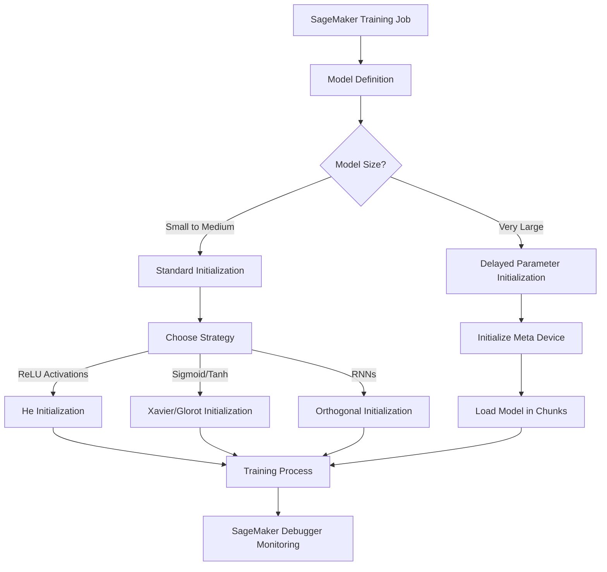

# Model initialization strategies

## Quick Revision Block

> Key Points:
> 
> - Model initialization significantly impacts training convergence, speed, and final model performance.
> - Xavier/Glorot initialization is ideal for networks with sigmoid/tanh activations, while He initialization works better for ReLU-based networks.
> - AWS SageMaker offers specialized initialization approaches like delayed parameter initialization for large models to address memory constraints.
> - SageMaker Debugger can detect initialization problems through rules that monitor weight distributions at the start of training.

## Prerequisites

- **Linear Algebra**: Understanding of matrix operations, variance, and distribution properties that form the foundation of initialization techniques.
- **Deep Learning Basics**: Familiarity with neural network structures, activation functions, and the gradient descent optimization process.
- **AWS SageMaker**: Basic knowledge of SageMaker environment and how to configure training jobs.

## Detailed Explanation

### What is Model initialization strategies?

Model initialization strategies refer to methods for setting the initial values of neural network parameters (weights and biases) before training begins. These strategies aim to prevent issues like vanishing and exploding gradients while facilitating faster convergence. Proper initialization creates a favorable starting point in the complex loss landscape of deep neural networks, allowing optimization algorithms to more efficiently find good solutions. For large-scale models deployed in AWS, initialization can significantly impact both training time and costs.

### Key Characteristics

- **Distribution-Based**: Most initialization strategies sample weights from specific probability distributions with carefully calculated variances based on network architecture.
- **Activation-Specific**: Different initialization methods are optimized for specific activation functions to maintain appropriate signal flow through the network.
- **Scale-Aware**: Advanced initialization strategies account for layer sizes, adapting the weight distributions based on the number of inputs and outputs per layer.

### How it Works

Model initialization generally follows these principles:

1. **Weight Initialization**: Select an appropriate initialization strategy based on the network architecture and activation functions:
   - Xavier/Glorot initialization for tanh/sigmoid activations: Weights ~ U[-√(6/(nin + nout)), √(6/(nin + nout))]
   - He initialization for ReLU activations: Weights ~ N(0, √(2/nin))
   - Orthogonal initialization for RNNs to address vanishing gradients in sequential data

2. **Bias Initialization**: Often initialized to zero or small constant values, with specific considerations for certain activation functions (e.g., small positive values for ReLU to prevent "dead neurons").

3. **Implementation in AWS**: In SageMaker, initialization can be specified through framework parameters (PyTorch, TensorFlow), custom training scripts, or using specialized methods like delayed parameter initialization for large models.

4. **Monitoring**: SageMaker Debugger can track initialization through rules that verify appropriate weight distributions.

### Practical Real World Use Cases

- **Large Language Model Training**: When training large language models on AWS, delayed parameter initialization enables handling models with billions of parameters that wouldn't fit in GPU memory during standard initialization.
- **Computer Vision Transfer Learning**: Fine-tuning pre-trained vision models on AWS often requires careful initialization of new classification layers while maintaining pre-trained weights.
- **Financial Time Series Prediction**: For LSTM/RNN models predicting market movements, proper initialization of recurrent layers using orthogonal matrices helps maintain gradient flow through time steps.

## System Design Considerations

### Architecture Patterns

- **Standard Training Pipeline**: For most models, initialization is defined in the model architecture code and executed when the training job starts.
  ```
  S3 (Data) → SageMaker Training Job (with initialization strategy) → Model Training → S3 (Model Artifacts)
  ```

- **Large Model Training Pattern**: For very large models, use distributed training with delayed parameter initialization.
  ```
  S3 (Data) → SageMaker Distributed Training → Delayed Parameter Initialization → Model Parallel Training → S3 (Model Artifacts)
  ```



### Performance Optimization

- **Initialization Tuning**: Use SageMaker Experiments to systematically test different initialization approaches and their impact on convergence speed.
- **Hybrid Strategies**: Combine initialization strategies when using mixed activation functions across different parts of the network.

### Cost Optimization

- **Efficient Initialization**: Proper initialization reduces training time and thus lowers compute costs on AWS.
- **Memory Optimization**: For large models, delayed parameter initialization reduces memory overhead, allowing the use of smaller, less expensive instance types.

### Security Best Practices

- **Reproducibility**: Set random seeds when initializing models to ensure consistent results across training runs, important for audit and compliance.
- **Access Control**: Protect initialization code in SageMaker notebooks with appropriate IAM policies to prevent unauthorized modification.

## Common Exam Scenarios

- **Troubleshooting Convergence**: Given a scenario where a model fails to converge, identify inappropriate initialization as a potential cause and recommend an appropriate strategy.
- **Architecture Selection**: Determine the suitable initialization strategy for a given neural network architecture and activation function.
- **Large Model Training**: Recommend AWS resources and initialization approaches for training a model that's too large to fit in GPU memory during standard initialization.

## Related Concepts

- **Optimization Algorithms**: Initialization strategies work together with optimizers like Adam, SGD, or RMSprop to affect training dynamics.
- **Regularization Techniques**: Methods like batch normalization can reduce sensitivity to initialization by normalizing layer inputs.
- **Transfer Learning**: Initialization using pre-trained weights rather than random values for knowledge transfer.

## Learning Resources

### Official Documentation

- [Amazon SageMaker Debugger – Initialization Monitoring](https://docs.aws.amazon.com/sagemaker/latest/dg/train-model.html)
- [Amazon SageMaker Model Parallel – Delayed Parameter Initialization](https://docs.aws.amazon.com/sagemaker/latest/dg/model-parallel-core-features-v2-delayed-param-init.html)

### Video Tutorials

- [AWS re:Invent 2023: Optimize deep learning model training with SageMaker](https://www.youtube.com/watch?v=pQa6k_w3E4E)
- [Debugging Neural Networks: Initialization, Regularization, and Beyond](https://www.youtube.com/watch?v=NVH_EjPy0F4)

### Hands-on Labs

- [SageMaker Studio Lab - Neural Network Initialization Strategies](https://studiolab.sagemaker.aws/)
- [AWS Workshop - Deep Learning Best Practices](https://www.amazon.com/gp/product/B07YSDGS53/)

### Practice Questions

- Q1: Your deep neural network with ReLU activations is experiencing slow convergence despite numerous optimization attempts. What initialization strategy would you recommend?
    - A: He initialization, because it preserves variance appropriately for ReLU activations by incorporating a factor of 2 to compensate for ReLU zeroing out negative values.
- Q2: When training a large language model with billions of parameters on SageMaker, you encounter an out-of-memory error during model initialization. What AWS-specific technique should you employ?
    - A: Use delayed parameter initialization with SageMaker's model parallelism library, which initializes the model with empty weights and attaches data only when needed during training.

