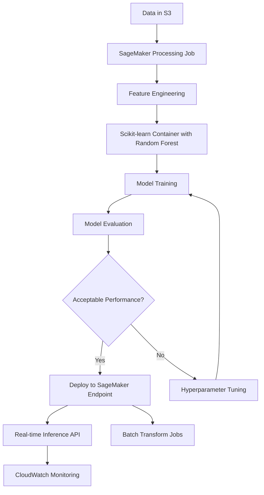

# Random forests

## Quick Revision Block

> Key Points:
> 
> - Random Forest is an ensemble learning method that combines multiple decision trees to improve prediction accuracy and reduce overfitting.
> - While AWS SageMaker doesn't have a built-in Random Forest algorithm, you can implement it using scikit-learn with the SageMaker Python SDK.
> - Random Cut Forest (RCF) is AWS SageMaker's built-in algorithm for anomaly detection that uses concepts from Random Forests.
> - Key hyperparameters to optimize include number of trees (n_estimators), maximum tree depth, and minimum samples per leaf.

## Prerequisites

- **Decision Trees**: Understanding of how individual decision trees work as they form the foundation of Random Forests.
- **Ensemble Methods**: Knowledge of how combining multiple models can improve predictive performance.
- **Python and scikit-learn**: Basic familiarity with scikit-learn for implementing Random Forests in AWS SageMaker.

## Detailed Explanation

### What is Random forests?

Random Forest is an ensemble machine learning algorithm that combines multiple decision trees to create a more accurate and stable prediction model. It uses a technique called bootstrap aggregating (bagging), where numerous decision trees are trained on different random subsets of the original data. During prediction, each tree makes its own prediction, and the final output is determined by majority voting (for classification) or averaging (for regression). Random Forests also use feature randomization, where each tree can only consider a random subset of features at each split, which increases diversity among trees.

### Key Characteristics

- **Robustness to Overfitting**: By averaging many trees trained on different data subsets, Random Forests reduce the risk of overfitting compared to single decision trees.
- **Feature Importance**: Random Forests provide built-in metrics for assessing the importance of each feature in the prediction, making them valuable for feature selection.
- **Handles Non-linearity**: Can capture complex non-linear relationships in data without requiring explicit feature engineering.

### How it Works

Random Forest operates through the following steps:

1. **Bootstrap Sampling**: Randomly select n samples from the dataset with replacement to create multiple subsets.
2. **Tree Building**: For each subset, build a decision tree with a random selection of features at each node.
3. **Feature Randomization**: At each split, only consider a random subset of features (typically sqrt(total_features) for classification).
4. **Ensemble Creation**: Combine all trees to form the forest.
5. **Prediction**: For new data, pass it through all trees and aggregate their predictions (voting for classification, averaging for regression).

In AWS, while there's no built-in Random Forest algorithm in SageMaker, you can implement it using the scikit-learn container or bring your own implementation.

### Practical Real World Use Cases

- **Credit Risk Assessment**: Banks use Random Forests to evaluate loan applications by analyzing patterns in applicant data and historical loan performance.
- **Healthcare Diagnostics**: Medical institutions leverage Random Forests to predict disease outcomes based on patient symptoms, test results, and demographic information.
- **Retail Demand Forecasting**: Retailers use Random Forests to predict future product demand by analyzing sales history, promotions, seasonality, and other factors.

## System Design Considerations

### Architecture Patterns

- **Scikit-learn on SageMaker Pattern**: For most standard Random Forest implementations, deploy scikit-learn models using SageMaker's scikit-learn container.
  ```
  S3 (Data) → SageMaker Processing → Scikit-learn Training (Random Forest) → S3 (Model) → SageMaker Endpoint
  ```

- **Multi-model Deployment Pattern**: For scenarios requiring multiple Random Forest models, use SageMaker multi-model endpoints to efficiently host them.
  ```
  Multiple RF Models in S3 → SageMaker Multi-model Endpoint → API Gateway → Client Applications
  ```



### Performance Optimization

- **Hyperparameter Tuning**: Use SageMaker's automatic model tuning to optimize key parameters like n_estimators (number of trees), max_depth, and min_samples_split.
- **Feature Selection**: Apply Random Forest's feature importance to identify and keep only the most predictive features to reduce model complexity.

### Cost Optimization

- **Instance Selection**: Use CPU-based instances (ml.m5 or ml.c5 families) as Random Forests don't benefit from GPU acceleration.
- **Serverless Inference**: For sporadic prediction needs, consider SageMaker Serverless Inference to avoid paying for idle resources.

### Security Best Practices

- **Data Encryption**: Implement encryption at rest for training data and model artifacts in S3.
- **IAM Role Configuration**: Create specific roles for SageMaker with minimum necessary permissions for accessing data and creating resources.

## Common Exam Scenarios

- **Algorithm Selection**: Given a scenario with high-dimensional data and requirements for feature importance ranking, identify Random Forest as an appropriate choice.
- **Performance Tuning**: Determine how to improve a Random Forest model's performance through hyperparameter optimization using SageMaker's automatic model tuning.
- **Implementation Strategy**: Choose the correct approach for implementing Random Forest in AWS (scikit-learn container vs. built-in algorithms).

## Related Concepts

- **Decision Trees**: The foundational algorithm that makes up Random Forests, used for simpler models with interpretability requirements.
- **Gradient Boosting Machines**: Related ensemble method that builds trees sequentially rather than independently (XGBoost is an optimized implementation).
- **Random Cut Forest**: AWS SageMaker's built-in algorithm for anomaly detection, which uses concepts from Random Forests.

## Learning Resources

### Official Documentation

- [Amazon SageMaker Python SDK - Scikit-learn Estimator](https://sagemaker.readthedocs.io/en/stable/frameworks/sklearn/using_sklearn.html)
- [Running Scikit-learn Jobs with Amazon SageMaker](https://docs.aws.amazon.com/sagemaker/latest/dg/sklearn.html)

### Video Tutorials

- [AWS re:Invent 2023: Build, train, and deploy machine learning models with Amazon SageMaker](https://www.youtube.com/watch?v=iH8Y3Z3yiDs)
- [Getting Started with Amazon SageMaker for Machine Learning](https://www.youtube.com/watch?v=Qv_Tr_BCFCQ)

### Hands-on Labs

- [Scikit-learn Random Forest on Amazon SageMaker End-to-End](https://github.com/aws/amazon-sagemaker-examples/blob/master/sagemaker-python-sdk/scikit_learn_randomforest/Sklearn_on_SageMaker_end2end.ipynb)
- [SageMaker Studio Lab: Random Forest Implementation](https://studiolab.sagemaker.aws/)

### Practice Questions

- Q1: Which AWS service would you use to implement a Random Forest model and deploy it as a real-time endpoint?
    - A: Amazon SageMaker with the scikit-learn container, as SageMaker provides both training infrastructure and deployment capabilities for custom algorithms like Random Forest.
- Q2: How would you optimize a Random Forest model for a classification problem with 100 features in AWS SageMaker?
    - A: Use SageMaker Automatic Model Tuning to optimize hyperparameters such as n_estimators, max_depth, and max_features (set to approximately sqrt(100) features for classification tasks).

