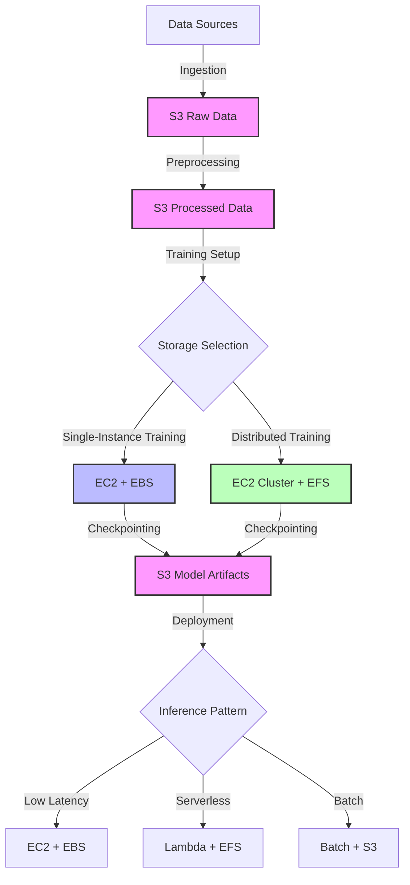

# Storage options comparison

## Quick Revision Block

> Key Points:
> 
> - AWS offers three primary storage types for ML workloads: object storage (S3), block storage (EBS), and file storage (EFS), each optimized for different use cases.
> - Object storage (S3) excels at storing large volumes of unstructured data like datasets and model artifacts with unlimited scalability but higher latency.
> - Block storage (EBS) provides high performance and low latency for active training workloads attached to EC2 instances but limited to single-instance access.
> - File storage (EFS) enables shared access across multiple compute instances with moderate performance, making it ideal for distributed ML training.

## Prerequisites

- **Cloud Computing Fundamentals**: Understanding of AWS infrastructure and service models affects storage decisions
- **Machine Learning Workflow**: Knowledge of different phases (data preparation, training, inference) influences storage requirements
- **Data Management Principles**: Familiarity with data access patterns, security requirements, and lifecycle management

## Detailed Explanation

### What is Storage options comparison?

Storage options comparison in the context of AWS machine learning involves evaluating the tradeoffs between different AWS storage services based on performance, scalability, access patterns, cost, and security requirements for ML workloads. This assessment helps data scientists and ML engineers select the most appropriate storage solutions for each phase of the ML lifecycle, from initial data collection through model training to production deployment and inference.

### Key Characteristics

- **Storage Types Classification**: AWS storage services are categorized as object storage, block storage, or file storage, each with distinct characteristics:
  
  - **Object Storage**: Stores data as discrete objects with unique identifiers and metadata, optimized for scale and durability.
  
  - **Block Storage**: Divides data into fixed-size blocks managed at a low level, providing high performance for transactional workloads.
  
  - **File Storage**: Organizes data in a hierarchical structure with files and directories, facilitating shared access.

- **Performance vs. Scale Tradeoff**: Storage options typically balance between high performance (low latency, high throughput) and large scale (petabyte-level capacity, unlimited objects).

- **Access Pattern Optimization**: Different storage solutions are optimized for specific access patterns - sequential vs. random access, read-heavy vs. write-heavy, shared vs. exclusive access.

### How it Works

Storage selection for ML workflows requires matching storage characteristics to workload requirements:

1. **Data Collection Phase**:
   - Raw data is typically ingested into S3 (object storage)
   - Data catalogs like AWS Glue catalog metadata about the stored data
   - Data can be organized in S3 using prefixes or partitioning strategies

2. **Data Preparation Phase**:
   - For distributed processing, data often remains in S3
   - For intensive processing on single instances, data might be temporarily moved to EBS
   - Shared preprocessing across multiple instances may leverage EFS

3. **Model Training Phase**:
   - Single-instance training often uses EBS volumes for high-performance random access
   - Distributed training across clusters may use EFS for shared file access
   - Training checkpoints are commonly saved to S3 for durability

4. **Model Deployment and Inference**:
   - Models artifacts are typically stored in S3
   - Inference instances may load models from S3, cache on EBS, or for serverless, use EFS
   - Real-time serving with strict latency requirements may load models directly into memory

### Practical Real World Use Cases

- **High-Performance Computer Vision Training**: An autonomous vehicle company processes large image datasets for object detection models. They store raw images in S3, use EBS st1 volumes for preprocessing, and gp3 volumes for high-IOPS training workloads. Model checkpoints are saved back to S3 for durability.
  
- **Distributed NLP Model Training**: A research team trains large transformer models across multiple GPU instances. They use EFS for the shared dataset access, allowing all training nodes to see the same files simultaneously, while storing checkpoints in S3 for fault tolerance.
  
- **Real-time Recommendation System**: An e-commerce platform deploys personalized recommendation models. They store model artifacts in S3, but for low-latency serving, they use Amazon EFS with Lambda to provide fast inference without loading the entire model with each invocation.

## System Design Considerations

### Architecture Patterns

- **Data Lake Pattern**: Centralize raw and processed data in S3, with appropriate organization (partitioning, prefixes) and lifecycle policies. This pattern supports diverse ML workloads with different compute services accessing the same data sources.
  
- **High-Performance Training Pattern**: Use EC2 instances with optimized EBS volumes (io2 or gp3) for maximum throughput during training, with results periodically checkpointed to S3 for durability.

### Performance Optimization

- **S3 Transfer Acceleration**: Enable transfer acceleration for faster uploads/downloads of large datasets to/from S3 across geographic distances.
  
- **EBS Volume Type Selection**: Choose appropriate EBS volume types based on workload - gp3 for balanced performance, io2 for high-IOPS requirements, st1 for high-throughput sequential access.

### Cost Optimization

- **S3 Storage Classes**: Implement lifecycle policies to automatically transition less-frequently accessed training data to S3 Standard-IA or Glacier for cost savings.
  
- **Instance Storage for Ephemeral Workloads**: Use EC2 instance store volumes for temporary processing when data persistence isn't required.

### Security Best Practices

- **Encryption**: Enable encryption at rest for all storage types (S3 with SSE, EBS/EFS with KMS) and in transit (TLS).
  
- **IAM Access Control**: Implement least-privilege access policies for all storage resources, using bucket policies for S3 and resource policies for EFS.

## Common Exam Scenarios

- **Scenario 1**: A company is training a large NLP model requiring shared access across multiple GPU instances, with frequent checkpoint saves.
  
  Solution: Use Amazon EFS for the dataset to enable shared access across all training instances. Configure automatic checkpointing to Amazon S3 for durability. This combination provides both the shared access needed during training and the durability required for checkpoints.

- **Scenario 2**: A financial services company needs to analyze historical transaction data for fraud detection model training, but has strict requirements for data locality and encryption.
  
  Solution: Store historical data in S3 with server-side encryption using KMS custom keys and bucket policies preventing cross-region replication. For training, use EC2 instances in a VPC with encrypted EBS volumes, processing data in batches from the encrypted S3 source.

- **Scenario 3**: A healthcare startup is developing an image classification model for medical images, with a need to process 10TB of training data with high throughput.
  
  Solution: Store the original images in S3, use EC2 instances with ST1 HDD volumes for preprocessing (optimized for sequential workloads), and GP3 SSD volumes for the actual training phase requiring random access patterns. Save model artifacts back to S3.

## Related Concepts

- **[Data Lakes]**: A centralized repository that allows storing structured and unstructured data at any scale, often implemented using S3.
  
- **[Storage Performance Metrics]**: IOPS, throughput, and latency measurements that determine how well storage systems handle ML workloads.
  
- **[Storage Lifecycle Management]**: Policies and automation for moving data between storage tiers based on access frequency and retention requirements.

## Learning Resources

### Official Documentation

- [AWS Storage Services Overview](https://docs.aws.amazon.com/whitepapers/latest/aws-overview/storage-services.html)
- [Storage Best Practices for Machine Learning](https://docs.aws.amazon.com/sagemaker/latest/dg/model-storage.html)

### Video Tutorials

- [AWS re:Invent 2023: Optimizing Storage for ML Workflows](https://www.youtube.com/watch?v=LvZ06Z76Avo)
- [Deep Dive on Amazon S3 and EFS for Machine Learning](https://www.youtube.com/watch?v=5JQwwmkpGBY)

### Hands-on Labs

- [Building an ML Pipeline with Optimized Storage](https://aws.amazon.com/getting-started/hands-on/build-train-deploy-machine-learning-model-sagemaker/)
- [Storage Performance Benchmarking for ML Workloads](https://github.com/aws-samples/amazon-sagemaker-storage-benchmark)

### Practice Questions

- Q1: A data science team needs to train a large computer vision model using a dataset stored in S3. The training will run on a single high-memory EC2 instance and requires high-performance random access to the data. Which storage option is most appropriate?
    - A: Amazon EBS gp3 volumes, as they provide high-performance block storage with consistent low latency and high IOPS, ideal for random access patterns during ML training on a single instance.

- Q2: A company is implementing a distributed training system across multiple EC2 instances that need shared access to the same dataset. Which storage service should they choose?
    - A: Amazon EFS, as it provides a file system interface that can be mounted simultaneously by multiple EC2 instances, allowing all training nodes to access the same files concurrently.